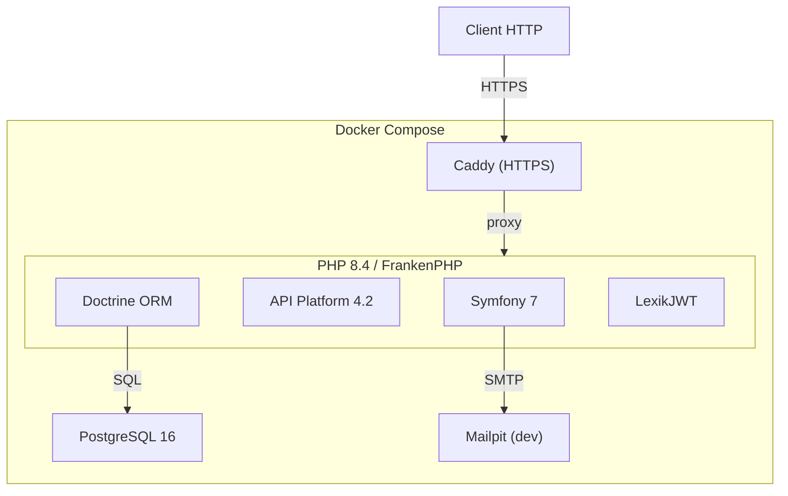
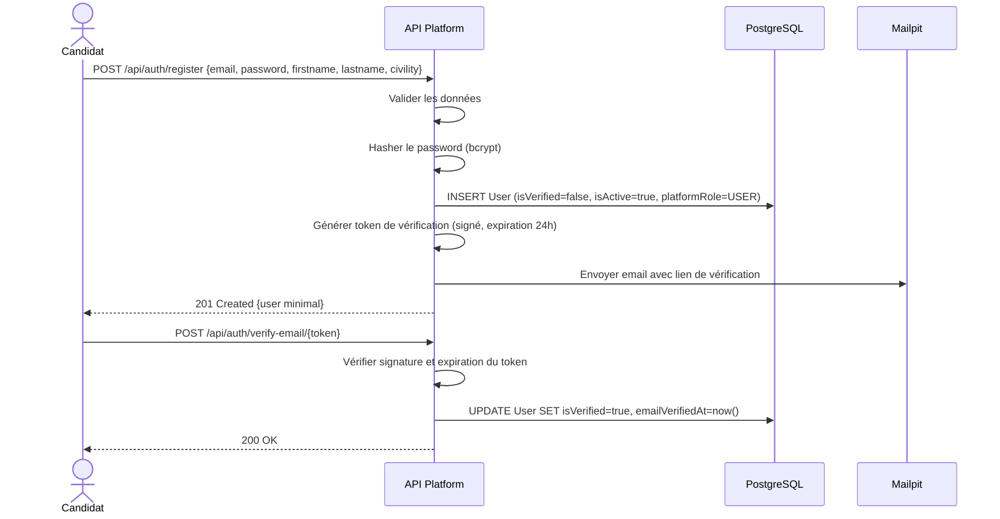
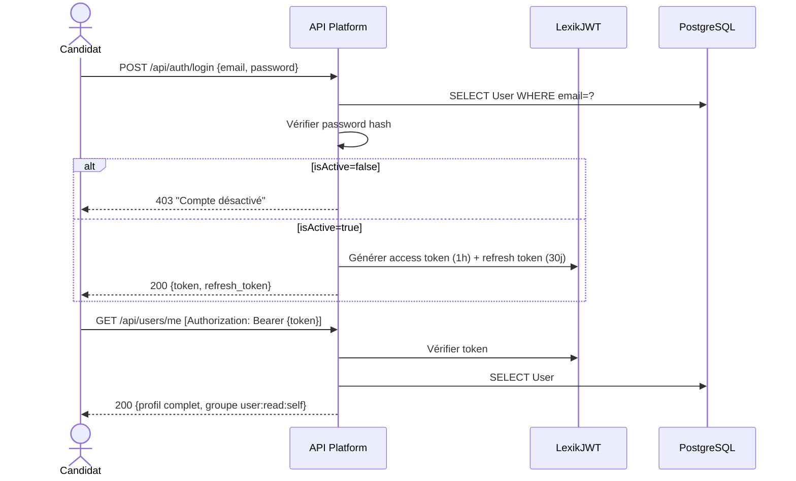
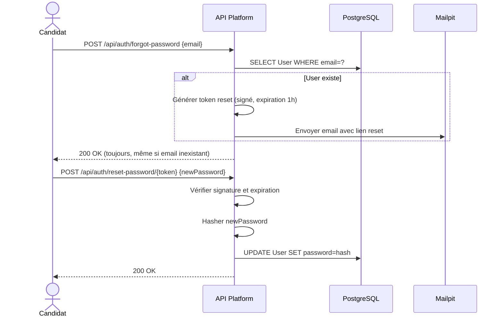
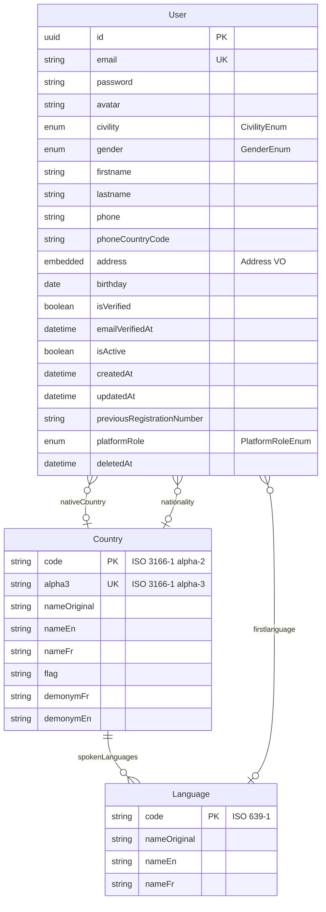

# Design Document — Sprint 0 : Fondations

---
**Purpose**: Fournir le détail nécessaire pour que l'implémentation soit cohérente, de l'infrastructure Docker aux endpoints User/Auth.
**Approach**: Diagrammes Mermaid, tables de contrats API, décisions d'architecture.

---

## Overview

**Purpose** : Ce sprint livre l'infrastructure technique et les premières entités (Country, Language, User) avec un système d'authentification JWT complet.

**Users** : Tous les futurs utilisateurs de la plateforme — candidats, personnel d'institut, administrateurs plateforme.

**Impact** : Crée le socle sur lequel tous les sprints suivants s'appuient.

### Goals
- Environnement Docker fonctionnel en une commande
- Entités de référence Country/Language avec fixtures
- Entité User complète avec soft delete
- Auth JWT : register, login, verify-email, forgot/reset-password
- Groupes de sérialisation par contexte

### Non-Goals
- Pas de gestion d'institut (Sprint 1)
- Pas de gestion de tests/épreuves (Sprint 2)
- Pas d'envoi réel d'emails (on utilise Mailtrap/Mailpit en dev)
- Pas de frontend

## Architecture

### Architecture Pattern & Boundary Map



**Architecture Integration** :
- Selected pattern : **monolithe en couches** (Entity → Repository → Service → API Platform Processor)
- Domain boundaries : chaque entité est autonome avec son mapping, sa validation et sa sérialisation dans un seul fichier
- Existing patterns : aucun (projet from scratch)
- New components : tous — c'est le sprint fondation
- Steering compliance : respect des conventions Symfony, API Platform déclaratif

### Technology Stack

| Layer | Choice / Version | Role in Feature | Notes |
|-------|------------------|-----------------|-------|
| Runtime | FrankenPHP (PHP 8.4) | Serveur d'application | Worker mode pour performance |
| Framework | Symfony 7 | Structure, DI, routing | |
| API | API Platform 4.2 | Génération REST auto | JSON-LD par défaut |
| ORM | Doctrine ORM | Mapping, migrations | Attributs PHP 8 |
| Auth | LexikJWT | JWT access + refresh | |
| Database | PostgreSQL 16 | Stockage | |
| Reverse Proxy | Caddy | HTTPS auto | |
| Mail (dev) | Mailpit | Capture emails | Port 8025 pour UI |

## System Flows

### Flow 1 : Inscription et vérification email



### Flow 2 : Login JWT



### Flow 3 : Reset password



## Requirements Traceability

| Requirement | Summary | Components | Interfaces | Flows |
|-------------|---------|------------|------------|-------|
| 1 | Infrastructure Docker | docker-compose.yml, Dockerfile | — | — |
| 2 | Country & Language | Country, Language entities | REST API | — |
| 3 | Enums & Value Objects | PlatformRoleEnum, CivilityEnum, GenderEnum, Address, Price | — | — |
| 4 | Entité User | User entity, UserRepository | REST API | — |
| 5 | Auth JWT | AuthController, JWT config | REST API | Flow 1, 2, 3 |
| 6 | Groupes sérialisation | Attributs Groups sur User | — | — |

## Components and Interfaces

### Entities Layer

#### Country

| Field | Detail |
|-------|--------|
| Intent | Données de référence pays (ISO 3166-1) |
| Requirements | 2 |

**Contracts** : API [x]

##### API Contract
| Method | Endpoint | Request | Response | Errors |
|--------|----------|---------|----------|--------|
| GET | /api/countries | — | Collection\<Country\> | — |
| GET | /api/countries/{code} | — | Country (avec languages) | 404 |
| POST | /api/countries | CountryInput | Country | 403, 422 |
| PATCH | /api/countries/{code} | Partial\<CountryInput\> | Country | 403, 404, 422 |

#### Language

| Field | Detail |
|-------|--------|
| Intent | Données de référence langues (ISO 639-1) |
| Requirements | 2 |

**Contracts** : API [x]

##### API Contract
| Method | Endpoint | Request | Response | Errors |
|--------|----------|---------|----------|--------|
| GET | /api/languages | — | Collection\<Language\> | — |
| GET | /api/languages/{code} | — | Language | 404 |
| POST | /api/languages | LanguageInput | Language | 403, 422 |
| PATCH | /api/languages/{code} | Partial\<LanguageInput\> | Language | 403, 404, 422 |

#### User

| Field | Detail |
|-------|--------|
| Intent | Utilisateur de la plateforme avec profil complet |
| Requirements | 4, 5, 6 |

**Contracts** : API [x] / State [x]

##### API Contract
| Method | Endpoint | Request | Response | Errors |
|--------|----------|---------|----------|--------|
| GET | /api/users/me | — | User (user:read:self) | 401 |
| PATCH | /api/users/me | UserProfileInput | User (user:read:self) | 401, 422 |
| GET | /api/users | — | Collection\<User\> (user:read:admin) | 401, 403 |
| GET | /api/users/{id} | — | User (user:read:admin) | 401, 403, 404 |
| PATCH | /api/users/{id} | UserAdminInput | User (user:read:admin) | 401, 403, 404, 422 |
| DELETE | /api/users/{id} | — | 204 | 401, 403, 404 |

### Auth Layer

#### AuthController

| Field | Detail |
|-------|--------|
| Intent | Endpoints d'authentification hors API Platform (custom controllers) |
| Requirements | 5 |

**Contracts** : API [x]

##### API Contract
| Method | Endpoint | Request | Response | Errors |
|--------|----------|---------|----------|--------|
| POST | /api/auth/register | {email, password, firstname, lastname, civility} | User (user:read:self) | 422 |
| POST | /api/auth/login | {email, password} | {token, refresh_token} | 401, 403 |
| POST | /api/auth/refresh | {refresh_token} | {token, refresh_token} | 401 |
| POST | /api/auth/verify-email/{token} | — | {message} | 400 |
| POST | /api/auth/forgot-password | {email} | {message} | — (toujours 200) |
| POST | /api/auth/reset-password/{token} | {newPassword} | {message} | 400, 422 |

**Implementation Notes** :
- Le register est un State Processor API Platform (pas un controller custom) pour bénéficier de la validation automatique
- Le login est géré nativement par LexikJWT (`/api/auth/login` = `json_login` dans `security.yaml`)
- Les tokens de vérification/reset sont des JWT signés avec une durée de vie courte
- `forgot-password` retourne toujours 200 pour ne pas révéler l'existence d'un email (sécurité)

## Data Models

### Domain Model



### Physical Data Model

**UUID** : toutes les entités utilisent des UUID v7 (ordonnés chronologiquement) comme clés primaires, sauf Country (PK = `code`) et Language (PK = `code`).

**Soft delete** : User possède un champ `deleted_at` (nullable). Un filtre Doctrine global exclut automatiquement les enregistrements où `deleted_at IS NOT NULL`.

**Embeddable Address** : les colonnes sont préfixées dans la table parent (`address_address1`, `address_zipcode`, etc.).

## Error Handling

### Error Categories and Responses

**User Errors (4xx)** :
- 400 : token invalide/expiré (verify-email, reset-password)
- 401 : JWT absent ou expiré
- 403 : compte désactivé (login), accès interdit (PLATFORM_ADMIN requis)
- 404 : ressource inexistante
- 422 : validation échouée (email invalide, password trop court, email déjà pris)

### Format d'erreur

API Platform retourne les erreurs au format JSON-LD `hydra:error` :
```json
{
    "@context": "/api/contexts/ConstraintViolationList",
    "@type": "ConstraintViolationList",
    "violations": [
        {
            "propertyPath": "email",
            "message": "Cette valeur est déjà utilisée."
        }
    ]
}
```

## Testing Strategy

### Tests fonctionnels (PHPUnit + API Platform Test Client)
1. **Register** : inscription valide (201), email dupliqué (422), champs manquants (422)
2. **Login** : identifiants valides (200 + JWT), identifiants invalides (401), compte désactivé (403)
3. **Verify email** : token valide (200), token expiré (400)
4. **Users/me** : profil avec JWT (200), sans JWT (401), modification profil (200)
5. **Users admin** : liste par ADMIN (200), liste par USER (403), modification isActive (200)
6. **Countries/Languages** : liste publique (200), création par non-admin (403), création par admin (201)
7. **Soft delete** : user supprimé n'apparaît plus dans les listes

### Fixtures de données

Deux groupes de fixtures distincts :

**Groupe `reference`** (données de production, chargées en dev ET en prod) :
- ~250 pays (ISO 3166-1) depuis `data/countries.json`
- ~180 langues (ISO 639-1) depuis `data/languages.json`
- Relations pays → langues officielles depuis `data/country_languages.json`

**Groupe `test`** (données de test, chargées en dev/test uniquement) :
- 1 PLATFORM_ADMIN (admin@gettested.com)
- 2 USER standards (user1@test.com, user2@test.com dont 1 non vérifié)
- 1 User inactif (inactive@test.com)

Les fichiers JSON de référence sont versionnés dans `data/` et servent de source unique de vérité. Les fixtures Doctrine les chargent via `json_decode(file_get_contents(...))`.

## Security Considerations

- Passwords hashés avec bcrypt (cost 13) ou argon2id
- JWT access token : durée 1h, refresh token : 30 jours
- Tokens de vérification/reset : JWT signés, expiration courte (24h / 1h)
- `forgot-password` ne révèle pas l'existence d'un email
- Rate limiting recommandé sur `/api/auth/login` et `/api/auth/register` (à ajouter en post-sprint si nécessaire)
- CORS configuré via NelmioCorsBundle
