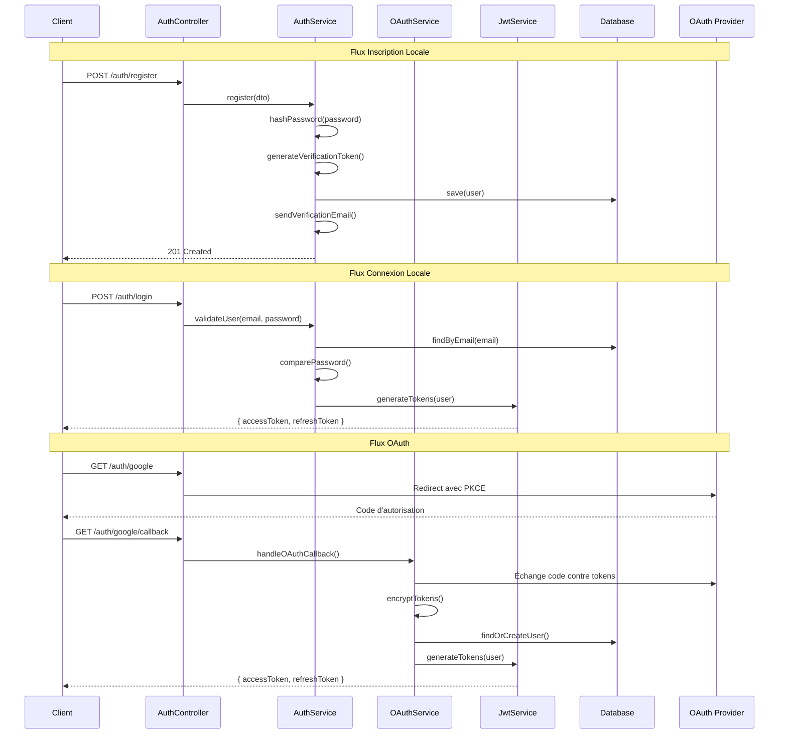

# Document de Conception - Module Authentification & Utilisateurs

## Vue d'ensemble

Ce document décrit l'architecture et la conception technique du module d'authentification et de gestion des utilisateurs pour la plateforme de gestion d'examens de langues. Le module implémente une authentification hybride supportant à la fois l'authentification locale (email/mot de passe) et OAuth 2.0 multi-fournisseurs (Google, Facebook, Microsoft).

L'architecture suit les principes de NestJS avec une séparation claire entre les couches contrôleur, service et repository. La sécurité est au cœur de la conception avec le chiffrement des tokens OAuth, le hashing bcrypt des mots de passe, et l'implémentation de PKCE pour OAuth.

**Améliorations architecturales clés :**
- Gestion des refresh tokens dans une table séparée (multi-device, révocation sélective)
- Système d'audit pour la conformité RGPD
- Rate limiting distribué avec Redis
- Architecture événementielle pour le découplage des emails
- Gestion centralisée des tokens de vérification

## Architecture

```mermaid
graph TB
    subgraph "Couche Présentation"
        AC[AuthController]
        UC[UserController]
        ADC[AdminController]
    end
    
    subgraph "Couche Service"
        AS[AuthService]
        US[UserService]
        JS[JwtService]
        OS[OAuthService]
        ES[EmailService]
        CS[CryptoService]
        AUS[AuditService]
        TS[TokenService]
        SS[StorageService]
    end
    
    subgraph "Couche Repository"
        UR[UserRepository]
        OAR[OAuthAccountRepository]
        RTR[RefreshTokenRepository]
        VTR[VerificationTokenRepository]
        ALR[AuditLogRepository]
    end
    
    subgraph "Infrastructure"
        REDIS[(Redis)]
        S3[S3/MinIO Storage]
        QUEUE[Bull Queue]
    end
    
    subgraph "Guards & Strategies"
        JG[JwtAuthGuard]
        LG[LocalAuthGuard]
        OG[OAuthGuard]
        RG[RolesGuard]
        LS[LocalStrategy]
        JWS[JwtStrategy]
        GS[GoogleStrategy]
        FS[FacebookStrategy]
        MS[MicrosoftStrategy]
    end
    
    subgraph "Base de données"
        DB[(PostgreSQL)]
    end
    
    subgraph "Services externes"
        SMTP[Service Email]
        GOOGLE[Google OAuth]
        FB[Facebook OAuth]
        MSFT[Microsoft OAuth]
    end
    
    AC --> AS
    AC --> OS
    UC --> US
    ADC --> US
    
    AS --> UR
    AS --> OAR
    AS --> JS
    AS --> CS
    AS --> ES
    
    US --> UR
    US --> OAR
    
    OS --> GS
    OS --> FS
    OS --> MS
    OS --> CS
    
    UR --> DB
    OAR --> DB
    RTR --> DB
    VTR --> DB
    ALR --> DB
    
    AS --> TS
    AS --> AUS
    TS --> RTR
    TS --> VTR
    US --> SS
    SS --> S3
    
    ES --> QUEUE
    QUEUE --> SMTP
    
    JG --> REDIS
    
    GS --> GOOGLE
    FS --> FB
    MS --> MSFT
    
    JG --> JWS
    LG --> LS
    OG --> GS
    OG --> FS
    OG --> MS
```



### Flux d'authentification



## Composants et Interfaces

### AuthController

```typescript
@Controller('auth')
export class AuthController {
  // Inscription locale
  @Post('register')
  async register(@Body() dto: RegisterDto): Promise<{ message: string }>;
  
  // Connexion locale
  @Post('login')
  @UseGuards(LocalAuthGuard)
  async login(@Request() req): Promise<TokenResponseDto>;
  
  // Vérification email
  @Get('verify-email/:token')
  async verifyEmail(@Param('token') token: string): Promise<{ message: string }>;
  
  // Renvoi email de vérification
  @Post('resend-verification')
  async resendVerification(@Body() dto: ResendVerificationDto): Promise<{ message: string }>;
  
  // Réinitialisation mot de passe
  @Post('forgot-password')
  async forgotPassword(@Body() dto: ForgotPasswordDto): Promise<{ message: string }>;
  
  @Post('reset-password')
  async resetPassword(@Body() dto: ResetPasswordDto): Promise<{ message: string }>;
  
  // Rafraîchissement token
  @Post('refresh')
  async refreshToken(@Body() dto: RefreshTokenDto): Promise<TokenResponseDto>;
  
  // Déconnexion
  @Post('logout')
  @UseGuards(JwtAuthGuard)
  async logout(@Request() req): Promise<{ message: string }>;
  
  // OAuth Google
  @Get('google')
  @UseGuards(GoogleOAuthGuard)
  async googleAuth(): Promise<void>;
  
  @Get('google/callback')
  @UseGuards(GoogleOAuthGuard)
  async googleCallback(@Request() req): Promise<TokenResponseDto>;
  
  // OAuth Facebook
  @Get('facebook')
  @UseGuards(FacebookOAuthGuard)
  async facebookAuth(): Promise<void>;
  
  @Get('facebook/callback')
  @UseGuards(FacebookOAuthGuard)
  async facebookCallback(@Request() req): Promise<TokenResponseDto>;
  
  // OAuth Microsoft
  @Get('microsoft')
  @UseGuards(MicrosoftOAuthGuard)
  async microsoftAuth(): Promise<void>;
  
  @Get('microsoft/callback')
  @UseGuards(MicrosoftOAuthGuard)
  async microsoftCallback(@Request() req): Promise<TokenResponseDto>;
}
```

### UserController

```typescript
@Controller('users')
@UseGuards(JwtAuthGuard)
export class UserController {
  // Profil utilisateur courant
  @Get('me')
  async getProfile(@Request() req): Promise<UserProfileDto>;
  
  // Mise à jour profil
  @Patch('me')
  async updateProfile(@Request() req, @Body() dto: UpdateProfileDto): Promise<UserProfileDto>;
  
  // Changement mot de passe
  @Post('me/change-password')
  async changePassword(@Request() req, @Body() dto: ChangePasswordDto): Promise<{ message: string }>;
  
  // Définir mot de passe (pour OAuth-only)
  @Post('me/set-password')
  async setPassword(@Request() req, @Body() dto: SetPasswordDto): Promise<{ message: string }>;
  
  // Upload avatar
  @Post('me/avatar')
  @UseInterceptors(FileInterceptor('avatar'))
  async uploadAvatar(@Request() req, @UploadedFile() file: Express.Multer.File): Promise<{ avatarUrl: string }>;
  
  // Lister comptes OAuth liés
  @Get('me/oauth-accounts')
  async getOAuthAccounts(@Request() req): Promise<OAuthAccountDto[]>;
  
  // Lier compte OAuth
  @Post('me/oauth-accounts/:provider')
  async linkOAuthAccount(@Request() req, @Param('provider') provider: AuthProviderEnum): Promise<OAuthAccountDto>;
  
  // Délier compte OAuth
  @Delete('me/oauth-accounts/:provider')
  async unlinkOAuthAccount(@Request() req, @Param('provider') provider: AuthProviderEnum): Promise<{ message: string }>;
  
  // Demande de suppression de compte
  @Post('me/delete-request')
  async requestAccountDeletion(@Request() req, @Body() dto: DeleteAccountRequestDto): Promise<{ message: string; scheduledDeletionDate: Date }>;
  
  // Annulation de la suppression de compte (pendant le délai de grâce)
  @Post('me/cancel-deletion')
  async cancelAccountDeletion(@Request() req): Promise<{ message: string }>;
  
  // Confirmation de suppression immédiate (sans délai de grâce)
  @Delete('me')
  async deleteAccountImmediately(@Request() req, @Body() dto: ConfirmDeleteAccountDto): Promise<{ message: string }>;
}
```

### AdminController

```typescript
@Controller('admin/users')
@UseGuards(JwtAuthGuard, RolesGuard)
@Roles(PlatformRoleEnum.ADMIN)
export class AdminController {
  // Liste paginée des utilisateurs
  @Get()
  async listUsers(@Query() query: ListUsersQueryDto): Promise<PaginatedUsersDto>;
  
  // Détails d'un utilisateur
  @Get(':id')
  async getUser(@Param('id') id: string): Promise<UserDetailDto>;
  
  // Modifier rôle plateforme
  @Patch(':id/role')
  async updateUserRole(@Param('id') id: string, @Body() dto: UpdateRoleDto): Promise<UserDetailDto>;
  
  // Désactiver compte
  @Post(':id/deactivate')
  async deactivateUser(@Param('id') id: string): Promise<{ message: string }>;
  
  // Réactiver compte
  @Post(':id/reactivate')
  async reactivateUser(@Param('id') id: string): Promise<{ message: string }>;
}
```

### AuthService

```typescript
@Injectable()
export class AuthService {
  async register(dto: RegisterDto): Promise<User>;
  async validateUser(email: string, password: string): Promise<User | null>;
  async login(user: User): Promise<TokenResponseDto>;
  async verifyEmail(token: string): Promise<void>;
  async resendVerificationEmail(email: string): Promise<void>;
  async forgotPassword(email: string): Promise<void>;
  async resetPassword(token: string, newPassword: string): Promise<void>;
  async refreshToken(refreshToken: string): Promise<TokenResponseDto>;
  async logout(userId: string): Promise<void>;
  async logoutAll(userId: string): Promise<void>;
  async changePassword(userId: string, currentPassword: string, newPassword: string): Promise<void>;
  async setPassword(userId: string, newPassword: string): Promise<void>;
  async validatePassword(password: string): ValidationResult;
  async hashPassword(password: string): Promise<string>;
  async comparePassword(password: string, hash: string): Promise<boolean>;
  async generateVerificationToken(): Promise<string>;
  async generateResetToken(): Promise<string>;
}
```

### OAuthService

```typescript
@Injectable()
export class OAuthService {
  async handleOAuthLogin(profile: OAuthProfile, provider: AuthProviderEnum): Promise<User>;
  async linkOAuthAccount(userId: string, profile: OAuthProfile, provider: AuthProviderEnum): Promise<OAuthAccount>;
  async unlinkOAuthAccount(userId: string, provider: AuthProviderEnum): Promise<void>;
  async findOAuthAccount(provider: AuthProviderEnum, providerUserId: string): Promise<OAuthAccount | null>;
  async updateOAuthTokens(accountId: string, accessToken: string, refreshToken: string, expiresAt: Date): Promise<void>;
  async encryptToken(token: string): Promise<string>;
  async decryptToken(encryptedToken: string): Promise<string>;
}
```

### CryptoService

```typescript
@Injectable()
export class CryptoService {
  async encrypt(plaintext: string): Promise<string>;
  async decrypt(ciphertext: string): Promise<string>;
  generateSecureToken(length: number): string;
}
```

### AccountDeletionService

```typescript
@Injectable()
export class AccountDeletionService {
  // Demande de suppression avec délai de grâce
  async requestDeletion(userId: string, dto: DeleteAccountRequestDto): Promise<{ scheduledDeletionDate: Date }>;
  
  // Annulation de la demande de suppression
  async cancelDeletion(userId: string): Promise<void>;
  
  // Suppression immédiate (sans délai de grâce)
  async deleteImmediately(userId: string, dto: ConfirmDeleteAccountDto): Promise<void>;
  
  // Exécution de la suppression définitive (appelé par CRON)
  async executeScheduledDeletions(): Promise<number>;
  
  // Vérification de la confirmation (mot de passe ou OAuth)
  async verifyDeletionConfirmation(userId: string, dto: DeleteAccountRequestDto | ConfirmDeleteAccountDto): Promise<boolean>;
  
  // Anonymisation des données liées aux examens
  async anonymizeExamRegistrations(userId: string): Promise<void>;
  
  // Suppression des données personnelles
  async deletePersonalData(userId: string): Promise<void>;
  
  // Révocation de tous les tokens et comptes OAuth
  async revokeAllAccess(userId: string): Promise<void>;
}
```

### Configuration CSRF

```typescript
// Configuration du module CSRF avec csurf
@Module({
  imports: [
    // Configuration CSRF pour les cookies
  ],
})
export class SecurityModule {}

// Middleware CSRF
@Injectable()
export class CsrfMiddleware implements NestMiddleware {
  use(req: Request, res: Response, next: NextFunction) {
    // Génération et validation du token CSRF
    // Exclusion des endpoints OAuth callback
  }
}

// Décorateur pour exclure certains endpoints
export const SkipCsrf = () => SetMetadata('skipCsrf', true);
```

## Modèles de données

### Entité User

```typescript
@Entity('users')
export class User implements Contactable {
  @PrimaryGeneratedColumn('uuid')
  id: string;

  @Column({ nullable: true })
  avatar: string;

  @Column({ unique: true })
  login: string; // email

  @Column({ nullable: true })
  password: string; // nullable pour OAuth-only

  @Column({ type: 'enum', enum: CivilityEnum })
  civility: CivilityEnum;

  @Column({ type: 'enum', enum: GenderEnum, default: GenderEnum.NON_SPECIFIE })
  gender: GenderEnum;

  @Column()
  firstname: string;

  @Column()
  lastname: string;

  @Column(() => ContactInfo)
  contactInfo: ContactInfo;

  @ManyToOne(() => Country)
  country: Country;

  @Column({ type: 'date', nullable: true })
  birthday: Date;

  @ManyToOne(() => Country, { nullable: true })
  nativeCountry: Country;

  @Column({ nullable: true })
  nationality: string;

  @Column({ nullable: true })
  firstlanguage: string;

  @Column({ type: 'timestamp', default: () => 'CURRENT_TIMESTAMP' })
  createdAt: Date;

  @Column({ type: 'timestamp', default: () => 'CURRENT_TIMESTAMP', onUpdate: 'CURRENT_TIMESTAMP' })
  updatedAt: Date;

  @Column({ nullable: true })
  previousRegistrationNumber: string;

  @Column({ type: 'timestamp', nullable: true })
  inscription: Date;

  @Column({ type: 'enum', enum: PlatformRoleEnum, default: PlatformRoleEnum.USER })
  platformRole: PlatformRoleEnum;

  @Column({ default: false })
  emailVerified: boolean;

  @Column({ default: true })
  isActive: boolean;

  @Column({ default: 0 })
  failedLoginAttempts: number;

  @Column({ type: 'timestamp', nullable: true })
  lockoutUntil: Date;

  // Relations
  @OneToMany(() => OAuthAccount, (oauth) => oauth.user)
  oauthAccounts: OAuthAccount[];

  @OneToMany(() => RefreshToken, (token) => token.user)
  refreshTokens: RefreshToken[];

  @OneToMany(() => VerificationToken, (token) => token.user)
  verificationTokens: VerificationToken[];

  // Implémentation Contactable
  getName(): string {
    return `${this.firstname} ${this.lastname}`;
  }
  getAddress(): string {
    return this.contactInfo?.address1 || '';
  }
  getZipcode(): string {
    return this.contactInfo?.zipcode || '';
  }
  getCity(): string {
    return this.contactInfo?.city || '';
  }
  getCountry(): string {
    return this.country?.commonName || '';
  }
}
```

### Entité OAuthAccount

```typescript
@Entity('oauth_accounts')
@Unique(['provider', 'providerUserId'])
export class OAuthAccount {
  @PrimaryGeneratedColumn('uuid')
  id: string;

  @Column({ type: 'enum', enum: AuthProviderEnum })
  provider: AuthProviderEnum;

  @Column()
  providerUserId: string;

  @Column()
  email: string;

  @Column({ type: 'text' })
  accessToken: string; // chiffré

  @Column({ type: 'text', nullable: true })
  refreshToken: string; // chiffré

  @Column({ type: 'timestamp', nullable: true })
  tokenExpiresAt: Date;

  @Column({ type: 'timestamp', default: () => 'CURRENT_TIMESTAMP' })
  createdAt: Date;

  @Column({ type: 'timestamp', default: () => 'CURRENT_TIMESTAMP', onUpdate: 'CURRENT_TIMESTAMP' })
  updatedAt: Date;

  @ManyToOne(() => User, (user) => user.oauthAccounts, { onDelete: 'CASCADE' })
  user: User;
}
```

### Value Object ContactInfo

```typescript
@Embeddable()
export class ContactInfo {
  @Column({ nullable: true })
  address1: string;

  @Column({ nullable: true })
  address2: string;

  @Column({ nullable: true })
  zipcode: string;

  @Column({ nullable: true })
  city: string;
}
```

### Enums

```typescript
export enum CivilityEnum {
  M = 'M',
  MME = 'MME',
  MLLE = 'MLLE',
  AUTRE = 'AUTRE',
}

export enum GenderEnum {
  MASCULIN = 'MASCULIN',
  FEMININ = 'FEMININ',
  AUTRE = 'AUTRE',
  NON_SPECIFIE = 'NON_SPECIFIE',
}

export enum PlatformRoleEnum {
  ADMIN = 'ADMIN',
  USER = 'USER',
}

export enum AuthProviderEnum {
  LOCAL = 'LOCAL',
  GOOGLE = 'GOOGLE',
  FACEBOOK = 'FACEBOOK',
  MICROSOFT = 'MICROSOFT',
}
```

### DTOs

```typescript
// Inscription
export class RegisterDto {
  @IsEmail()
  email: string;

  @IsString()
  @MinLength(8)
  @Matches(/^(?=.*[a-z])(?=.*[A-Z])(?=.*\d)/)
  password: string;

  @IsEnum(CivilityEnum)
  civility: CivilityEnum;

  @IsString()
  @IsNotEmpty()
  firstname: string;

  @IsString()
  @IsNotEmpty()
  lastname: string;
}

// Connexion
export class LoginDto {
  @IsEmail()
  email: string;

  @IsString()
  password: string;
}

// Réponse token
export class TokenResponseDto {
  accessToken: string;
  refreshToken: string;
  expiresIn: number;
  tokenType: string;
}

// Mise à jour profil
export class UpdateProfileDto {
  @IsOptional()
  @IsEnum(CivilityEnum)
  civility?: CivilityEnum;

  @IsOptional()
  @IsEnum(GenderEnum)
  gender?: GenderEnum;

  @IsOptional()
  @IsString()
  firstname?: string;

  @IsOptional()
  @IsString()
  lastname?: string;

  @IsOptional()
  @ValidateNested()
  @Type(() => ContactInfoDto)
  contactInfo?: ContactInfoDto;

  @IsOptional()
  @IsUUID()
  countryId?: string;

  @IsOptional()
  @IsDate()
  @Type(() => Date)
  birthday?: Date;

  @IsOptional()
  @IsUUID()
  nativeCountryId?: string;

  @IsOptional()
  @IsString()
  nationality?: string;

  @IsOptional()
  @IsString()
  firstlanguage?: string;
}

// Changement mot de passe
export class ChangePasswordDto {
  @IsString()
  currentPassword: string;

  @IsString()
  @MinLength(8)
  @Matches(/^(?=.*[a-z])(?=.*[A-Z])(?=.*\d)/)
  newPassword: string;
}

// Demande de suppression de compte
export class DeleteAccountRequestDto {
  @IsString()
  @IsOptional()
  password?: string; // Pour les comptes locaux

  @IsEnum(AuthProviderEnum)
  @IsOptional()
  oauthProvider?: AuthProviderEnum; // Pour ré-authentification OAuth

  @IsString()
  @IsOptional()
  reason?: string; // Raison optionnelle de la suppression (pour analytics)
}

// Confirmation de suppression immédiate
export class ConfirmDeleteAccountDto {
  @IsString()
  confirmationPhrase: string; // Ex: "SUPPRIMER MON COMPTE"

  @IsString()
  @IsOptional()
  password?: string;

  @IsEnum(AuthProviderEnum)
  @IsOptional()
  oauthProvider?: AuthProviderEnum;
}

// Profil OAuth
export interface OAuthProfile {
  provider: AuthProviderEnum;
  providerUserId: string;
  email: string;
  firstname?: string;
  lastname?: string;
  avatar?: string;
  accessToken: string;
  refreshToken?: string;
  tokenExpiresAt?: Date;
}
```

## Composants additionnels (Bonnes pratiques)

### Entité User - Champs supplémentaires pour suppression

```typescript
// Ajouts à l'entité User pour la gestion de la suppression
@Entity('users')
export class User {
  // ... champs existants ...

  @Column({ default: false })
  isPendingDeletion: boolean;

  @Column({ type: 'timestamp', nullable: true })
  deletionRequestedAt: Date;

  @Column({ type: 'timestamp', nullable: true })
  scheduledDeletionDate: Date;

  @Column({ nullable: true })
  deletionReason: string;
}
```

### Entité RefreshToken (Gestion multi-device)

```typescript
@Entity('refresh_tokens')
export class RefreshToken {
  @PrimaryGeneratedColumn('uuid')
  id: string;

  @Column({ type: 'text' })
  token: string; // hashé

  @Column()
  deviceInfo: string; // User-Agent ou identifiant device

  @Column({ nullable: true })
  ipAddress: string;

  @Column({ type: 'timestamp' })
  expiresAt: Date;

  @Column({ default: false })
  isRevoked: boolean;

  @Column({ type: 'timestamp', nullable: true })
  revokedAt: Date;

  @Column({ type: 'timestamp', default: () => 'CURRENT_TIMESTAMP' })
  createdAt: Date;

  @Column({ type: 'timestamp', nullable: true })
  lastUsedAt: Date;

  @ManyToOne(() => User, { onDelete: 'CASCADE' })
  user: User;
}
```

**Avantages de cette approche :**
- Support multi-device : un utilisateur peut être connecté sur plusieurs appareils
- Révocation sélective : déconnecter un seul appareil sans affecter les autres
- Rotation des tokens : chaque utilisation génère un nouveau refresh token
- Traçabilité : savoir quand et d'où l'utilisateur s'est connecté
- Sécurité : possibilité de révoquer tous les tokens en cas de compromission

### Entité VerificationToken (Tokens de vérification centralisés)

```typescript
export enum TokenTypeEnum {
  EMAIL_VERIFICATION = 'EMAIL_VERIFICATION',
  PASSWORD_RESET = 'PASSWORD_RESET',
  EMAIL_CHANGE = 'EMAIL_CHANGE',
}

@Entity('verification_tokens')
@Index(['token'])
@Index(['user', 'type'])
export class VerificationToken {
  @PrimaryGeneratedColumn('uuid')
  id: string;

  @Column({ type: 'text', unique: true })
  token: string; // hashé

  @Column({ type: 'enum', enum: TokenTypeEnum })
  type: TokenTypeEnum;

  @Column({ type: 'timestamp' })
  expiresAt: Date;

  @Column({ default: false })
  isUsed: boolean;

  @Column({ type: 'timestamp', nullable: true })
  usedAt: Date;

  @Column({ type: 'jsonb', nullable: true })
  metadata: Record<string, any>; // ex: nouvel email pour EMAIL_CHANGE

  @Column({ type: 'timestamp', default: () => 'CURRENT_TIMESTAMP' })
  createdAt: Date;

  @ManyToOne(() => User, { onDelete: 'CASCADE' })
  user: User;
}
```

**Avantages :**
- Centralisation de tous les tokens de vérification
- Support de plusieurs tokens actifs par type
- Métadonnées flexibles (ex: stocker le nouvel email)
- Nettoyage facile des tokens expirés

### Entité AuditLog (Conformité RGPD)

```typescript
export enum AuditActionEnum {
  // Authentification
  USER_REGISTERED = 'USER_REGISTERED',
  USER_LOGIN = 'USER_LOGIN',
  USER_LOGOUT = 'USER_LOGOUT',
  USER_LOGIN_FAILED = 'USER_LOGIN_FAILED',
  PASSWORD_CHANGED = 'PASSWORD_CHANGED',
  PASSWORD_RESET_REQUESTED = 'PASSWORD_RESET_REQUESTED',
  PASSWORD_RESET_COMPLETED = 'PASSWORD_RESET_COMPLETED',
  EMAIL_VERIFIED = 'EMAIL_VERIFIED',
  
  // OAuth
  OAUTH_ACCOUNT_LINKED = 'OAUTH_ACCOUNT_LINKED',
  OAUTH_ACCOUNT_UNLINKED = 'OAUTH_ACCOUNT_UNLINKED',
  
  // Profil
  PROFILE_UPDATED = 'PROFILE_UPDATED',
  EMAIL_CHANGED = 'EMAIL_CHANGED',
  AVATAR_UPLOADED = 'AVATAR_UPLOADED',
  
  // Administration
  USER_ROLE_CHANGED = 'USER_ROLE_CHANGED',
  USER_DEACTIVATED = 'USER_DEACTIVATED',
  USER_REACTIVATED = 'USER_REACTIVATED',
  
  // Sécurité
  ACCOUNT_LOCKED = 'ACCOUNT_LOCKED',
  ACCOUNT_UNLOCKED = 'ACCOUNT_UNLOCKED',
  ALL_SESSIONS_REVOKED = 'ALL_SESSIONS_REVOKED',
}

@Entity('audit_logs')
@Index(['userId', 'createdAt'])
@Index(['action', 'createdAt'])
export class AuditLog {
  @PrimaryGeneratedColumn('uuid')
  id: string;

  @Column({ type: 'enum', enum: AuditActionEnum })
  action: AuditActionEnum;

  @Column({ type: 'uuid', nullable: true })
  userId: string; // L'utilisateur concerné

  @Column({ type: 'uuid', nullable: true })
  performedBy: string; // L'utilisateur qui a effectué l'action (admin)

  @Column({ nullable: true })
  ipAddress: string;

  @Column({ nullable: true })
  userAgent: string;

  @Column({ type: 'jsonb', nullable: true })
  oldValues: Record<string, any>; // Valeurs avant modification

  @Column({ type: 'jsonb', nullable: true })
  newValues: Record<string, any>; // Valeurs après modification

  @Column({ type: 'jsonb', nullable: true })
  metadata: Record<string, any>; // Données additionnelles

  @Column({ type: 'timestamp', default: () => 'CURRENT_TIMESTAMP' })
  createdAt: Date;
}
```

**Conformité RGPD :**
- Traçabilité complète des actions sur les données personnelles
- Distinction entre l'utilisateur concerné et l'administrateur
- Conservation des valeurs avant/après pour les modifications
- Horodatage précis de chaque action

### AuditService

```typescript
@Injectable()
export class AuditService {
  async log(params: {
    action: AuditActionEnum;
    userId?: string;
    performedBy?: string;
    ipAddress?: string;
    userAgent?: string;
    oldValues?: Record<string, any>;
    newValues?: Record<string, any>;
    metadata?: Record<string, any>;
  }): Promise<AuditLog>;

  async getLogsForUser(userId: string, options?: PaginationOptions): Promise<PaginatedResult<AuditLog>>;
  
  async getLogsByAction(action: AuditActionEnum, options?: PaginationOptions): Promise<PaginatedResult<AuditLog>>;
  
  async getAdminActions(adminId: string, options?: PaginationOptions): Promise<PaginatedResult<AuditLog>>;
}
```

### TokenService (Gestion centralisée des tokens)

```typescript
@Injectable()
export class TokenService {
  // Refresh Tokens
  async createRefreshToken(user: User, deviceInfo: string, ipAddress?: string): Promise<string>;
  async validateRefreshToken(token: string): Promise<RefreshToken | null>;
  async rotateRefreshToken(oldToken: string, deviceInfo: string, ipAddress?: string): Promise<string>;
  async revokeRefreshToken(tokenId: string): Promise<void>;
  async revokeAllUserTokens(userId: string): Promise<void>;
  async revokeTokenExcept(userId: string, currentTokenId: string): Promise<void>;
  async getUserActiveSessions(userId: string): Promise<RefreshToken[]>;
  
  // Verification Tokens
  async createVerificationToken(user: User, type: TokenTypeEnum, metadata?: Record<string, any>): Promise<string>;
  async validateVerificationToken(token: string, type: TokenTypeEnum): Promise<VerificationToken | null>;
  async markTokenAsUsed(tokenId: string): Promise<void>;
  async cleanupExpiredTokens(): Promise<number>;
}
```

### Configuration Rate Limiting (Protection DDoS et force brute)

```typescript
// app.module.ts
@Module({
  imports: [
    ThrottlerModule.forRoot({
      throttlers: [
        {
          name: 'short',
          ttl: 1000,  // 1 seconde
          limit: 3,   // 3 requêtes max
        },
        {
          name: 'medium',
          ttl: 10000, // 10 secondes
          limit: 20,  // 20 requêtes max
        },
        {
          name: 'long',
          ttl: 60000, // 1 minute
          limit: 100, // 100 requêtes max
        },
      ],
      storage: new ThrottlerStorageRedisService(redisClient),
    }),
  ],
})
export class AppModule {}

// Décorateurs personnalisés pour les endpoints sensibles
@Controller('auth')
export class AuthController {
  @Post('login')
  @Throttle({ short: { limit: 5, ttl: 60000 } }) // 5 tentatives par minute
  async login() {}

  @Post('forgot-password')
  @Throttle({ short: { limit: 3, ttl: 3600000 } }) // 3 demandes par heure
  async forgotPassword() {}

  @Post('register')
  @Throttle({ short: { limit: 5, ttl: 3600000 } }) // 5 inscriptions par heure par IP
  async register() {}
}
```

**Stratégie de rate limiting :**
- Stockage Redis pour environnement distribué (multi-instances)
- Limites différenciées par endpoint selon la sensibilité
- Protection contre les attaques par force brute sur login
- Limitation des demandes de reset password pour éviter le spam

### StorageService (Gestion des avatars)

```typescript
@Injectable()
export class StorageService {
  async uploadAvatar(userId: string, file: Express.Multer.File): Promise<string>;
  async deleteAvatar(avatarUrl: string): Promise<void>;
  async getSignedUrl(key: string, expiresIn?: number): Promise<string>;
  
  private validateFile(file: Express.Multer.File): void;
  private generateKey(userId: string, filename: string): string;
  private resizeImage(buffer: Buffer, maxWidth: number, maxHeight: number): Promise<Buffer>;
}

// Configuration
export const AVATAR_CONFIG = {
  maxSizeBytes: 5 * 1024 * 1024, // 5 MB
  allowedMimeTypes: ['image/jpeg', 'image/png', 'image/webp'],
  maxWidth: 500,
  maxHeight: 500,
  quality: 80,
};
```

**Bonnes pratiques stockage :**
- Validation stricte du type MIME et de la taille
- Redimensionnement automatique pour optimiser le stockage
- URLs signées pour la sécurité d'accès
- Support S3/MinIO pour la scalabilité

### Architecture événementielle (Découplage emails)

```typescript
// events/auth.events.ts
export class UserRegisteredEvent {
  constructor(
    public readonly userId: string,
    public readonly email: string,
    public readonly verificationToken: string,
    public readonly firstname: string,
  ) {}
}

export class PasswordResetRequestedEvent {
  constructor(
    public readonly userId: string,
    public readonly email: string,
    public readonly resetToken: string,
  ) {}
}

export class EmailChangeRequestedEvent {
  constructor(
    public readonly userId: string,
    public readonly oldEmail: string,
    public readonly newEmail: string,
    public readonly verificationToken: string,
  ) {}
}

export class AccountDeletionRequestedEvent {
  constructor(
    public readonly userId: string,
    public readonly email: string,
    public readonly firstname: string,
    public readonly scheduledDeletionDate: Date,
  ) {}
}

export class AccountDeletionCancelledEvent {
  constructor(
    public readonly userId: string,
    public readonly email: string,
    public readonly firstname: string,
  ) {}
}

export class AccountDeletedEvent {
  constructor(
    public readonly anonymizedUserId: string,
    public readonly deletionDate: Date,
  ) {}
}

// listeners/email.listener.ts
@Injectable()
export class EmailEventListener {
  constructor(
    private readonly emailService: EmailService,
    private readonly auditService: AuditService,
  ) {}

  @OnEvent('user.registered')
  async handleUserRegistered(event: UserRegisteredEvent) {
    await this.emailService.sendVerificationEmail(
      event.email,
      event.verificationToken,
      event.firstname,
    );
  }

  @OnEvent('password.reset.requested')
  async handlePasswordResetRequested(event: PasswordResetRequestedEvent) {
    await this.emailService.sendPasswordResetEmail(
      event.email,
      event.resetToken,
    );
  }
}

// Utilisation dans AuthService
@Injectable()
export class AuthService {
  constructor(private readonly eventEmitter: EventEmitter2) {}

  async register(dto: RegisterDto): Promise<User> {
    // ... création utilisateur ...
    
    // Émettre l'événement au lieu d'envoyer l'email directement
    this.eventEmitter.emit(
      'user.registered',
      new UserRegisteredEvent(user.id, user.login, verificationToken, user.firstname),
    );
    
    return user;
  }
}
```

**Avantages de l'architecture événementielle :**
- Découplage : AuthService n'a pas besoin de connaître EmailService
- Asynchrone : les emails peuvent être envoyés en arrière-plan
- Extensible : facile d'ajouter d'autres listeners (analytics, notifications push)
- Testable : les événements peuvent être mockés facilement
- Résilience : si l'envoi d'email échoue, l'inscription n'est pas bloquée

### Configuration Bull Queue (Emails asynchrones)

```typescript
// email.processor.ts
@Processor('email')
export class EmailProcessor {
  constructor(private readonly emailService: EmailService) {}

  @Process('verification')
  async handleVerificationEmail(job: Job<VerificationEmailData>) {
    await this.emailService.sendVerificationEmail(
      job.data.email,
      job.data.token,
      job.data.firstname,
    );
  }

  @Process('password-reset')
  async handlePasswordResetEmail(job: Job<PasswordResetEmailData>) {
    await this.emailService.sendPasswordResetEmail(
      job.data.email,
      job.data.token,
    );
  }
}

// email.service.ts
@Injectable()
export class EmailService {
  constructor(
    @InjectQueue('email') private readonly emailQueue: Queue,
  ) {}

  async queueVerificationEmail(email: string, token: string, firstname: string) {
    await this.emailQueue.add('verification', { email, token, firstname }, {
      attempts: 3,
      backoff: { type: 'exponential', delay: 1000 },
      removeOnComplete: true,
    });
  }
}
```

**Avantages de Bull Queue :**
- Retry automatique en cas d'échec
- Backoff exponentiel pour éviter de surcharger le serveur SMTP
- Persistance Redis : les jobs survivent aux redémarrages
- Monitoring : dashboard Bull Board pour suivre les jobs


## Propriétés de Correction

*Une propriété est une caractéristique ou un comportement qui doit rester vrai pour toutes les exécutions valides d'un système - essentiellement, une déclaration formelle sur ce que le système doit faire. Les propriétés servent de pont entre les spécifications lisibles par l'humain et les garanties de correction vérifiables par la machine.*

### Propriété 1 : Round-trip inscription et vérification email

*Pour tout* utilisateur créé via inscription locale avec des données valides, si le token de vérification généré est utilisé pour vérifier l'email, alors emailVerified doit passer à true et le token doit être supprimé.

**Valide : Exigences 1.1, 2.1**

### Propriété 2 : Unicité des emails

*Pour tout* email déjà associé à un User existant, toute tentative de création d'un nouveau User avec ce même email doit être rejetée avec une erreur appropriée.

**Valide : Exigences 1.2**

### Propriété 3 : Hashing bcrypt des mots de passe

*Pour tout* mot de passe fourni lors de l'inscription ou du changement de mot de passe, le mot de passe stocké en base de données ne doit jamais être égal au mot de passe en clair, et bcrypt.compare(motDePasseClair, hash) doit retourner true.

**Valide : Exigences 1.3, 8.1**

### Propriété 4 : Rôle USER par défaut

*Pour tout* User nouvellement créé (inscription locale ou OAuth), le champ platformRole doit être égal à PlatformRoleEnum.USER.

**Valide : Exigences 1.4**

### Propriété 5 : Contenu JWT valide

*Pour tout* JWT généré par le système, le payload décodé doit contenir : l'identifiant User (sub), le PlatformRole (role), et une date d'expiration (exp) dans le futur.

**Valide : Exigences 3.3**

### Propriété 6 : Rejet des tokens invalides ou expirés

*Pour tout* token (vérification email, réinitialisation mot de passe, JWT) qui est invalide, expiré ou révoqué, toute tentative d'utilisation doit être rejetée avec le code d'erreur approprié.

**Valide : Exigences 2.2, 6.2, 9.3**

### Propriété 7 : Round-trip chiffrement tokens OAuth

*Pour tout* token OAuth (accessToken ou refreshToken), si on chiffre le token puis on le déchiffre, on doit obtenir exactement le token original. De plus, le token chiffré stocké ne doit jamais être égal au token en clair.

**Valide : Exigences 4.5, 12.4**

### Propriété 8 : Mapping OAuth correct

*Pour tout* profil OAuth reçu d'un provider, le mapping vers User et OAuthAccount doit respecter : sub → providerUserId, email → login, given_name → firstname, family_name → lastname, picture → avatar.

**Valide : Exigences 4.4**

### Propriété 9 : Fusion comptes OAuth avec email existant

*Pour tout* User existant avec un email donné, si une inscription OAuth arrive avec le même email, alors un nouvel OAuthAccount doit être créé et lié au User existant, sans créer de doublon User.

**Valide : Exigences 4.6**

### Propriété 10 : Validation format email

*Pour tout* string soumis comme email, le système doit accepter uniquement les strings conformes au format RFC 5322 et rejeter tous les autres.

**Valide : Exigences 12.1**

### Propriété 11 : Validation complexité mot de passe

*Pour tout* mot de passe soumis, le système doit accepter uniquement les mots de passe d'au moins 8 caractères contenant au moins une majuscule, une minuscule et un chiffre, et rejeter tous les autres.

**Valide : Exigences 12.2**

### Propriété 12 : Protection force brute

*Pour tout* utilisateur, après N tentatives de connexion échouées consécutives (N configurable), les tentatives suivantes doivent être bloquées pendant une durée définie, même avec des credentials corrects.

**Valide : Exigences 12.3**

### Propriété 13 : Invalidation JWT après changement mot de passe

*Pour tout* JWT valide émis avant un changement de mot de passe réussi, ce JWT doit être rejeté pour toute requête après le changement.

**Valide : Exigences 8.3**

### Propriété 14 : Blocage déliaison dernier moyen d'authentification

*Pour tout* User ayant un seul OAuthAccount et aucun mot de passe local (password = null), toute tentative de déliaison de cet OAuthAccount doit être bloquée.

**Valide : Exigences 10.4**

### Propriété 15 : Autorisation admin uniquement

*Pour tout* User avec platformRole différent de ADMIN, toute tentative d'accès aux endpoints d'administration (/admin/*) doit être rejetée avec un code 403.

**Valide : Exigences 11.1, 11.2, 11.3**

### Propriété 16 : Validation date de naissance

*Pour toute* date de naissance soumise, le système doit accepter uniquement les dates dans le passé et raisonnables (pas avant 1900, pas dans le futur), et rejeter toutes les autres.

**Valide : Exigences 12.5**

### Propriété 17 : Rotation des refresh tokens

*Pour tout* refresh token utilisé pour obtenir un nouveau access token, l'ancien refresh token doit être invalidé et un nouveau refresh token doit être généré, garantissant qu'un token ne peut être utilisé qu'une seule fois.

**Valide : Exigences 6.3, 6.4**

### Propriété 18 : Journalisation des actions administratives

*Pour toute* action administrative (changement de rôle, désactivation de compte), un enregistrement AuditLog doit être créé contenant l'identifiant de l'administrateur, l'utilisateur concerné, l'action effectuée et l'horodatage.

**Valide : Exigences 11.5**

### Propriété 19 : Durées d'expiration des tokens

*Pour tout* access token généré, la durée d'expiration (exp - iat) doit être exactement de 15 minutes. *Pour tout* refresh token créé, la date d'expiration doit être exactement 7 jours après la création.

**Valide : Exigences 6.5, 6.6**

### Propriété 20 : Protection CSRF sur les mutations

*Pour toute* requête de mutation (POST, PUT, PATCH, DELETE) sans token CSRF valide, le système doit rejeter la requête avec un code 403.

**Valide : Exigences 12.6**

### Propriété 21 : Audit des connexions

*Pour toute* connexion réussie (locale ou OAuth), un enregistrement AuditLog doit être créé contenant l'adresse IP, le User-Agent et l'horodatage.

**Valide : Exigences 12.7**

### Propriété 22 : Suppression de compte avec confirmation

*Pour toute* demande de suppression de compte sans confirmation valide (mot de passe correct ou ré-authentification OAuth), la suppression doit être rejetée.

**Valide : Exigences 13.1**

### Propriété 23 : Suppression complète des données personnelles

*Pour tout* compte dont la suppression est confirmée et le délai de grâce écoulé, toutes les données personnelles (nom, prénom, email, adresse, etc.) doivent être supprimées et non récupérables.

**Valide : Exigences 13.2**

### Propriété 24 : Révocation des tokens à la suppression

*Pour tout* compte supprimé, tous les JWT et refresh tokens associés doivent être révoqués, et tous les OAuthAccount doivent être supprimés.

**Valide : Exigences 13.3**

### Propriété 25 : Anonymisation des inscriptions aux examens

*Pour tout* compte supprimé, les inscriptions aux examens associées doivent être conservées mais avec les données utilisateur anonymisées (userId remplacé par un identifiant anonyme).

**Valide : Exigences 13.4**

### Propriété 26 : Délai de grâce avant suppression définitive

*Pour tout* compte marqué pour suppression, les données doivent rester intactes pendant 30 jours. Pendant cette période, l'utilisateur peut annuler la suppression. Après 30 jours, la suppression définitive doit être exécutée automatiquement.

**Valide : Exigences 13.6**

**Valide : Exigences 11.5**

## Gestion des Erreurs

### Codes d'erreur HTTP

| Code | Situation | Message type |
|------|-----------|--------------|
| 400 | Données invalides (validation DTO) | `ValidationError` avec détails des champs |
| 401 | JWT manquant, invalide ou expiré | `UnauthorizedError` |
| 403 | Accès refusé (rôle insuffisant) | `ForbiddenError` |
| 404 | Ressource non trouvée | `NotFoundError` |
| 409 | Conflit (email déjà utilisé) | `ConflictError` |
| 422 | Erreur métier (ex: déliaison impossible) | `UnprocessableEntityError` |
| 429 | Trop de requêtes (rate limiting) | `TooManyRequestsError` |

### Format des erreurs

```typescript
interface ApiError {
  statusCode: number;
  error: string;
  message: string;
  details?: Record<string, string[]>;
  timestamp: string;
  path: string;
}
```

### Erreurs spécifiques au module

```typescript
// Authentification
class InvalidCredentialsError extends UnauthorizedException {
  message = 'Email ou mot de passe incorrect';
}

class EmailNotVerifiedError extends UnauthorizedException {
  message = 'Veuillez vérifier votre email avant de vous connecter';
}

class AccountDeactivatedError extends UnauthorizedException {
  message = 'Ce compte a été désactivé';
}

class AccountLockedError extends UnauthorizedException {
  message = 'Compte temporairement verrouillé suite à trop de tentatives';
}

// Inscription
class EmailAlreadyExistsError extends ConflictException {
  message = 'Un compte existe déjà avec cet email';
}

class InvalidVerificationTokenError extends BadRequestException {
  message = 'Token de vérification invalide ou expiré';
}

// OAuth
class OAuthAccountAlreadyLinkedError extends ConflictException {
  message = 'Ce compte OAuth est déjà lié à un autre utilisateur';
}

class CannotUnlinkLastAuthMethodError extends UnprocessableEntityException {
  message = 'Impossible de délier le dernier moyen d\'authentification. Définissez d\'abord un mot de passe.';
}

// Mot de passe
class InvalidCurrentPasswordError extends BadRequestException {
  message = 'Le mot de passe actuel est incorrect';
}

class PasswordAlreadySetError extends ConflictException {
  message = 'Un mot de passe est déjà défini pour ce compte';
}

class InvalidResetTokenError extends BadRequestException {
  message = 'Token de réinitialisation invalide ou expiré';
}

// Suppression de compte
class DeletionConfirmationRequiredError extends BadRequestException {
  message = 'Confirmation requise pour supprimer le compte. Veuillez fournir votre mot de passe ou vous ré-authentifier via OAuth.';
}

class InvalidDeletionConfirmationError extends BadRequestException {
  message = 'Confirmation invalide. Le mot de passe est incorrect ou la ré-authentification OAuth a échoué.';
}

class AccountAlreadyPendingDeletionError extends ConflictException {
  message = 'Une demande de suppression est déjà en cours pour ce compte.';
}

class NoDeletionRequestFoundError extends BadRequestException {
  message = 'Aucune demande de suppression en cours pour ce compte.';
}

class InvalidConfirmationPhraseError extends BadRequestException {
  message = 'La phrase de confirmation est incorrecte. Veuillez saisir exactement "SUPPRIMER MON COMPTE".';
}

// CSRF
class CsrfTokenMissingError extends ForbiddenException {
  message = 'Token CSRF manquant ou invalide.';
}
```

## Stratégie de Test

### Approche duale : Tests unitaires et Tests basés sur les propriétés

Les tests unitaires et les tests basés sur les propriétés sont complémentaires :
- **Tests unitaires** : Vérifient des exemples spécifiques, des cas limites et des conditions d'erreur
- **Tests basés sur les propriétés** : Vérifient des propriétés universelles sur un large éventail d'entrées générées

### Configuration des tests basés sur les propriétés

- **Bibliothèque** : fast-check pour TypeScript/NestJS
- **Minimum d'itérations** : 100 par test de propriété
- **Format de tag** : `Feature: authentification-utilisateurs, Property {N}: {titre_propriété}`

### Tests unitaires recommandés

```typescript
describe('AuthService', () => {
  describe('register', () => {
    it('devrait créer un utilisateur avec emailVerified=false');
    it('devrait générer un token de vérification unique');
    it('devrait rejeter un email déjà utilisé');
    it('devrait hasher le mot de passe avec bcrypt');
    it('devrait attribuer le rôle USER par défaut');
  });

  describe('login', () => {
    it('devrait retourner un JWT pour des credentials valides');
    it('devrait rejeter un email non vérifié');
    it('devrait rejeter des credentials invalides');
    it('devrait bloquer après N tentatives échouées');
  });

  describe('verifyEmail', () => {
    it('devrait mettre emailVerified à true avec un token valide');
    it('devrait rejeter un token expiré');
    it('devrait rejeter un token invalide');
  });
});

describe('OAuthService', () => {
  describe('handleOAuthLogin', () => {
    it('devrait créer un nouvel utilisateur OAuth');
    it('devrait lier à un utilisateur existant avec le même email');
    it('devrait chiffrer les tokens OAuth');
  });

  describe('unlinkOAuthAccount', () => {
    it('devrait supprimer le compte OAuth');
    it('devrait bloquer si c\'est le dernier moyen d\'auth');
  });
});
```

### Tests basés sur les propriétés

```typescript
import * as fc from 'fast-check';

describe('Property-based tests', () => {
  // Feature: authentification-utilisateurs, Property 3: Hashing bcrypt des mots de passe
  it('P3: le mot de passe hashé ne doit jamais égaler le mot de passe en clair', () => {
    fc.assert(
      fc.property(fc.string({ minLength: 8 }), async (password) => {
        const hash = await authService.hashPassword(password);
        expect(hash).not.toEqual(password);
        expect(await bcrypt.compare(password, hash)).toBe(true);
      }),
      { numRuns: 100 }
    );
  });

  // Feature: authentification-utilisateurs, Property 7: Round-trip chiffrement tokens OAuth
  it('P7: chiffrer puis déchiffrer doit retourner le token original', () => {
    fc.assert(
      fc.property(fc.string(), async (token) => {
        const encrypted = await cryptoService.encrypt(token);
        expect(encrypted).not.toEqual(token);
        const decrypted = await cryptoService.decrypt(encrypted);
        expect(decrypted).toEqual(token);
      }),
      { numRuns: 100 }
    );
  });

  // Feature: authentification-utilisateurs, Property 10: Validation format email
  it('P10: seuls les emails valides RFC 5322 sont acceptés', () => {
    const validEmailArb = fc.emailAddress();
    const invalidEmailArb = fc.string().filter(s => !isValidEmail(s));

    fc.assert(
      fc.property(validEmailArb, (email) => {
        expect(validateEmail(email).isValid).toBe(true);
      }),
      { numRuns: 100 }
    );

    fc.assert(
      fc.property(invalidEmailArb, (email) => {
        expect(validateEmail(email).isValid).toBe(false);
      }),
      { numRuns: 100 }
    );
  });

  // Feature: authentification-utilisateurs, Property 11: Validation complexité mot de passe
  it('P11: seuls les mots de passe complexes sont acceptés', () => {
    const validPasswordArb = fc.string({ minLength: 8 })
      .filter(p => /[a-z]/.test(p) && /[A-Z]/.test(p) && /\d/.test(p));

    fc.assert(
      fc.property(validPasswordArb, (password) => {
        expect(validatePassword(password).isValid).toBe(true);
      }),
      { numRuns: 100 }
    );
  });

  // Feature: authentification-utilisateurs, Property 19: Durées d'expiration des tokens
  it('P19: les tokens ont les durées d\'expiration correctes', () => {
    fc.assert(
      fc.property(validUserArb, async (userData) => {
        const user = await createTestUser(userData);
        const tokens = await authService.login(user);
        
        const accessPayload = jwtService.decode(tokens.accessToken);
        const accessDuration = accessPayload.exp - accessPayload.iat;
        expect(accessDuration).toBe(15 * 60); // 15 minutes en secondes
        
        const refreshToken = await refreshTokenRepository.findByToken(tokens.refreshToken);
        const refreshDuration = (refreshToken.expiresAt.getTime() - refreshToken.createdAt.getTime()) / 1000;
        expect(refreshDuration).toBe(7 * 24 * 60 * 60); // 7 jours en secondes
      }),
      { numRuns: 100 }
    );
  });

  // Feature: authentification-utilisateurs, Property 20: Protection CSRF sur les mutations
  it('P20: les requêtes sans token CSRF sont rejetées', () => {
    const mutationMethods = ['POST', 'PUT', 'PATCH', 'DELETE'];
    const protectedEndpoints = ['/users/me', '/auth/logout', '/admin/users'];
    
    fc.assert(
      fc.property(
        fc.constantFrom(...mutationMethods),
        fc.constantFrom(...protectedEndpoints),
        async (method, endpoint) => {
          const response = await request(app)
            [method.toLowerCase()](endpoint)
            .set('Authorization', `Bearer ${validToken}`)
            // Pas de token CSRF
            .send({});
          
          expect(response.status).toBe(403);
        }
      ),
      { numRuns: 100 }
    );
  });

  // Feature: authentification-utilisateurs, Property 21: Audit des connexions
  it('P21: chaque connexion génère un log d\'audit', () => {
    fc.assert(
      fc.property(
        validUserArb,
        fc.ipV4(),
        fc.string({ minLength: 10, maxLength: 200 }), // User-Agent
        async (userData, ipAddress, userAgent) => {
          const user = await createTestUser(userData);
          const initialLogCount = await auditLogRepository.countByUserId(user.id);
          
          await authService.login(user, { ipAddress, userAgent });
          
          const logs = await auditLogRepository.findByUserId(user.id);
          expect(logs.length).toBe(initialLogCount + 1);
          
          const latestLog = logs[0];
          expect(latestLog.action).toBe(AuditActionEnum.USER_LOGIN);
          expect(latestLog.ipAddress).toBe(ipAddress);
          expect(latestLog.userAgent).toBe(userAgent);
          expect(latestLog.createdAt).toBeDefined();
        }
      ),
      { numRuns: 100 }
    );
  });

  // Feature: authentification-utilisateurs, Property 22: Suppression avec confirmation
  it('P22: la suppression sans confirmation valide est rejetée', () => {
    fc.assert(
      fc.property(validUserArb, async (userData) => {
        const user = await createTestUser(userData);
        
        // Sans mot de passe ni OAuth
        await expect(
          accountDeletionService.requestDeletion(user.id, {})
        ).rejects.toThrow(DeletionConfirmationRequiredError);
        
        // Avec mauvais mot de passe
        await expect(
          accountDeletionService.requestDeletion(user.id, { password: 'wrongpassword' })
        ).rejects.toThrow(InvalidDeletionConfirmationError);
      }),
      { numRuns: 100 }
    );
  });

  // Feature: authentification-utilisateurs, Property 26: Délai de grâce
  it('P26: le délai de grâce de 30 jours est respecté', () => {
    fc.assert(
      fc.property(validUserArb, async (userData) => {
        const user = await createTestUser(userData);
        
        const result = await accountDeletionService.requestDeletion(user.id, { 
          password: userData.password 
        });
        
        const expectedDate = new Date();
        expectedDate.setDate(expectedDate.getDate() + 30);
        
        // Vérifier que la date de suppression est dans ~30 jours (tolérance de 1 minute)
        const diff = Math.abs(result.scheduledDeletionDate.getTime() - expectedDate.getTime());
        expect(diff).toBeLessThan(60 * 1000);
        
        // Vérifier que l'utilisateur est marqué comme en attente de suppression
        const updatedUser = await userRepository.findById(user.id);
        expect(updatedUser.isPendingDeletion).toBe(true);
        expect(updatedUser.scheduledDeletionDate).toBeDefined();
      }),
      { numRuns: 100 }
    );
  });
});
```

### Générateurs personnalisés pour fast-check

```typescript
// Générateur d'utilisateur valide
const validUserArb = fc.record({
  email: fc.emailAddress(),
  password: fc.string({ minLength: 8 })
    .filter(p => /[a-z]/.test(p) && /[A-Z]/.test(p) && /\d/.test(p)),
  civility: fc.constantFrom(...Object.values(CivilityEnum)),
  firstname: fc.string({ minLength: 1, maxLength: 50 }),
  lastname: fc.string({ minLength: 1, maxLength: 50 }),
});

// Générateur de profil OAuth
const oauthProfileArb = fc.record({
  provider: fc.constantFrom(...Object.values(AuthProviderEnum).filter(p => p !== 'LOCAL')),
  providerUserId: fc.uuid(),
  email: fc.emailAddress(),
  firstname: fc.option(fc.string({ minLength: 1 })),
  lastname: fc.option(fc.string({ minLength: 1 })),
  avatar: fc.option(fc.webUrl()),
  accessToken: fc.string({ minLength: 20 }),
  refreshToken: fc.option(fc.string({ minLength: 20 })),
});

// Générateur de date de naissance valide
const validBirthdayArb = fc.date({
  min: new Date('1900-01-01'),
  max: new Date(),
});
```

### Couverture de test cible

| Composant | Couverture cible |
|-----------|------------------|
| AuthService | 90% |
| OAuthService | 85% |
| UserService | 85% |
| AccountDeletionService | 90% |
| CryptoService | 95% |
| Guards | 90% |
| Strategies | 80% |
| DTOs (validation) | 95% |
| CsrfMiddleware | 85% |
