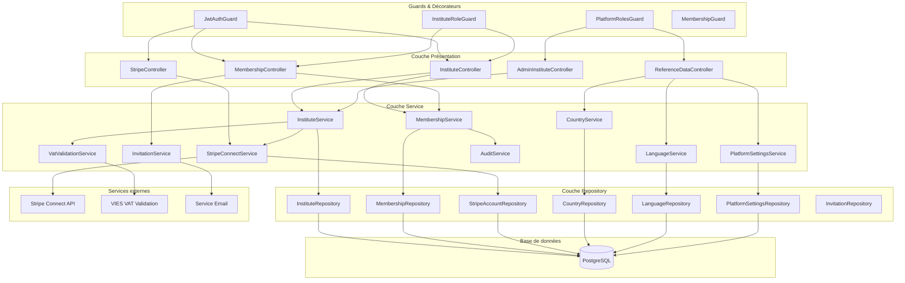
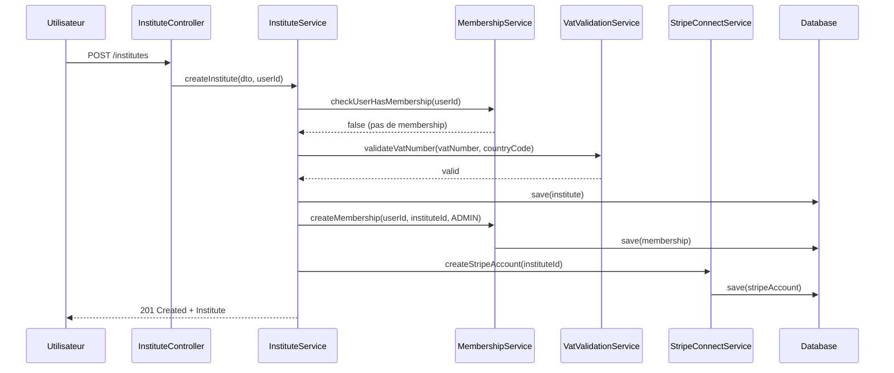
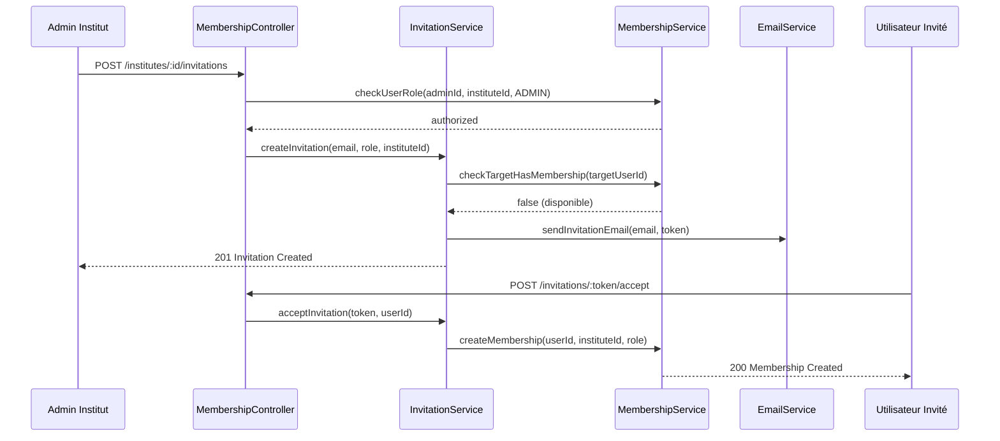
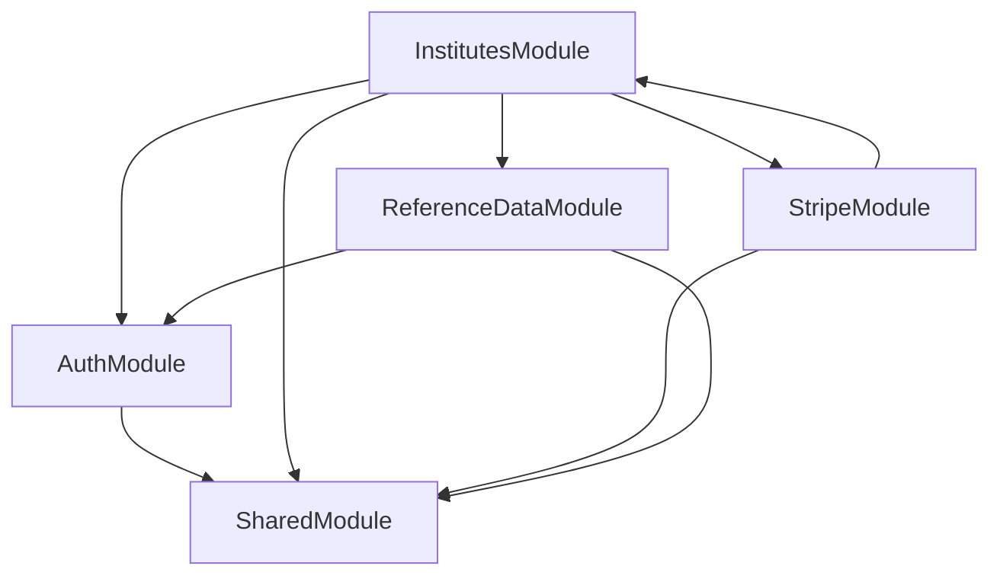

# Document de Conception - Module Gestion des Instituts

## Vue d'ensemble

Ce document décrit l'architecture et la conception technique du module de gestion des instituts pour la plateforme de gestion d'inscriptions aux tests de langues. Le module couvre la création et gestion des instituts, la gestion des membres avec leurs rôles, l'intégration Stripe Connect pour les paiements, et les données de référence (Country, Language, PlatformSettings).

L'architecture suit les principes de NestJS avec une séparation claire entre les couches contrôleur, service et repository. Le module dépend du module authentification-utilisateurs pour la gestion des utilisateurs et des JWT.

**Points clés de l'architecture :**
- Guards personnalisés pour les permissions institut (InstituteRoleGuard)
- Intégration Stripe Connect avec gestion des webhooks
- Validation des numéros de TVA européens
- Contrainte d'appartenance unique via InstituteMembership
- Données de référence centralisées (Country, Language, PlatformSettings)

## Architecture



### Flux de création d'institut



### Flux d'invitation de membre



## Composants et Interfaces

### InstituteController

```typescript
@Controller('institutes')
@UseGuards(JwtAuthGuard)
export class InstituteController {
  // Création d'un institut
  @Post()
  async createInstitute(
    @Body() dto: CreateInstituteDto,
    @CurrentUser() user: User
  ): Promise<InstituteResponseDto>;
  
  // Liste des instituts (public)
  @Get()
  @Public()
  async listInstitutes(
    @Query() query: ListInstitutesQueryDto
  ): Promise<PaginatedResult<InstituteListDto>>;
  
  // Détails d'un institut
  @Get(':id')
  async getInstitute(@Param('id') id: string): Promise<InstituteDetailDto>;
  
  // Mise à jour de l'institut (ADMIN institut requis)
  @Patch(':id')
  @UseGuards(InstituteRoleGuard)
  @InstituteRoles(InstituteRoleEnum.ADMIN)
  async updateInstitute(
    @Param('id') id: string,
    @Body() dto: UpdateInstituteDto
  ): Promise<InstituteResponseDto>;
  
  // Mon institut (pour le membre connecté)
  @Get('me/institute')
  async getMyInstitute(@CurrentUser() user: User): Promise<InstituteDetailDto>;
}
```

### MembershipController

```typescript
@Controller('institutes/:instituteId/members')
@UseGuards(JwtAuthGuard, InstituteRoleGuard)
export class MembershipController {
  // Liste des membres de l'institut
  @Get()
  @InstituteRoles(InstituteRoleEnum.ADMIN, InstituteRoleEnum.TEACHER, InstituteRoleEnum.STAFF)
  async listMembers(
    @Param('instituteId') instituteId: string
  ): Promise<MembershipListDto[]>;
  
  // Modifier le rôle d'un membre
  @Patch(':memberId/role')
  @InstituteRoles(InstituteRoleEnum.ADMIN)
  async updateMemberRole(
    @Param('instituteId') instituteId: string,
    @Param('memberId') memberId: string,
    @Body() dto: UpdateMemberRoleDto
  ): Promise<MembershipResponseDto>;
  
  // Retirer un membre
  @Delete(':memberId')
  @InstituteRoles(InstituteRoleEnum.ADMIN)
  async removeMember(
    @Param('instituteId') instituteId: string,
    @Param('memberId') memberId: string
  ): Promise<{ message: string }>;
  
  // Quitter l'institut (pour soi-même)
  @Delete('me')
  async leaveInstitute(
    @Param('instituteId') instituteId: string,
    @CurrentUser() user: User
  ): Promise<{ message: string }>;
}
```

### InvitationController

```typescript
@Controller('institutes/:instituteId/invitations')
@UseGuards(JwtAuthGuard)
export class InvitationController {
  // Envoyer une invitation
  @Post()
  @UseGuards(InstituteRoleGuard)
  @InstituteRoles(InstituteRoleEnum.ADMIN)
  async sendInvitation(
    @Param('instituteId') instituteId: string,
    @Body() dto: SendInvitationDto
  ): Promise<InvitationResponseDto>;
  
  // Liste des invitations en attente
  @Get()
  @UseGuards(InstituteRoleGuard)
  @InstituteRoles(InstituteRoleEnum.ADMIN)
  async listPendingInvitations(
    @Param('instituteId') instituteId: string
  ): Promise<InvitationListDto[]>;
  
  // Annuler une invitation
  @Delete(':invitationId')
  @UseGuards(InstituteRoleGuard)
  @InstituteRoles(InstituteRoleEnum.ADMIN)
  async cancelInvitation(
    @Param('invitationId') invitationId: string
  ): Promise<{ message: string }>;
}

@Controller('invitations')
@UseGuards(JwtAuthGuard)
export class UserInvitationController {
  // Mes invitations en attente
  @Get('me')
  async getMyInvitations(@CurrentUser() user: User): Promise<InvitationListDto[]>;
  
  // Accepter une invitation
  @Post(':token/accept')
  async acceptInvitation(
    @Param('token') token: string,
    @CurrentUser() user: User
  ): Promise<MembershipResponseDto>;
  
  // Refuser une invitation
  @Post(':token/decline')
  async declineInvitation(@Param('token') token: string): Promise<{ message: string }>;
}
```

### StripeController

```typescript
@Controller('institutes/:instituteId/stripe')
@UseGuards(JwtAuthGuard, InstituteRoleGuard)
@InstituteRoles(InstituteRoleEnum.ADMIN)
export class StripeController {
  // Initier l'onboarding Stripe
  @Post('onboarding')
  async initiateOnboarding(
    @Param('instituteId') instituteId: string,
    @Body() dto: StripeOnboardingDto
  ): Promise<{ onboardingUrl: string }>;
  
  // Statut du compte Stripe
  @Get('status')
  async getStripeStatus(
    @Param('instituteId') instituteId: string
  ): Promise<StripeStatusDto>;
  
  // Lien vers le dashboard Stripe
  @Get('dashboard-link')
  async getDashboardLink(
    @Param('instituteId') instituteId: string
  ): Promise<{ dashboardUrl: string }>;
}

@Controller('webhooks/stripe')
export class StripeWebhookController {
  // Endpoint pour les webhooks Stripe
  @Post()
  @Public()
  async handleWebhook(
    @Headers('stripe-signature') signature: string,
    @Req() request: RawBodyRequest<Request>
  ): Promise<{ received: boolean }>;
}
```

### ReferenceDataController

```typescript
@Controller('reference')
export class ReferenceDataController {
  // === COUNTRIES ===
  @Get('countries')
  async listCountries(): Promise<CountryListDto[]>;
  
  @Get('countries/:id')
  async getCountry(@Param('id') id: string): Promise<CountryDetailDto>;
  
  @Post('countries')
  @UseGuards(JwtAuthGuard, PlatformRolesGuard)
  @PlatformRoles(PlatformRoleEnum.ADMIN)
  async createCountry(@Body() dto: CreateCountryDto): Promise<CountryResponseDto>;
  
  @Patch('countries/:id')
  @UseGuards(JwtAuthGuard, PlatformRolesGuard)
  @PlatformRoles(PlatformRoleEnum.ADMIN)
  async updateCountry(
    @Param('id') id: string,
    @Body() dto: UpdateCountryDto
  ): Promise<CountryResponseDto>;
  
  @Delete('countries/:id')
  @UseGuards(JwtAuthGuard, PlatformRolesGuard)
  @PlatformRoles(PlatformRoleEnum.ADMIN)
  async deleteCountry(@Param('id') id: string): Promise<{ message: string }>;
  
  // === LANGUAGES ===
  @Get('languages')
  async listLanguages(): Promise<LanguageListDto[]>;
  
  @Get('languages/:id')
  async getLanguage(@Param('id') id: string): Promise<LanguageDetailDto>;
  
  @Post('languages')
  @UseGuards(JwtAuthGuard, PlatformRolesGuard)
  @PlatformRoles(PlatformRoleEnum.ADMIN)
  async createLanguage(@Body() dto: CreateLanguageDto): Promise<LanguageResponseDto>;
  
  @Patch('languages/:id')
  @UseGuards(JwtAuthGuard, PlatformRolesGuard)
  @PlatformRoles(PlatformRoleEnum.ADMIN)
  async updateLanguage(
    @Param('id') id: string,
    @Body() dto: UpdateLanguageDto
  ): Promise<LanguageResponseDto>;
  
  @Delete('languages/:id')
  @UseGuards(JwtAuthGuard, PlatformRolesGuard)
  @PlatformRoles(PlatformRoleEnum.ADMIN)
  async deleteLanguage(@Param('id') id: string): Promise<{ message: string }>;
  
  // === PLATFORM SETTINGS ===
  @Get('platform-settings')
  @UseGuards(JwtAuthGuard, PlatformRolesGuard)
  @PlatformRoles(PlatformRoleEnum.ADMIN)
  async getPlatformSettings(): Promise<PlatformSettingsDto>;
  
  @Patch('platform-settings')
  @UseGuards(JwtAuthGuard, PlatformRolesGuard)
  @PlatformRoles(PlatformRoleEnum.ADMIN)
  async updatePlatformSettings(
    @Body() dto: UpdatePlatformSettingsDto
  ): Promise<PlatformSettingsDto>;
}
```

### AdminInstituteController

```typescript
@Controller('admin/institutes')
@UseGuards(JwtAuthGuard, PlatformRolesGuard)
@PlatformRoles(PlatformRoleEnum.ADMIN)
export class AdminInstituteController {
  // Liste de tous les instituts (admin plateforme)
  @Get()
  async listAllInstitutes(
    @Query() query: AdminListInstitutesQueryDto
  ): Promise<PaginatedResult<AdminInstituteListDto>>;
  
  // Détails complets d'un institut
  @Get(':id')
  async getInstituteDetails(@Param('id') id: string): Promise<AdminInstituteDetailDto>;
  
  // Modifier le taux de commission personnalisé
  @Patch(':id/commission')
  async updateCommissionRate(
    @Param('id') id: string,
    @Body() dto: UpdateCommissionRateDto
  ): Promise<InstituteResponseDto>;
  
  // Désactiver un institut
  @Post(':id/deactivate')
  async deactivateInstitute(@Param('id') id: string): Promise<{ message: string }>;
  
  // Réactiver un institut
  @Post(':id/reactivate')
  async reactivateInstitute(@Param('id') id: string): Promise<{ message: string }>;
}
```

### Services

#### InstituteService

```typescript
@Injectable()
export class InstituteService {
  async createInstitute(dto: CreateInstituteDto, userId: string): Promise<Institute>;
  async getInstituteById(id: string): Promise<Institute>;
  async updateInstitute(id: string, dto: UpdateInstituteDto): Promise<Institute>;
  async listInstitutes(query: ListInstitutesQueryDto): Promise<PaginatedResult<Institute>>;
  async searchInstitutes(searchTerm: string, countryId?: string): Promise<Institute[]>;
  async getInstituteByUserId(userId: string): Promise<Institute | null>;
  async deactivateInstitute(id: string): Promise<void>;
  async reactivateInstitute(id: string): Promise<void>;
  async updateCommissionRate(id: string, rate: number | null): Promise<Institute>;
  async getEffectiveCommissionRate(instituteId: string): Promise<number>;
}
```

#### MembershipService

```typescript
@Injectable()
export class MembershipService {
  async createMembership(userId: string, instituteId: string, role: InstituteRoleEnum): Promise<InstituteMembership>;
  async getMembershipByUserId(userId: string): Promise<InstituteMembership | null>;
  async getMembershipsByInstituteId(instituteId: string): Promise<InstituteMembership[]>;
  async updateMemberRole(membershipId: string, newRole: InstituteRoleEnum): Promise<InstituteMembership>;
  async removeMembership(membershipId: string): Promise<void>;
  async checkUserHasMembership(userId: string): Promise<boolean>;
  async checkUserRoleInInstitute(userId: string, instituteId: string, requiredRoles: InstituteRoleEnum[]): Promise<boolean>;
  async getAdminCountForInstitute(instituteId: string): Promise<number>;
  async canUserLeaveInstitute(userId: string, instituteId: string): Promise<boolean>;
}
```

#### InvitationService

```typescript
@Injectable()
export class InvitationService {
  async createInvitation(instituteId: string, email: string, role: InstituteRoleEnum): Promise<Invitation>;
  async getInvitationByToken(token: string): Promise<Invitation | null>;
  async getPendingInvitationsByInstitute(instituteId: string): Promise<Invitation[]>;
  async getPendingInvitationsByEmail(email: string): Promise<Invitation[]>;
  async acceptInvitation(token: string, userId: string): Promise<InstituteMembership>;
  async declineInvitation(token: string): Promise<void>;
  async cancelInvitation(invitationId: string): Promise<void>;
  async cleanupExpiredInvitations(): Promise<number>;
}
```

#### StripeConnectService

```typescript
@Injectable()
export class StripeConnectService {
  async createStripeAccount(instituteId: string): Promise<StripeAccount>;
  async generateOnboardingLink(instituteId: string, returnUrl: string, refreshUrl: string): Promise<string>;
  async getStripeAccountStatus(instituteId: string): Promise<StripeStatusDto>;
  async generateDashboardLink(instituteId: string): Promise<string>;
  async handleAccountUpdatedWebhook(event: Stripe.Event): Promise<void>;
  async isAccountActivated(instituteId: string): Promise<boolean>;
  async getStripeAccountByInstituteId(instituteId: string): Promise<StripeAccount | null>;
}
```

#### VatValidationService

```typescript
@Injectable()
export class VatValidationService {
  async validateVatNumber(vatNumber: string, countryCode: string): Promise<VatValidationResult>;
  async getVatPattern(countryCode: string): RegExp;
  async formatVatNumber(vatNumber: string, countryCode: string): string;
}

export interface VatValidationResult {
  isValid: boolean;
  formattedNumber?: string;
  errorMessage?: string;
}
```

#### CountryService

```typescript
@Injectable()
export class CountryService {
  async createCountry(dto: CreateCountryDto): Promise<Country>;
  async getCountryById(id: string): Promise<Country>;
  async getCountryByCode(cca2: string): Promise<Country>;
  async updateCountry(id: string, dto: UpdateCountryDto): Promise<Country>;
  async deleteCountry(id: string): Promise<void>;
  async listCountries(): Promise<Country[]>;
  async addLanguageToCountry(countryId: string, languageId: string): Promise<void>;
  async removeLanguageFromCountry(countryId: string, languageId: string): Promise<void>;
}
```

#### LanguageService

```typescript
@Injectable()
export class LanguageService {
  async createLanguage(dto: CreateLanguageDto): Promise<Language>;
  async getLanguageById(id: string): Promise<Language>;
  async getLanguageByCode(code: string): Promise<Language>;
  async updateLanguage(id: string, dto: UpdateLanguageDto): Promise<Language>;
  async deleteLanguage(id: string): Promise<void>;
  async listLanguages(): Promise<Language[]>;
}
```

#### PlatformSettingsService

```typescript
@Injectable()
export class PlatformSettingsService {
  async getSettings(): Promise<PlatformSettings>;
  async updateSettings(dto: UpdatePlatformSettingsDto): Promise<PlatformSettings>;
  async getDefaultCommissionRate(): Promise<number>;
  async getPlatformVAT(): Promise<number>;
  async initializeSettings(): Promise<PlatformSettings>; // Appelé au démarrage si pas de settings
}
```

## Modèles de données

### Entité Institute

```typescript
@Entity('institutes')
export class Institute implements Contactable {
  @PrimaryGeneratedColumn('uuid')
  id: string;

  @Column()
  label: string;

  @Column({ nullable: true })
  siteweb: string;

  @Column({ type: 'jsonb', nullable: true })
  socialNetworks: Record<string, string>; // { facebook: url, linkedin: url, ... }

  @Column(() => ContactInfo)
  address: ContactInfo;

  @ManyToOne(() => Country, { eager: true })
  @JoinColumn({ name: 'country_id' })
  country: Country;

  @Column({ nullable: true })
  vatNumber: string;

  @Column({ type: 'decimal', precision: 5, scale: 2, nullable: true })
  customCommissionRate: number | null;

  @Column({ default: true })
  isActive: boolean;

  @Column({ type: 'timestamp', default: () => 'CURRENT_TIMESTAMP' })
  createdAt: Date;

  @Column({ type: 'timestamp', default: () => 'CURRENT_TIMESTAMP', onUpdate: 'CURRENT_TIMESTAMP' })
  updatedAt: Date;

  // Relations
  @OneToMany(() => InstituteMembership, (membership) => membership.institute)
  memberships: InstituteMembership[];

  @OneToOne(() => StripeAccount, (stripe) => stripe.institute)
  stripeAccount: StripeAccount;

  // Implémentation Contactable
  getName(): string {
    return this.label;
  }
  getAddress(): string {
    return this.address?.address1 || '';
  }
  getZipcode(): string {
    return this.address?.zipcode || '';
  }
  getCity(): string {
    return this.address?.city || '';
  }
  getCountry(): string {
    return this.country?.commonName || '';
  }
}
```

### Entité InstituteMembership

```typescript
@Entity('institute_memberships')
@Unique(['user']) // Un utilisateur ne peut avoir qu'une seule membership
export class InstituteMembership {
  @PrimaryGeneratedColumn('uuid')
  id: string;

  @Column({ type: 'enum', enum: InstituteRoleEnum })
  role: InstituteRoleEnum;

  @Column({ type: 'timestamp', default: () => 'CURRENT_TIMESTAMP' })
  since: Date;

  @ManyToOne(() => User, { eager: true })
  @JoinColumn({ name: 'user_id' })
  user: User;

  @ManyToOne(() => Institute, (institute) => institute.memberships, { onDelete: 'CASCADE' })
  @JoinColumn({ name: 'institute_id' })
  institute: Institute;
}

export enum InstituteRoleEnum {
  ADMIN = 'ADMIN',
  TEACHER = 'TEACHER',
  STAFF = 'STAFF',
}
```

### Entité StripeAccount

```typescript
@Entity('stripe_accounts')
export class StripeAccount {
  @PrimaryGeneratedColumn('uuid')
  id: string;

  @Column({ unique: true })
  stripeId: string; // acct_xxxxx

  @Column({ default: false })
  isActivated: boolean;

  @Column({ type: 'jsonb', nullable: true })
  capabilities: Record<string, string>; // { card_payments: 'active', transfers: 'active' }

  @Column({ type: 'timestamp', default: () => 'CURRENT_TIMESTAMP' })
  createdAt: Date;

  @Column({ type: 'timestamp', default: () => 'CURRENT_TIMESTAMP', onUpdate: 'CURRENT_TIMESTAMP' })
  updatedAt: Date;

  @OneToOne(() => Institute, (institute) => institute.stripeAccount, { onDelete: 'CASCADE' })
  @JoinColumn({ name: 'institute_id' })
  institute: Institute;
}
```

### Entité Invitation

```typescript
@Entity('institute_invitations')
@Index(['token'])
@Index(['email', 'institute'])
export class Invitation {
  @PrimaryGeneratedColumn('uuid')
  id: string;

  @Column()
  email: string;

  @Column({ type: 'enum', enum: InstituteRoleEnum })
  role: InstituteRoleEnum;

  @Column({ unique: true })
  token: string;

  @Column({ type: 'enum', enum: InvitationStatusEnum, default: InvitationStatusEnum.PENDING })
  status: InvitationStatusEnum;

  @Column({ type: 'timestamp' })
  expiresAt: Date;

  @Column({ type: 'timestamp', default: () => 'CURRENT_TIMESTAMP' })
  createdAt: Date;

  @ManyToOne(() => Institute, { onDelete: 'CASCADE' })
  @JoinColumn({ name: 'institute_id' })
  institute: Institute;

  @ManyToOne(() => User)
  @JoinColumn({ name: 'invited_by_id' })
  invitedBy: User;
}

export enum InvitationStatusEnum {
  PENDING = 'PENDING',
  ACCEPTED = 'ACCEPTED',
  DECLINED = 'DECLINED',
  EXPIRED = 'EXPIRED',
  CANCELLED = 'CANCELLED',
}
```

### Entité Country

```typescript
@Entity('countries')
export class Country {
  @PrimaryGeneratedColumn('uuid')
  id: string;

  @Column()
  commonName: string;

  @Column({ nullable: true })
  demonyms: string;

  @Column({ nullable: true })
  flag: string; // emoji ou URL

  @Column({ nullable: true })
  currencies: string; // EUR, USD, etc.

  @Column({ length: 2, unique: true })
  cca2: string; // FR, DE, ES

  @Column({ length: 3, unique: true })
  cca3: string; // FRA, DEU, ESP

  @Column({ nullable: true })
  callingCodes: string; // +33, +49

  // Relation many-to-many avec Language
  @ManyToMany(() => Language, (language) => language.countries)
  @JoinTable({
    name: 'country_languages',
    joinColumn: { name: 'country_id' },
    inverseJoinColumn: { name: 'language_id' },
  })
  languages: Language[];
}
```

### Entité Language

```typescript
@Entity('languages')
export class Language {
  @PrimaryGeneratedColumn('uuid')
  id: string;

  @Column({ unique: true })
  code: string; // fr, en, de, ja

  @Column()
  name: string; // French, English, German, Japanese

  @Column()
  native: string; // Français, English, Deutsch, 日本語

  @ManyToMany(() => Country, (country) => country.languages)
  countries: Country[];
}
```

### Entité PlatformSettings

```typescript
@Entity('platform_settings')
export class PlatformSettings {
  @PrimaryGeneratedColumn('uuid')
  id: string;

  @Column({ type: 'decimal', precision: 5, scale: 2, default: 10.00 })
  defaultCommissionRate: number; // Pourcentage par défaut

  @Column({ type: 'decimal', precision: 5, scale: 2, default: 20.00 })
  platformVAT: number; // TVA de la plateforme

  @ManyToOne(() => Country, { eager: true, nullable: true })
  @JoinColumn({ name: 'country_id' })
  country: Country; // Pays de la plateforme

  @Column({ type: 'timestamp', default: () => 'CURRENT_TIMESTAMP' })
  updatedAt: Date;
}
```

### Value Object ContactInfo

```typescript
@Embeddable()
export class ContactInfo {
  @Column({ nullable: true })
  address1: string;

  @Column({ nullable: true })
  address2: string;

  @Column({ nullable: true })
  zipcode: string;

  @Column({ nullable: true })
  city: string;
}
```

### Interface Contactable

```typescript
export interface Contactable {
  getName(): string;
  getAddress(): string;
  getZipcode(): string;
  getCity(): string;
  getCountry(): string;
}
```

### DTOs

```typescript
// === INSTITUTE DTOs ===
export class CreateInstituteDto {
  @IsString()
  @IsNotEmpty()
  label: string;

  @IsString()
  @IsOptional()
  siteweb?: string;

  @IsObject()
  @IsOptional()
  socialNetworks?: Record<string, string>;

  @ValidateNested()
  @Type(() => ContactInfoDto)
  address: ContactInfoDto;

  @IsUUID()
  countryId: string;

  @IsString()
  @IsNotEmpty()
  vatNumber: string;
}

export class UpdateInstituteDto {
  @IsString()
  @IsOptional()
  label?: string;

  @IsString()
  @IsOptional()
  siteweb?: string;

  @IsObject()
  @IsOptional()
  socialNetworks?: Record<string, string>;

  @ValidateNested()
  @IsOptional()
  @Type(() => ContactInfoDto)
  address?: ContactInfoDto;

  @IsUUID()
  @IsOptional()
  countryId?: string;

  @IsString()
  @IsOptional()
  vatNumber?: string;
}

export class ContactInfoDto {
  @IsString()
  @IsOptional()
  address1?: string;

  @IsString()
  @IsOptional()
  address2?: string;

  @IsString()
  @IsOptional()
  zipcode?: string;

  @IsString()
  @IsOptional()
  city?: string;
}

// === MEMBERSHIP DTOs ===
export class SendInvitationDto {
  @IsEmail()
  email: string;

  @IsEnum(InstituteRoleEnum)
  role: InstituteRoleEnum;
}

export class UpdateMemberRoleDto {
  @IsEnum(InstituteRoleEnum)
  role: InstituteRoleEnum;
}

// === COMMISSION DTOs ===
export class UpdateCommissionRateDto {
  @IsNumber()
  @Min(0)
  @Max(100)
  @IsOptional()
  customCommissionRate: number | null;
}

// === REFERENCE DATA DTOs ===
export class CreateCountryDto {
  @IsString()
  @IsNotEmpty()
  commonName: string;

  @IsString()
  @IsOptional()
  demonyms?: string;

  @IsString()
  @IsOptional()
  flag?: string;

  @IsString()
  @IsOptional()
  currencies?: string;

  @IsString()
  @Length(2, 2)
  cca2: string;

  @IsString()
  @Length(3, 3)
  cca3: string;

  @IsString()
  @IsOptional()
  callingCodes?: string;
}

export class CreateLanguageDto {
  @IsString()
  @IsNotEmpty()
  code: string;

  @IsString()
  @IsNotEmpty()
  name: string;

  @IsString()
  @IsNotEmpty()
  native: string;
}

export class UpdatePlatformSettingsDto {
  @IsNumber()
  @Min(0)
  @Max(100)
  @IsOptional()
  defaultCommissionRate?: number;

  @IsNumber()
  @Min(0)
  @Max(100)
  @IsOptional()
  platformVAT?: number;

  @IsUUID()
  @IsOptional()
  countryId?: string;
}

// === STRIPE DTOs ===
export class StripeOnboardingDto {
  @IsUrl()
  returnUrl: string;

  @IsUrl()
  refreshUrl: string;
}

export class StripeStatusDto {
  stripeId: string;
  isActivated: boolean;
  capabilities: Record<string, string>;
  detailsSubmitted: boolean;
  chargesEnabled: boolean;
  payoutsEnabled: boolean;
}
```

## Guards et Décorateurs

### InstituteRoleGuard

```typescript
@Injectable()
export class InstituteRoleGuard implements CanActivate {
  constructor(
    private reflector: Reflector,
    private membershipService: MembershipService,
  ) {}

  async canActivate(context: ExecutionContext): Promise<boolean> {
    const requiredRoles = this.reflector.getAllAndOverride<InstituteRoleEnum[]>(
      INSTITUTE_ROLES_KEY,
      [context.getHandler(), context.getClass()],
    );
    
    if (!requiredRoles) {
      return true;
    }

    const request = context.switchToHttp().getRequest();
    const user = request.user;
    const instituteId = request.params.instituteId || request.params.id;

    if (!instituteId) {
      throw new BadRequestException('Institute ID requis');
    }

    // Les admins plateforme ont accès à tout
    if (user.platformRole === PlatformRoleEnum.ADMIN) {
      return true;
    }

    return this.membershipService.checkUserRoleInInstitute(
      user.id,
      instituteId,
      requiredRoles,
    );
  }
}
```

### Décorateurs personnalisés

```typescript
// Décorateur pour les rôles institut
export const INSTITUTE_ROLES_KEY = 'instituteRoles';
export const InstituteRoles = (...roles: InstituteRoleEnum[]) =>
  SetMetadata(INSTITUTE_ROLES_KEY, roles);

// Décorateur pour les rôles plateforme
export const PLATFORM_ROLES_KEY = 'platformRoles';
export const PlatformRoles = (...roles: PlatformRoleEnum[]) =>
  SetMetadata(PLATFORM_ROLES_KEY, roles);

// Décorateur pour récupérer l'utilisateur courant
export const CurrentUser = createParamDecorator(
  (data: unknown, ctx: ExecutionContext) => {
    const request = ctx.switchToHttp().getRequest();
    return request.user;
  },
);

// Décorateur pour les endpoints publics
export const IS_PUBLIC_KEY = 'isPublic';
export const Public = () => SetMetadata(IS_PUBLIC_KEY, true);
```

## Validation TVA Européenne

### Patterns de validation par pays

```typescript
export const VAT_PATTERNS: Record<string, RegExp> = {
  AT: /^ATU\d{8}$/,           // Autriche
  BE: /^BE0\d{9}$/,           // Belgique
  BG: /^BG\d{9,10}$/,         // Bulgarie
  CY: /^CY\d{8}[A-Z]$/,       // Chypre
  CZ: /^CZ\d{8,10}$/,         // République tchèque
  DE: /^DE\d{9}$/,            // Allemagne
  DK: /^DK\d{8}$/,            // Danemark
  EE: /^EE\d{9}$/,            // Estonie
  EL: /^EL\d{9}$/,            // Grèce
  ES: /^ES[A-Z0-9]\d{7}[A-Z0-9]$/, // Espagne
  FI: /^FI\d{8}$/,            // Finlande
  FR: /^FR[A-Z0-9]{2}\d{9}$/, // France
  HR: /^HR\d{11}$/,           // Croatie
  HU: /^HU\d{8}$/,            // Hongrie
  IE: /^IE\d{7}[A-Z]{1,2}$/,  // Irlande
  IT: /^IT\d{11}$/,           // Italie
  LT: /^LT(\d{9}|\d{12})$/,   // Lituanie
  LU: /^LU\d{8}$/,            // Luxembourg
  LV: /^LV\d{11}$/,           // Lettonie
  MT: /^MT\d{8}$/,            // Malte
  NL: /^NL\d{9}B\d{2}$/,      // Pays-Bas
  PL: /^PL\d{10}$/,           // Pologne
  PT: /^PT\d{9}$/,            // Portugal
  RO: /^RO\d{2,10}$/,         // Roumanie
  SE: /^SE\d{12}$/,           // Suède
  SI: /^SI\d{8}$/,            // Slovénie
  SK: /^SK\d{10}$/,           // Slovaquie
};
```

### VatValidationService Implementation

```typescript
@Injectable()
export class VatValidationService {
  async validateVatNumber(vatNumber: string, countryCode: string): Promise<VatValidationResult> {
    // Normaliser le numéro (supprimer espaces et tirets)
    const normalizedVat = vatNumber.replace(/[\s-]/g, '').toUpperCase();
    
    // Vérifier le pattern selon le pays
    const pattern = VAT_PATTERNS[countryCode.toUpperCase()];
    if (!pattern) {
      return {
        isValid: false,
        errorMessage: `Pays non supporté pour la validation TVA: ${countryCode}`,
      };
    }
    
    if (!pattern.test(normalizedVat)) {
      return {
        isValid: false,
        errorMessage: `Format de TVA invalide pour ${countryCode}. Format attendu: ${this.getExpectedFormat(countryCode)}`,
      };
    }
    
    return {
      isValid: true,
      formattedNumber: normalizedVat,
    };
  }
  
  private getExpectedFormat(countryCode: string): string {
    const formats: Record<string, string> = {
      FR: 'FRXX999999999 (XX = 2 caractères, 9 chiffres)',
      DE: 'DE999999999 (9 chiffres)',
      ES: 'ESX9999999X (X = lettre ou chiffre)',
      IT: 'IT99999999999 (11 chiffres)',
      // ... autres formats
    };
    return formats[countryCode] || 'Voir documentation';
  }
}
```

## Intégration Stripe Connect

### Configuration Stripe

```typescript
// stripe.config.ts
export const stripeConfig = {
  apiKey: process.env.STRIPE_SECRET_KEY,
  webhookSecret: process.env.STRIPE_WEBHOOK_SECRET,
  connectAccountType: 'standard' as const, // ou 'express'
};

// stripe.module.ts
@Module({
  providers: [
    {
      provide: 'STRIPE_CLIENT',
      useFactory: () => new Stripe(stripeConfig.apiKey, { apiVersion: '2023-10-16' }),
    },
    StripeConnectService,
  ],
  exports: [StripeConnectService],
})
export class StripeModule {}
```

### Gestion des webhooks Stripe

```typescript
@Injectable()
export class StripeConnectService {
  constructor(
    @Inject('STRIPE_CLIENT') private stripe: Stripe,
    @InjectRepository(StripeAccount)
    private stripeAccountRepository: Repository<StripeAccount>,
  ) {}

  async handleWebhook(signature: string, payload: Buffer): Promise<void> {
    const event = this.stripe.webhooks.constructEvent(
      payload,
      signature,
      stripeConfig.webhookSecret,
    );

    switch (event.type) {
      case 'account.updated':
        await this.handleAccountUpdated(event.data.object as Stripe.Account);
        break;
      case 'account.application.deauthorized':
        await this.handleAccountDeauthorized(event.data.object as Stripe.Account);
        break;
    }
  }

  private async handleAccountUpdated(account: Stripe.Account): Promise<void> {
    const stripeAccount = await this.stripeAccountRepository.findOne({
      where: { stripeId: account.id },
    });

    if (stripeAccount) {
      stripeAccount.isActivated = account.charges_enabled && account.payouts_enabled;
      stripeAccount.capabilities = account.capabilities as Record<string, string>;
      await this.stripeAccountRepository.save(stripeAccount);
    }
  }

  async generateOnboardingLink(
    instituteId: string,
    returnUrl: string,
    refreshUrl: string,
  ): Promise<string> {
    const stripeAccount = await this.getStripeAccountByInstituteId(instituteId);
    
    const accountLink = await this.stripe.accountLinks.create({
      account: stripeAccount.stripeId,
      refresh_url: refreshUrl,
      return_url: returnUrl,
      type: 'account_onboarding',
    });

    return accountLink.url;
  }
}
```

## Propriétés de Correction

*Une propriété est une caractéristique ou un comportement qui doit rester vrai pour toutes les exécutions valides du système. Les propriétés servent de pont entre les spécifications lisibles par l'humain et les garanties de correction vérifiables par la machine.*

### Property 1: Unicité de l'appartenance à un institut

*Pour tout* utilisateur de la plateforme, il ne peut exister qu'une seule InstituteMembership active à la fois. Toute tentative de créer une seconde membership doit être rejetée.

**Valide: Exigences 1.4, 7.1, 7.2**

### Property 2: Créateur devient ADMIN

*Pour tout* institut nouvellement créé, l'utilisateur créateur doit automatiquement recevoir une InstituteMembership avec le rôle ADMIN.

**Valide: Exigence 1.1**

### Property 3: Invariant - Au moins un ADMIN par institut

*Pour tout* institut actif, il doit toujours exister au moins un membre avec le rôle ADMIN. Toute opération (modification de rôle, révocation) qui violerait cette contrainte doit être rejetée.

**Valide: Exigences 4.3, 4.4, 5.3**

### Property 4: Validation TVA par pays

*Pour tout* numéro de TVA et code pays, la validation doit accepter uniquement les numéros conformes au pattern du pays. Un numéro valide pour un pays doit être rejeté s'il est soumis avec un autre pays.

**Valide: Exigences 1.2, 17.1, 17.2, 17.3**

### Property 5: Initialisation du StripeAccount

*Pour tout* institut créé avec succès, un StripeAccount doit être automatiquement créé avec isActivated à false.

**Valide: Exigences 1.5, 9.4**

### Property 6: Commission rate fallback

*Pour tout* institut, le taux de commission effectif doit être égal à customCommissionRate si défini, sinon à PlatformSettings.defaultCommissionRate.

**Valide: Exigences 1.3, 12.2, 12.3**

### Property 7: Permissions par rôle institut

*Pour tout* membre d'un institut, les opérations autorisées doivent correspondre exactement à son rôle:
- ADMIN: toutes les opérations
- TEACHER: consultation + assignation examinateur
- STAFF: consultation uniquement

**Valide: Exigences 8.1, 8.2, 8.3, 8.4**

### Property 8: Blocage sessions payantes sans Stripe activé

*Pour tout* institut dont le StripeAccount a isActivated à false, la création de sessions payantes doit être rejetée.

**Valide: Exigences 10.2**

### Property 9: Unicité des codes pays

*Pour tout* pays créé, les codes cca2 et cca3 doivent être uniques dans la base de données.

**Valide: Exigence 13.4**

### Property 10: Unicité du code langue

*Pour toute* langue créée, le code doit être unique dans la base de données.

**Valide: Exigence 14.4**

### Property 11: Singleton PlatformSettings

*Pour toute* opération sur PlatformSettings, il ne doit exister qu'une seule instance dans la base de données.

**Valide: Exigence 15.2**

### Property 12: Invitation - Cible sans membership existante

*Pour toute* invitation envoyée, si l'utilisateur cible possède déjà une InstituteMembership active, l'invitation doit être rejetée.

**Valide: Exigences 3.3, 3.5**

## Gestion des Erreurs

### Exceptions personnalisées

```typescript
// Institut
export class InstituteNotFoundException extends NotFoundException {
  constructor(id: string) {
    super(`Institut non trouvé: ${id}`);
  }
}

export class UserAlreadyHasMembershipException extends ConflictException {
  constructor() {
    super('L\'utilisateur appartient déjà à un institut');
  }
}

export class InvalidVatNumberException extends BadRequestException {
  constructor(vatNumber: string, countryCode: string, expectedFormat: string) {
    super(`Numéro de TVA invalide: ${vatNumber} pour le pays ${countryCode}. Format attendu: ${expectedFormat}`);
  }
}

// Membership
export class MembershipNotFoundException extends NotFoundException {
  constructor(id: string) {
    super(`Membership non trouvée: ${id}`);
  }
}

export class LastAdminCannotLeaveException extends ForbiddenException {
  constructor() {
    super('Le dernier administrateur ne peut pas quitter l\'institut');
  }
}

export class InsufficientInstituteRoleException extends ForbiddenException {
  constructor(requiredRoles: InstituteRoleEnum[]) {
    super(`Rôle insuffisant. Rôles requis: ${requiredRoles.join(', ')}`);
  }
}

// Invitation
export class InvitationNotFoundException extends NotFoundException {
  constructor(token: string) {
    super(`Invitation non trouvée ou expirée: ${token}`);
  }
}

export class InvitationExpiredException extends GoneException {
  constructor() {
    super('Cette invitation a expiré');
  }
}

export class UserAlreadyInvitedException extends ConflictException {
  constructor(email: string) {
    super(`Une invitation est déjà en attente pour: ${email}`);
  }
}

// Stripe
export class StripeAccountNotFoundException extends NotFoundException {
  constructor(instituteId: string) {
    super(`Compte Stripe non trouvé pour l\'institut: ${instituteId}`);
  }
}

export class StripeAccountNotActivatedException extends ForbiddenException {
  constructor() {
    super('Le compte Stripe n\'est pas activé. Veuillez compléter l\'onboarding.');
  }
}

export class InvalidStripeWebhookException extends BadRequestException {
  constructor() {
    super('Signature du webhook Stripe invalide');
  }
}

// Reference Data
export class CountryNotFoundException extends NotFoundException {
  constructor(id: string) {
    super(`Pays non trouvé: ${id}`);
  }
}

export class DuplicateCountryCodeException extends ConflictException {
  constructor(code: string) {
    super(`Un pays avec le code ${code} existe déjà`);
  }
}

export class LanguageNotFoundException extends NotFoundException {
  constructor(id: string) {
    super(`Langue non trouvée: ${id}`);
  }
}

export class DuplicateLanguageCodeException extends ConflictException {
  constructor(code: string) {
    super(`Une langue avec le code ${code} existe déjà`);
  }
}
```

## Stratégie de Tests

### Approche duale

Le module utilise une approche de test combinant:
- **Tests unitaires**: Pour les cas spécifiques, les edge cases et les conditions d'erreur
- **Tests de propriétés (PBT)**: Pour valider les propriétés universelles avec des données générées

### Configuration des tests de propriétés

```typescript
// Configuration fast-check pour les tests de propriétés
import fc from 'fast-check';

// Minimum 100 itérations par test de propriété
const PBT_CONFIG = {
  numRuns: 100,
  verbose: true,
};
```

### Générateurs de données

```typescript
// Générateur d'institut valide
const instituteArb = fc.record({
  label: fc.string({ minLength: 1, maxLength: 100 }),
  siteweb: fc.option(fc.webUrl()),
  vatNumber: fc.tuple(fc.constantFrom('FR', 'DE', 'ES', 'IT'), fc.string())
    .map(([country, _]) => generateValidVatForCountry(country)),
  countryCode: fc.constantFrom('FR', 'DE', 'ES', 'IT', 'BE', 'NL'),
});

// Générateur de membership
const membershipArb = fc.record({
  role: fc.constantFrom(
    InstituteRoleEnum.ADMIN,
    InstituteRoleEnum.TEACHER,
    InstituteRoleEnum.STAFF
  ),
});

// Générateur de numéro TVA par pays
const vatNumberArb = (countryCode: string) => {
  const generators: Record<string, fc.Arbitrary<string>> = {
    FR: fc.tuple(
      fc.stringOf(fc.constantFrom(...'ABCDEFGHIJKLMNOPQRSTUVWXYZ0123456789'.split('')), { minLength: 2, maxLength: 2 }),
      fc.stringOf(fc.constantFrom(...'0123456789'.split('')), { minLength: 9, maxLength: 9 })
    ).map(([prefix, digits]) => `FR${prefix}${digits}`),
    DE: fc.stringOf(fc.constantFrom(...'0123456789'.split('')), { minLength: 9, maxLength: 9 })
      .map(digits => `DE${digits}`),
    // ... autres pays
  };
  return generators[countryCode] || fc.constant('');
};
```

### Tests de propriétés à implémenter

Chaque propriété du document de conception doit être implémentée comme un test de propriété:

```typescript
// Feature: gestion-instituts, Property 1: Unicité de l'appartenance
describe('Property 1: Unicité membership', () => {
  it('un utilisateur ne peut avoir qu\'une seule membership', async () => {
    await fc.assert(
      fc.asyncProperty(userArb, instituteArb, instituteArb, async (user, inst1, inst2) => {
        // Créer première membership
        await membershipService.createMembership(user.id, inst1.id, InstituteRoleEnum.ADMIN);
        
        // Tenter de créer une seconde membership doit échouer
        await expect(
          membershipService.createMembership(user.id, inst2.id, InstituteRoleEnum.STAFF)
        ).rejects.toThrow(UserAlreadyHasMembershipException);
      }),
      PBT_CONFIG
    );
  });
});

// Feature: gestion-instituts, Property 3: Invariant au moins un ADMIN
describe('Property 3: Invariant ADMIN', () => {
  it('impossible de retirer le dernier ADMIN', async () => {
    await fc.assert(
      fc.asyncProperty(instituteWithSingleAdminArb, async (institute) => {
        const admin = institute.memberships.find(m => m.role === InstituteRoleEnum.ADMIN);
        
        await expect(
          membershipService.removeMembership(admin.id)
        ).rejects.toThrow(LastAdminCannotLeaveException);
      }),
      PBT_CONFIG
    );
  });
});

// Feature: gestion-instituts, Property 4: Validation TVA
describe('Property 4: Validation TVA', () => {
  it('TVA valide acceptée pour le bon pays', async () => {
    await fc.assert(
      fc.asyncProperty(
        fc.constantFrom('FR', 'DE', 'ES', 'IT'),
        async (countryCode) => {
          const validVat = await vatNumberArb(countryCode).generate();
          const result = await vatService.validateVatNumber(validVat, countryCode);
          expect(result.isValid).toBe(true);
        }
      ),
      PBT_CONFIG
    );
  });
  
  it('TVA valide rejetée pour mauvais pays', async () => {
    await fc.assert(
      fc.asyncProperty(
        fc.constantFrom('FR', 'DE', 'ES', 'IT'),
        fc.constantFrom('FR', 'DE', 'ES', 'IT'),
        async (vatCountry, submitCountry) => {
          fc.pre(vatCountry !== submitCountry); // Précondition: pays différents
          
          const validVat = await vatNumberArb(vatCountry).generate();
          const result = await vatService.validateVatNumber(validVat, submitCountry);
          expect(result.isValid).toBe(false);
        }
      ),
      PBT_CONFIG
    );
  });
});

// Feature: gestion-instituts, Property 6: Commission rate fallback
describe('Property 6: Commission fallback', () => {
  it('utilise customCommissionRate si défini, sinon defaultCommissionRate', async () => {
    await fc.assert(
      fc.asyncProperty(
        fc.option(fc.float({ min: 0, max: 100 })),
        fc.float({ min: 0, max: 100 }),
        async (customRate, defaultRate) => {
          // Setup
          await platformSettingsService.updateSettings({ defaultCommissionRate: defaultRate });
          const institute = await createInstituteWithCommission(customRate);
          
          // Test
          const effectiveRate = await instituteService.getEffectiveCommissionRate(institute.id);
          
          // Assertion
          const expected = customRate ?? defaultRate;
          expect(effectiveRate).toBeCloseTo(expected, 2);
        }
      ),
      PBT_CONFIG
    );
  });
});
```

### Tests unitaires complémentaires

Les tests unitaires couvrent les cas spécifiques et les edge cases:

```typescript
describe('InstituteService', () => {
  describe('createInstitute', () => {
    it('devrait créer un institut avec les données valides', async () => {
      // Test exemple spécifique
    });
    
    it('devrait rejeter si le numéro TVA est vide', async () => {
      // Edge case
    });
    
    it('devrait rejeter si le pays n\'existe pas', async () => {
      // Condition d'erreur
    });
  });
});

describe('StripeConnectService', () => {
  describe('handleWebhook', () => {
    it('devrait rejeter une signature invalide', async () => {
      // Test de sécurité
    });
    
    it('devrait activer le compte sur account.updated avec charges_enabled', async () => {
      // Test d'intégration mocké
    });
  });
});
```

## Structure des Modules NestJS

```
src/
├── institutes/
│   ├── institutes.module.ts
│   ├── controllers/
│   │   ├── institute.controller.ts
│   │   ├── membership.controller.ts
│   │   ├── invitation.controller.ts
│   │   └── admin-institute.controller.ts
│   ├── services/
│   │   ├── institute.service.ts
│   │   ├── membership.service.ts
│   │   ├── invitation.service.ts
│   │   └── vat-validation.service.ts
│   ├── entities/
│   │   ├── institute.entity.ts
│   │   ├── institute-membership.entity.ts
│   │   └── invitation.entity.ts
│   ├── dto/
│   │   ├── create-institute.dto.ts
│   │   ├── update-institute.dto.ts
│   │   ├── send-invitation.dto.ts
│   │   └── ...
│   ├── guards/
│   │   └── institute-role.guard.ts
│   ├── decorators/
│   │   └── institute-roles.decorator.ts
│   └── exceptions/
│       └── institute.exceptions.ts
│
├── stripe/
│   ├── stripe.module.ts
│   ├── controllers/
│   │   ├── stripe.controller.ts
│   │   └── stripe-webhook.controller.ts
│   ├── services/
│   │   └── stripe-connect.service.ts
│   └── entities/
│       └── stripe-account.entity.ts
│
├── reference-data/
│   ├── reference-data.module.ts
│   ├── controllers/
│   │   └── reference-data.controller.ts
│   ├── services/
│   │   ├── country.service.ts
│   │   ├── language.service.ts
│   │   └── platform-settings.service.ts
│   ├── entities/
│   │   ├── country.entity.ts
│   │   ├── language.entity.ts
│   │   └── platform-settings.entity.ts
│   └── dto/
│       ├── create-country.dto.ts
│       ├── create-language.dto.ts
│       └── update-platform-settings.dto.ts
│
└── shared/
    ├── interfaces/
    │   └── contactable.interface.ts
    ├── embeddables/
    │   └── contact-info.embeddable.ts
    └── decorators/
        ├── current-user.decorator.ts
        └── public.decorator.ts
```

## Dépendances entre Modules



## Configuration de l'Application

```typescript
// app.module.ts
@Module({
  imports: [
    ConfigModule.forRoot({ isGlobal: true }),
    TypeOrmModule.forRootAsync({
      useFactory: (config: ConfigService) => ({
        type: 'postgres',
        host: config.get('DB_HOST'),
        port: config.get('DB_PORT'),
        username: config.get('DB_USERNAME'),
        password: config.get('DB_PASSWORD'),
        database: config.get('DB_DATABASE'),
        entities: [__dirname + '/**/*.entity{.ts,.js}'],
        synchronize: config.get('NODE_ENV') !== 'production',
      }),
      inject: [ConfigService],
    }),
    AuthModule,
    InstitutesModule,
    StripeModule,
    ReferenceDataModule,
  ],
})
export class AppModule {}
```
