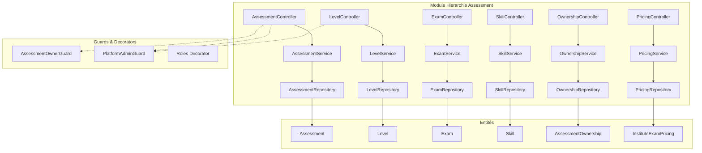
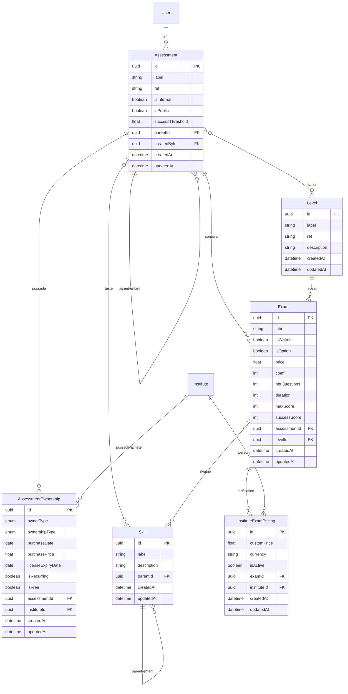

# Document de Conception - Module Hiérarchie Assessment

## Vue d'ensemble

Ce document décrit la conception technique du module de gestion hiérarchique des assessments pour une plateforme de tests de positionnement en langues. Le module implémente une architecture modulaire NestJS avec TypeORM et PostgreSQL, permettant la gestion des assessments avec héritage parent-enfant, les niveaux (Levels), les épreuves (Exams), les compétences (Skills), la propriété/achat entre instituts, et la tarification personnalisée.

### Dépendances

- **authentification-utilisateurs** : Authentification JWT, gestion des utilisateurs et PlatformRole
- **gestion-instituts** : Gestion des instituts, InstituteMembership et InstituteRole

### Principes de conception

1. **Héritage hiérarchique** : Les assessments enfants héritent automatiquement des Levels et Skills du parent
2. **Séparation propriétaire/acheteur** : Distinction claire entre OWNER (droits complets) et BUYER (droits limités)
3. **Tarification flexible** : Prix personnalisables par institut avec fallback sur le prix de base
4. **Validation stricte** : Contraintes métier validées au niveau service et entité

## Architecture



### Structure des modules

```
src/
├── assessment/
│   ├── assessment.module.ts
│   ├── controllers/
│   │   ├── assessment.controller.ts
│   │   ├── level.controller.ts
│   │   ├── exam.controller.ts
│   │   ├── skill.controller.ts
│   │   ├── ownership.controller.ts
│   │   └── pricing.controller.ts
│   ├── services/
│   │   ├── assessment.service.ts
│   │   ├── level.service.ts
│   │   ├── exam.service.ts
│   │   ├── skill.service.ts
│   │   ├── ownership.service.ts
│   │   └── pricing.service.ts
│   ├── entities/
│   │   ├── assessment.entity.ts
│   │   ├── level.entity.ts
│   │   ├── exam.entity.ts
│   │   ├── skill.entity.ts
│   │   ├── assessment-ownership.entity.ts
│   │   └── institute-exam-pricing.entity.ts
│   ├── dto/
│   │   ├── create-assessment.dto.ts
│   │   ├── update-assessment.dto.ts
│   │   ├── create-level.dto.ts
│   │   ├── create-exam.dto.ts
│   │   ├── create-skill.dto.ts
│   │   ├── create-ownership.dto.ts
│   │   └── create-pricing.dto.ts
│   ├── guards/
│   │   ├── assessment-owner.guard.ts
│   │   └── platform-admin.guard.ts
│   ├── enums/
│   │   ├── owner-type.enum.ts
│   │   └── ownership-type.enum.ts
│   └── interfaces/
│       └── price-calculation.interface.ts
```

## Composants et Interfaces

### AssessmentController

```typescript
@Controller('assessments')
@UseGuards(JwtAuthGuard)
export class AssessmentController {
  // GET /assessments - Liste paginée des assessments
  @Get()
  findAll(@Query() query: PaginationDto): Promise<PaginatedResult<Assessment>>;

  // GET /assessments/:id - Détail d'un assessment avec relations
  @Get(':id')
  findOne(@Param('id') id: string): Promise<Assessment>;

  // POST /assessments - Création d'un assessment
  @Post()
  @UseGuards(AssessmentOwnerGuard)
  create(@Body() dto: CreateAssessmentDto, @CurrentUser() user: User): Promise<Assessment>;

  // PATCH /assessments/:id - Modification d'un assessment
  @Patch(':id')
  @UseGuards(AssessmentOwnerGuard)
  update(@Param('id') id: string, @Body() dto: UpdateAssessmentDto): Promise<Assessment>;

  // DELETE /assessments/:id - Suppression d'un assessment
  @Delete(':id')
  @UseGuards(AssessmentOwnerGuard)
  remove(@Param('id') id: string): Promise<void>;

  // POST /assessments/:id/levels/:levelId - Association Level
  @Post(':id/levels/:levelId')
  @UseGuards(AssessmentOwnerGuard)
  addLevel(@Param('id') id: string, @Param('levelId') levelId: string): Promise<Assessment>;

  // DELETE /assessments/:id/levels/:levelId - Dissociation Level
  @Delete(':id/levels/:levelId')
  @UseGuards(AssessmentOwnerGuard)
  removeLevel(@Param('id') id: string, @Param('levelId') levelId: string): Promise<Assessment>;

  // POST /assessments/:id/skills/:skillId - Association Skill
  @Post(':id/skills/:skillId')
  @UseGuards(AssessmentOwnerGuard)
  addSkill(@Param('id') id: string, @Param('skillId') skillId: string): Promise<Assessment>;

  // DELETE /assessments/:id/skills/:skillId - Dissociation Skill
  @Delete(':id/skills/:skillId')
  @UseGuards(AssessmentOwnerGuard)
  removeSkill(@Param('id') id: string, @Param('skillId') skillId: string): Promise<Assessment>;
}
```

### LevelController

```typescript
@Controller('levels')
@UseGuards(JwtAuthGuard)
export class LevelController {
  // GET /levels - Liste de tous les niveaux
  @Get()
  findAll(): Promise<Level[]>;

  // GET /levels/:id - Détail d'un niveau
  @Get(':id')
  findOne(@Param('id') id: string): Promise<Level>;

  // POST /levels - Création d'un niveau (admin plateforme)
  @Post()
  @UseGuards(PlatformAdminGuard)
  create(@Body() dto: CreateLevelDto): Promise<Level>;

  // PATCH /levels/:id - Modification d'un niveau
  @Patch(':id')
  @UseGuards(PlatformAdminGuard)
  update(@Param('id') id: string, @Body() dto: UpdateLevelDto): Promise<Level>;

  // DELETE /levels/:id - Suppression d'un niveau
  @Delete(':id')
  @UseGuards(PlatformAdminGuard)
  remove(@Param('id') id: string): Promise<void>;
}
```

### ExamController

```typescript
@Controller('exams')
@UseGuards(JwtAuthGuard)
export class ExamController {
  // GET /exams - Liste des épreuves (filtrée par assessment)
  @Get()
  findAll(@Query('assessmentId') assessmentId?: string): Promise<Exam[]>;

  // GET /exams/:id - Détail d'une épreuve
  @Get(':id')
  findOne(@Param('id') id: string): Promise<Exam>;

  // POST /exams - Création d'une épreuve
  @Post()
  @UseGuards(AssessmentOwnerGuard)
  create(@Body() dto: CreateExamDto): Promise<Exam>;

  // PATCH /exams/:id - Modification d'une épreuve
  @Patch(':id')
  @UseGuards(AssessmentOwnerGuard)
  update(@Param('id') id: string, @Body() dto: UpdateExamDto): Promise<Exam>;

  // DELETE /exams/:id - Suppression d'une épreuve
  @Delete(':id')
  @UseGuards(AssessmentOwnerGuard)
  remove(@Param('id') id: string): Promise<void>;

  // POST /exams/:id/skills/:skillId - Association Skill
  @Post(':id/skills/:skillId')
  @UseGuards(AssessmentOwnerGuard)
  addSkill(@Param('id') id: string, @Param('skillId') skillId: string): Promise<Exam>;
}
```

### SkillController

```typescript
@Controller('skills')
@UseGuards(JwtAuthGuard)
export class SkillController {
  // GET /skills - Liste des compétences (avec hiérarchie)
  @Get()
  findAll(@Query('parentId') parentId?: string): Promise<Skill[]>;

  // GET /skills/:id - Détail d'une compétence avec enfants
  @Get(':id')
  findOne(@Param('id') id: string): Promise<Skill>;

  // POST /skills - Création d'une compétence
  @Post()
  create(@Body() dto: CreateSkillDto, @CurrentUser() user: User): Promise<Skill>;

  // PATCH /skills/:id - Modification d'une compétence
  @Patch(':id')
  update(@Param('id') id: string, @Body() dto: UpdateSkillDto): Promise<Skill>;

  // DELETE /skills/:id - Suppression d'une compétence (cascade)
  @Delete(':id')
  remove(@Param('id') id: string): Promise<void>;
}
```

### OwnershipController

```typescript
@Controller('assessment-ownerships')
@UseGuards(JwtAuthGuard)
export class OwnershipController {
  // GET /assessment-ownerships - Liste des propriétés/achats
  @Get()
  findAll(@Query('instituteId') instituteId?: string): Promise<AssessmentOwnership[]>;

  // POST /assessment-ownerships/purchase - Achat d'un assessment
  @Post('purchase')
  purchase(@Body() dto: PurchaseAssessmentDto, @CurrentUser() user: User): Promise<AssessmentOwnership>;

  // PATCH /assessment-ownerships/:id/license - Modification de licence (admin)
  @Patch(':id/license')
  @UseGuards(PlatformAdminGuard)
  updateLicense(@Param('id') id: string, @Body() dto: UpdateLicenseDto): Promise<AssessmentOwnership>;
}
```

### PricingController

```typescript
@Controller('institute-exam-pricing')
@UseGuards(JwtAuthGuard)
export class PricingController {
  // GET /institute-exam-pricing - Liste des prix personnalisés
  @Get()
  findAll(@Query('instituteId') instituteId: string): Promise<InstituteExamPricing[]>;

  // POST /institute-exam-pricing - Création d'un prix personnalisé
  @Post()
  create(@Body() dto: CreatePricingDto, @CurrentUser() user: User): Promise<InstituteExamPricing>;

  // PATCH /institute-exam-pricing/:id - Modification d'un prix
  @Patch(':id')
  update(@Param('id') id: string, @Body() dto: UpdatePricingDto): Promise<InstituteExamPricing>;

  // DELETE /institute-exam-pricing/:id - Suppression d'un prix personnalisé
  @Delete(':id')
  remove(@Param('id') id: string): Promise<void>;

  // POST /institute-exam-pricing/calculate - Calcul du prix total
  @Post('calculate')
  calculateTotal(@Body() dto: CalculatePriceDto): Promise<PriceCalculationResult>;
}
```

### AssessmentService

```typescript
@Injectable()
export class AssessmentService {
  constructor(
    @InjectRepository(Assessment)
    private assessmentRepository: Repository<Assessment>,
    private ownershipService: OwnershipService,
  ) {}

  // Création avec gestion de l'ownership
  async create(dto: CreateAssessmentDto, user: User): Promise<Assessment>;

  // Mise à jour avec vérification des droits
  async update(id: string, dto: UpdateAssessmentDto, user: User): Promise<Assessment>;

  // Suppression avec vérification des sessions actives
  async remove(id: string): Promise<void>;

  // Propagation des Levels aux enfants
  async propagateLevelToChildren(assessmentId: string, levelId: string): Promise<void>;

  // Propagation des Skills aux enfants
  async propagateSkillToChildren(assessmentId: string, skillId: string): Promise<void>;

  // Vérification si l'assessment est prêt pour les sessions
  async isReadyForSession(id: string): Promise<boolean>;

  // Récupération avec Levels et Skills hérités
  async findOneWithInheritedRelations(id: string): Promise<Assessment>;
}
```

### Guards

```typescript
// AssessmentOwnerGuard - Vérifie les droits de propriété
@Injectable()
export class AssessmentOwnerGuard implements CanActivate {
  async canActivate(context: ExecutionContext): Promise<boolean> {
    const request = context.switchToHttp().getRequest();
    const user = request.user;
    const assessmentId = request.params.id || request.body.assessmentId;

    // Admin plateforme : accès total
    if (user.platformRole === PlatformRole.ADMIN) {
      return true;
    }

    // Vérification de l'ownership
    const ownership = await this.ownershipService.findByAssessmentAndInstitute(
      assessmentId,
      user.instituteMembership?.instituteId,
    );

    // OWNER : accès complet, BUYER : lecture seule + sessions + pricing
    return ownership?.ownershipType === OwnershipType.OWNER;
  }
}

// PlatformAdminGuard - Vérifie le rôle admin plateforme
@Injectable()
export class PlatformAdminGuard implements CanActivate {
  canActivate(context: ExecutionContext): boolean {
    const request = context.switchToHttp().getRequest();
    return request.user?.platformRole === PlatformRole.ADMIN;
  }
}
```

## Modèles de données

### Diagramme des entités



### Entité Assessment

```typescript
@Entity('assessments')
export class Assessment {
  @PrimaryGeneratedColumn('uuid')
  id: string;

  @Column({ length: 255 })
  label: string;

  @Column({ length: 50, unique: true })
  ref: string;

  @Column({ default: false })
  isInternal: boolean;

  @Column({ default: false })
  isPublic: boolean;

  @Column({ type: 'decimal', precision: 5, scale: 2, default: 50.00 })
  successThreshold: number;

  @ManyToOne(() => Assessment, assessment => assessment.children, { nullable: true })
  @JoinColumn({ name: 'parentId' })
  parent: Assessment;

  @Column({ nullable: true })
  parentId: string;

  @OneToMany(() => Assessment, assessment => assessment.parent)
  children: Assessment[];

  @ManyToOne(() => User)
  @JoinColumn({ name: 'createdById' })
  createdBy: User;

  @Column()
  createdById: string;

  @ManyToMany(() => Level)
  @JoinTable({ name: 'assessment_levels' })
  levels: Level[];

  @ManyToMany(() => Skill)
  @JoinTable({ name: 'assessment_skills' })
  skills: Skill[];

  @OneToMany(() => Exam, exam => exam.assessment)
  exams: Exam[];

  @OneToMany(() => AssessmentOwnership, ownership => ownership.assessment)
  ownerships: AssessmentOwnership[];

  @CreateDateColumn()
  createdAt: Date;

  @UpdateDateColumn()
  updatedAt: Date;
}
```

### Entité Level

```typescript
@Entity('levels')
export class Level {
  @PrimaryGeneratedColumn('uuid')
  id: string;

  @Column({ length: 100 })
  label: string;

  @Column({ length: 20, unique: true })
  ref: string;

  @Column({ type: 'text', nullable: true })
  description: string;

  @ManyToMany(() => Assessment, assessment => assessment.levels)
  assessments: Assessment[];

  @OneToMany(() => Exam, exam => exam.level)
  exams: Exam[];

  @CreateDateColumn()
  createdAt: Date;

  @UpdateDateColumn()
  updatedAt: Date;
}
```

### Entité Exam

```typescript
@Entity('exams')
export class Exam {
  @PrimaryGeneratedColumn('uuid')
  id: string;

  @Column({ length: 255 })
  label: string;

  @Column({ default: true })
  isWritten: boolean;

  @Column({ default: false })
  isOption: boolean;

  @Column({ type: 'decimal', precision: 10, scale: 2 })
  price: number;

  @Column({ type: 'int', default: 1 })
  coeff: number;

  @Column({ type: 'int' })
  nbrQuestions: number;

  @Column({ type: 'int' })
  duration: number;

  @Column({ type: 'int' })
  maxScore: number;

  @Column({ type: 'int' })
  successScore: number;

  @ManyToOne(() => Assessment, assessment => assessment.exams)
  @JoinColumn({ name: 'assessmentId' })
  assessment: Assessment;

  @Column()
  assessmentId: string;

  @ManyToOne(() => Level, level => level.exams)
  @JoinColumn({ name: 'levelId' })
  level: Level;

  @Column()
  levelId: string;

  @ManyToMany(() => Skill)
  @JoinTable({ name: 'exam_skills' })
  skills: Skill[];

  @OneToMany(() => InstituteExamPricing, pricing => pricing.exam)
  pricings: InstituteExamPricing[];

  @CreateDateColumn()
  createdAt: Date;

  @UpdateDateColumn()
  updatedAt: Date;
}
```

### Entité Skill

```typescript
@Entity('skills')
export class Skill {
  @PrimaryGeneratedColumn('uuid')
  id: string;

  @Column({ length: 255 })
  label: string;

  @Column({ type: 'text', nullable: true })
  description: string;

  @ManyToOne(() => Skill, skill => skill.children, { nullable: true })
  @JoinColumn({ name: 'parentId' })
  parent: Skill;

  @Column({ nullable: true })
  parentId: string;

  @OneToMany(() => Skill, skill => skill.parent)
  children: Skill[];

  @ManyToMany(() => Assessment, assessment => assessment.skills)
  assessments: Assessment[];

  @ManyToMany(() => Exam, exam => exam.skills)
  exams: Exam[];

  @CreateDateColumn()
  createdAt: Date;

  @UpdateDateColumn()
  updatedAt: Date;
}
```

### Entité AssessmentOwnership

```typescript
@Entity('assessment_ownerships')
@Unique(['assessmentId', 'instituteId'])
export class AssessmentOwnership {
  @PrimaryGeneratedColumn('uuid')
  id: string;

  @Column({ type: 'enum', enum: OwnerTypeEnum })
  ownerType: OwnerTypeEnum;

  @Column({ type: 'enum', enum: OwnershipTypeEnum })
  ownershipType: OwnershipTypeEnum;

  @Column({ type: 'date', nullable: true })
  purchaseDate: Date;

  @Column({ type: 'decimal', precision: 10, scale: 2, nullable: true })
  purchasePrice: number;

  @Column({ type: 'date', nullable: true })
  licenseExpiryDate: Date;

  @Column({ default: false })
  isRecurring: boolean;

  @Column({ default: false })
  isFree: boolean;

  @ManyToOne(() => Assessment, assessment => assessment.ownerships)
  @JoinColumn({ name: 'assessmentId' })
  assessment: Assessment;

  @Column()
  assessmentId: string;

  @ManyToOne(() => Institute)
  @JoinColumn({ name: 'instituteId' })
  institute: Institute;

  @Column({ nullable: true })
  instituteId: string;

  @CreateDateColumn()
  createdAt: Date;

  @UpdateDateColumn()
  updatedAt: Date;
}
```

### Entité InstituteExamPricing

```typescript
@Entity('institute_exam_pricings')
@Unique(['examId', 'instituteId'])
export class InstituteExamPricing {
  @PrimaryGeneratedColumn('uuid')
  id: string;

  @Column({ type: 'decimal', precision: 10, scale: 2 })
  customPrice: number;

  @Column({ length: 3, default: 'EUR' })
  currency: string;

  @Column({ default: true })
  isActive: boolean;

  @ManyToOne(() => Exam, exam => exam.pricings)
  @JoinColumn({ name: 'examId' })
  exam: Exam;

  @Column()
  examId: string;

  @ManyToOne(() => Institute)
  @JoinColumn({ name: 'instituteId' })
  institute: Institute;

  @Column()
  instituteId: string;

  @CreateDateColumn()
  createdAt: Date;

  @UpdateDateColumn()
  updatedAt: Date;
}
```

### Énumérations

```typescript
// owner-type.enum.ts
export enum OwnerTypeEnum {
  PLATFORM = 'PLATFORM',
  INSTITUTE = 'INSTITUTE',
}

// ownership-type.enum.ts
export enum OwnershipTypeEnum {
  OWNER = 'OWNER',
  BUYER = 'BUYER',
}
```

### DTOs de validation

```typescript
// create-assessment.dto.ts
export class CreateAssessmentDto {
  @IsString()
  @IsNotEmpty()
  @MaxLength(255)
  label: string;

  @IsString()
  @IsNotEmpty()
  @MaxLength(50)
  ref: string;

  @IsBoolean()
  @IsOptional()
  isInternal?: boolean;

  @IsBoolean()
  @IsOptional()
  isPublic?: boolean;

  @IsNumber()
  @Min(0)
  @Max(100)
  @IsOptional()
  successThreshold?: number;

  @IsUUID()
  @IsOptional()
  parentId?: string;
}

// create-exam.dto.ts
export class CreateExamDto {
  @IsString()
  @IsNotEmpty()
  @MaxLength(255)
  label: string;

  @IsBoolean()
  @IsOptional()
  isWritten?: boolean;

  @IsBoolean()
  @IsOptional()
  isOption?: boolean;

  @IsNumber()
  @Min(0)
  price: number;

  @IsInt()
  @Min(1)
  coeff: number;

  @IsInt()
  @Min(1)
  nbrQuestions: number;

  @IsInt()
  @Min(1)
  duration: number;

  @IsInt()
  @Min(1)
  maxScore: number;

  @IsInt()
  @Min(0)
  successScore: number;

  @IsUUID()
  assessmentId: string;

  @IsUUID()
  levelId: string;
}
```


## Propriétés de Correction

*Une propriété est une caractéristique ou un comportement qui doit rester vrai pour toutes les exécutions valides d'un système - essentiellement, une déclaration formelle de ce que le système doit faire. Les propriétés servent de pont entre les spécifications lisibles par l'humain et les garanties de correction vérifiables par la machine.*

### Propriété 1 : Création d'ownership automatique

*Pour tout* assessment créé, le système doit automatiquement créer un AssessmentOwnership avec ownershipType OWNER et ownerType correspondant au créateur (PLATFORM si admin plateforme, INSTITUTE si admin institut).

**Valide : Exigences 1.2, 1.3**

### Propriété 2 : Validation du seuil de réussite

*Pour toute* valeur de successThreshold fournie lors de la création ou modification d'un assessment, le système doit accepter uniquement les valeurs dans l'intervalle [0, 100] et rejeter toutes les autres.

**Valide : Exigences 1.4**

### Propriété 3 : Héritage des Levels parent-enfant

*Pour tout* assessment enfant ayant un parent, l'ensemble des Levels de l'enfant doit être un sur-ensemble des Levels du parent. Autrement dit : Levels(parent) ⊆ Levels(enfant).

**Valide : Exigences 2.1, 2.3, 6.3**

### Propriété 4 : Héritage des Skills parent-enfant

*Pour tout* assessment enfant ayant un parent, l'ensemble des Skills de l'enfant doit être un sur-ensemble des Skills du parent. Autrement dit : Skills(parent) ⊆ Skills(enfant).

**Valide : Exigences 2.2, 2.4, 11.3**

### Propriété 5 : Immutabilité des éléments hérités

*Pour tout* assessment enfant, toute tentative de suppression d'un Level ou Skill hérité du parent doit échouer avec une erreur. Seuls les éléments ajoutés directement à l'enfant peuvent être supprimés.

**Valide : Exigences 2.5**

### Propriété 6 : Cohérence isInternal/isPublic

*Pour tout* assessment, la combinaison isInternal=true ET isPublic=true est invalide et doit être rejetée. Les combinaisons valides sont : (false, false), (false, true), (true, false).

**Valide : Exigences 3.4**

### Propriété 7 : Visibilité et catalogue d'achat

*Pour tout* assessment, il apparaît dans le catalogue d'achat si et seulement si isPublic=true. Les assessments avec isPublic=false ne doivent jamais être proposés à l'achat.

**Valide : Exigences 3.1, 3.2, 3.5, 13.1**

### Propriété 8 : Contrainte successScore ≤ maxScore

*Pour tout* Exam créé ou modifié, successScore doit être inférieur ou égal à maxScore. Toute tentative de définir successScore > maxScore doit être rejetée.

**Valide : Exigences 7.2, 8.3**

### Propriété 9 : Calcul du score pondéré

*Pour tout* ensemble de résultats d'épreuves, le score final doit être calculé selon la formule : finalScore = Σ(pointsObtained × coeff). Les épreuves optionnelles (isOption=true) contribuent uniquement en bonus (ajout sans pénalité si score < 0).

**Valide : Exigences 9.1, 9.2**

### Propriété 10 : Détermination de la réussite

*Pour tout* résultat d'examen, la réussite est déterminée par : (scoreObtenu ≥ successScore) pour chaque épreuve ET (scoreGlobal ≥ successThreshold × scoreMaxGlobal / 100) pour l'assessment.

**Valide : Exigences 9.3, 9.4**

### Propriété 11 : Hiérarchie des Skills sans cycle

*Pour tout* Skill avec un parent défini, il ne doit pas exister de chemin dans la hiérarchie qui ramène au Skill lui-même. Autrement dit, le graphe des Skills doit être un arbre (acyclique).

**Valide : Exigences 10.5**

### Propriété 12 : Contrainte minimum de Skills pour sessions

*Pour tout* assessment sans aucun Skill associé (directement ou par héritage), la création de session doit être bloquée. Un assessment est prêt pour les sessions si et seulement si |Skills| ≥ 1.

**Valide : Exigences 12.1, 12.2, 12.3**

### Propriété 13 : Unicité de l'ownership par institut

*Pour tout* couple (assessment, institut), il ne peut exister qu'un seul AssessmentOwnership. Toute tentative de créer un doublon doit être rejetée.

**Valide : Exigences 13.5**

### Propriété 14 : Droits limités des acheteurs (BUYER)

*Pour tout* institut avec ownershipType=BUYER sur un assessment, les opérations de modification de l'assessment, de ses Exams, de ses Skills et de ses questions doivent être interdites. Seules la création de sessions et la définition de prix personnalisés sont autorisées.

**Valide : Exigences 14.2, 14.3, 14.4, 14.5**

### Propriété 15 : Expiration de licence bloque les nouvelles sessions

*Pour tout* AssessmentOwnership avec licenseExpiryDate dans le passé, la création de nouvelles sessions doit être bloquée. Les sessions existantes et leurs résultats restent accessibles.

**Valide : Exigences 15.1, 15.2**

### Propriété 16 : Calcul du prix total avec priorité

*Pour tout* calcul de prix d'inscription, le prix total doit être : prixTotal = Σ(prixEffectif des épreuves obligatoires) + Σ(prixEffectif des épreuves optionnelles choisies), où prixEffectif = InstituteExamPricing.customPrice si isActive=true, sinon Exam.price.

**Valide : Exigences 17.1, 17.2, 17.3**

### Propriété 17 : Suppression en cascade des assessments enfants

*Pour tout* assessment parent supprimé, tous ses assessments enfants doivent également être supprimés. Après suppression, aucun assessment ne doit référencer le parent supprimé.

**Valide : Exigences 4.6**

### Propriété 18 : Suppression en cascade des Skills enfants

*Pour tout* Skill parent supprimé, tous ses Skills enfants doivent également être supprimés. Après suppression, aucun Skill ne doit référencer le parent supprimé.

**Valide : Exigences 10.4**

### Propriété 19 : Unicité des références

*Pour toute* entité Level, sa référence (ref) doit être unique dans le système. Toute tentative de créer un Level avec une ref existante doit être rejetée.

**Valide : Exigences 5.3**

### Propriété 20 : Permissions selon le rôle

*Pour tout* utilisateur et toute opération sur un assessment :
- PlatformRole.ADMIN → accès complet
- InstituteRole.ADMIN + OWNER → accès complet sur ses assessments
- InstituteRole.ADMIN + BUYER → lecture seule + sessions + pricing
- InstituteRole.TEACHER → lecture seule

**Valide : Exigences 18.1, 18.2, 18.3, 18.4**

## Gestion des erreurs

### Codes d'erreur HTTP

| Code | Situation |
|------|-----------|
| 400 Bad Request | Validation échouée (DTO invalide, successScore > maxScore, isInternal + isPublic) |
| 401 Unauthorized | Token JWT manquant ou invalide |
| 403 Forbidden | Permissions insuffisantes (BUYER tentant de modifier, TEACHER tentant de créer) |
| 404 Not Found | Assessment, Level, Exam, Skill ou Ownership non trouvé |
| 409 Conflict | Violation d'unicité (ref Level, ownership doublon) |
| 422 Unprocessable Entity | Règle métier violée (assessment sans Skills pour session, licence expirée) |

### Messages d'erreur standardisés

```typescript
// Exemples de messages d'erreur
{
  "statusCode": 400,
  "message": "successThreshold doit être compris entre 0 et 100",
  "error": "Bad Request"
}

{
  "statusCode": 403,
  "message": "Les acheteurs ne peuvent pas modifier le contenu de l'assessment",
  "error": "Forbidden"
}

{
  "statusCode": 422,
  "message": "L'assessment doit avoir au moins un Skill pour créer une session",
  "error": "Unprocessable Entity"
}

{
  "statusCode": 422,
  "message": "La licence de cet assessment a expiré le 2024-01-15",
  "error": "Unprocessable Entity"
}
```

### Gestion des exceptions

```typescript
// Exception personnalisée pour les règles métier
export class BusinessRuleException extends HttpException {
  constructor(message: string) {
    super(message, HttpStatus.UNPROCESSABLE_ENTITY);
  }
}

// Exception pour les permissions
export class InsufficientPermissionsException extends HttpException {
  constructor(action: string) {
    super(`Permissions insuffisantes pour : ${action}`, HttpStatus.FORBIDDEN);
  }
}

// Exception pour les licences expirées
export class LicenseExpiredException extends HttpException {
  constructor(expiryDate: Date) {
    super(
      `La licence de cet assessment a expiré le ${expiryDate.toISOString().split('T')[0]}`,
      HttpStatus.UNPROCESSABLE_ENTITY,
    );
  }
}
```

## Stratégie de test

### Approche duale : Tests unitaires et Tests par propriétés

Cette conception utilise une approche de test complémentaire :

1. **Tests unitaires** : Vérifient des exemples spécifiques, des cas limites et des conditions d'erreur
2. **Tests par propriétés (Property-Based Testing)** : Vérifient des propriétés universelles sur des entrées générées aléatoirement

Les deux types de tests sont nécessaires pour une couverture complète.

### Configuration des tests par propriétés

- **Bibliothèque** : fast-check (pour TypeScript/JavaScript)
- **Minimum d'itérations** : 100 par propriété
- **Format de tag** : `Feature: hierarchie-assessment, Property {N}: {description}`

### Tests par propriétés à implémenter

Chaque propriété de correction doit être implémentée comme un test par propriétés distinct :

```typescript
// Exemple : Propriété 2 - Validation du seuil de réussite
describe('Feature: hierarchie-assessment, Property 2: Validation du seuil de réussite', () => {
  it('doit accepter uniquement les valeurs entre 0 et 100', () => {
    fc.assert(
      fc.property(fc.float(), (threshold) => {
        const isValid = threshold >= 0 && threshold <= 100;
        const result = validateSuccessThreshold(threshold);
        return result.isValid === isValid;
      }),
      { numRuns: 100 }
    );
  });
});

// Exemple : Propriété 3 - Héritage des Levels
describe('Feature: hierarchie-assessment, Property 3: Héritage des Levels parent-enfant', () => {
  it('les Levels du parent doivent être inclus dans les Levels de l\'enfant', () => {
    fc.assert(
      fc.property(
        arbitraryAssessmentWithParent(),
        ({ parent, child }) => {
          const parentLevels = new Set(parent.levels.map(l => l.id));
          const childLevels = new Set(child.levels.map(l => l.id));
          return [...parentLevels].every(id => childLevels.has(id));
        }
      ),
      { numRuns: 100 }
    );
  });
});

// Exemple : Propriété 8 - Contrainte successScore ≤ maxScore
describe('Feature: hierarchie-assessment, Property 8: Contrainte successScore ≤ maxScore', () => {
  it('doit rejeter les Exams avec successScore > maxScore', () => {
    fc.assert(
      fc.property(
        fc.integer({ min: 1, max: 1000 }),
        fc.integer({ min: 1, max: 1000 }),
        (maxScore, successScore) => {
          const dto = { maxScore, successScore, /* autres champs */ };
          const result = validateExamDto(dto);
          return (successScore <= maxScore) === result.isValid;
        }
      ),
      { numRuns: 100 }
    );
  });
});

// Exemple : Propriété 16 - Calcul du prix total
describe('Feature: hierarchie-assessment, Property 16: Calcul du prix total avec priorité', () => {
  it('doit calculer le prix avec la bonne priorité', () => {
    fc.assert(
      fc.property(
        arbitraryExamsWithPricing(),
        arbitrarySelectedOptions(),
        (exams, selectedOptions) => {
          const calculated = calculateTotalPrice(exams, selectedOptions);
          const expected = exams
            .filter(e => !e.isOption || selectedOptions.includes(e.id))
            .reduce((sum, e) => {
              const price = e.customPricing?.isActive 
                ? e.customPricing.customPrice 
                : e.price;
              return sum + price;
            }, 0);
          return Math.abs(calculated - expected) < 0.01;
        }
      ),
      { numRuns: 100 }
    );
  });
});
```

### Tests unitaires à implémenter

Les tests unitaires couvrent les cas spécifiques et les conditions d'erreur :

```typescript
// Tests unitaires pour AssessmentService
describe('AssessmentService', () => {
  describe('create', () => {
    it('doit créer un assessment avec les valeurs par défaut', async () => {
      // Test d'exemple spécifique
    });

    it('doit rejeter isInternal=true avec isPublic=true', async () => {
      // Test de cas d'erreur
    });
  });

  describe('propagateLevelToChildren', () => {
    it('doit propager le Level à tous les enfants directs', async () => {
      // Test de propagation
    });

    it('doit propager le Level aux petits-enfants', async () => {
      // Test de propagation multi-niveau
    });
  });
});

// Tests unitaires pour ExamService
describe('ExamService', () => {
  describe('calculateScore', () => {
    it('doit calculer correctement avec coefficient 1', async () => {
      // Exemple : 80 points × coeff 1 = 80
    });

    it('doit calculer correctement avec coefficient > 1', async () => {
      // Exemple : 80 points × coeff 2 = 160
    });

    it('doit traiter les options comme bonus uniquement', async () => {
      // Exemple : option avec score négatif ne pénalise pas
    });
  });
});

// Tests unitaires pour PricingService
describe('PricingService', () => {
  describe('calculateTotalPrice', () => {
    it('doit utiliser le prix de base si pas de prix personnalisé', async () => {
      // Exemple spécifique
    });

    it('doit utiliser le prix personnalisé si actif', async () => {
      // Exemple spécifique
    });

    it('doit exclure les options non sélectionnées', async () => {
      // Exemple spécifique
    });
  });
});
```

### Tests d'intégration

```typescript
// Tests d'intégration pour les endpoints
describe('AssessmentController (e2e)', () => {
  describe('POST /assessments', () => {
    it('doit créer un assessment et son ownership', async () => {
      // Test e2e complet
    });
  });

  describe('POST /assessments/:id/levels/:levelId', () => {
    it('doit propager le Level aux enfants', async () => {
      // Test e2e de propagation
    });
  });
});
```

### Générateurs arbitraires pour fast-check

```typescript
// Générateurs personnalisés pour les tests par propriétés
const arbitraryAssessment = () => fc.record({
  label: fc.string({ minLength: 1, maxLength: 255 }),
  ref: fc.string({ minLength: 1, maxLength: 50 }),
  isInternal: fc.boolean(),
  isPublic: fc.boolean(),
  successThreshold: fc.float({ min: 0, max: 100 }),
});

const arbitraryExam = () => fc.record({
  label: fc.string({ minLength: 1, maxLength: 255 }),
  isWritten: fc.boolean(),
  isOption: fc.boolean(),
  price: fc.float({ min: 0, max: 10000 }),
  coeff: fc.integer({ min: 1, max: 10 }),
  nbrQuestions: fc.integer({ min: 1, max: 200 }),
  duration: fc.integer({ min: 1, max: 480 }),
  maxScore: fc.integer({ min: 1, max: 1000 }),
  successScore: fc.integer({ min: 0, max: 1000 }),
});

const arbitrarySkillHierarchy = () => fc.letrec(tie => ({
  skill: fc.record({
    label: fc.string({ minLength: 1, maxLength: 255 }),
    description: fc.option(fc.string()),
    children: fc.array(tie('skill'), { maxLength: 3 }),
  }),
})).skill;
```
