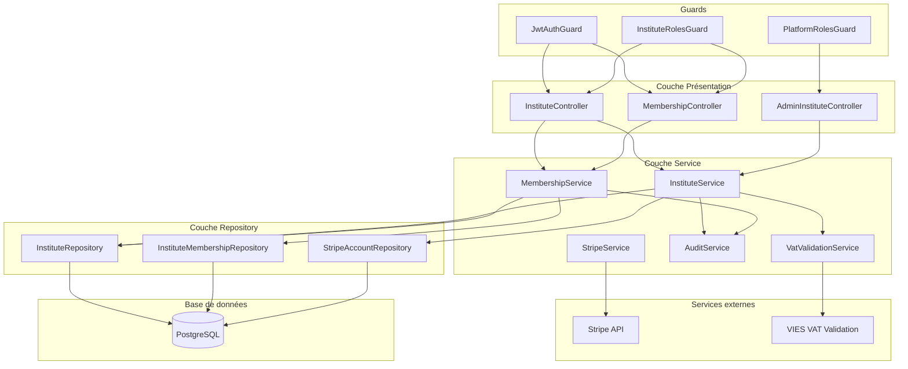
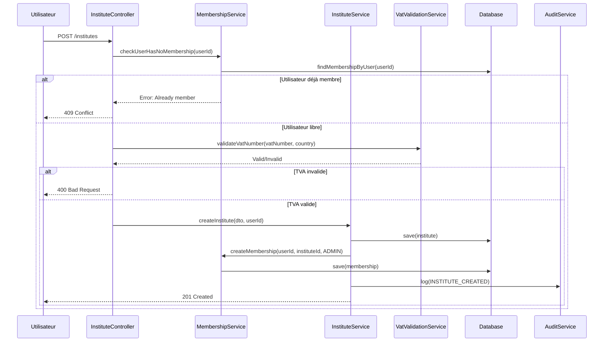

# Document de Conception - Module Instituts & Membres

## Vue d'ensemble

Ce document décrit l'architecture et la conception technique du module de gestion des instituts et de leurs membres. Le module permet aux utilisateurs de créer des organisations (instituts) pour organiser des sessions de tests de langues, gérer les membres avec différents rôles, et configurer les paiements via Stripe.

L'architecture s'intègre avec le module Authentification existant et réutilise les services communs (AuditService, etc.). La contrainte métier principale est qu'un utilisateur ne peut appartenir qu'à un seul institut à la fois.

## Architecture



### Flux de création d'institut



## Composants et Interfaces

### InstituteController

```typescript
@Controller('institutes')
export class InstituteController {
  // Création d'institut
  @Post()
  @UseGuards(JwtAuthGuard)
  async createInstitute(@Request() req, @Body() dto: CreateInstituteDto): Promise<InstituteDto>;
  
  // Liste publique des instituts
  @Get()
  async listInstitutes(@Query() query: ListInstitutesQueryDto): Promise<PaginatedInstitutesDto>;
  
  // Détails d'un institut (public)
  @Get(':id')
  async getInstitute(@Param('id') id: string): Promise<InstitutePublicDto>;
  
  // Mise à jour de l'institut (admin institut)
  @Patch(':id')
  @UseGuards(JwtAuthGuard, InstituteRolesGuard)
  @InstituteRoles(InstituteRoleEnum.ADMIN)
  async updateInstitute(@Param('id') id: string, @Body() dto: UpdateInstituteDto): Promise<InstituteDto>;
  
  // Configuration Stripe
  @Post(':id/stripe/connect')
  @UseGuards(JwtAuthGuard, InstituteRolesGuard)
  @InstituteRoles(InstituteRoleEnum.ADMIN)
  async connectStripe(@Param('id') id: string): Promise<{ url: string }>;
  
  @Post(':id/stripe/disconnect')
  @UseGuards(JwtAuthGuard, InstituteRolesGuard)
  @InstituteRoles(InstituteRoleEnum.ADMIN)
  async disconnectStripe(@Param('id') id: string): Promise<{ message: string }>;
  
  @Get(':id/stripe/status')
  @UseGuards(JwtAuthGuard, InstituteRolesGuard)
  @InstituteRoles(InstituteRoleEnum.ADMIN)
  async getStripeStatus(@Param('id') id: string): Promise<StripeStatusDto>;
}
```

### MembershipController

```typescript
@Controller('institutes/:instituteId/members')
@UseGuards(JwtAuthGuard, InstituteRolesGuard)
export class MembershipController {
  // Liste des membres
  @Get()
  @InstituteRoles(InstituteRoleEnum.ADMIN, InstituteRoleEnum.STAFF)
  async listMembers(@Param('instituteId') instituteId: string): Promise<MemberDto[]>;
  
  // Inviter un membre
  @Post()
  @InstituteRoles(InstituteRoleEnum.ADMIN)
  async inviteMember(
    @Param('instituteId') instituteId: string,
    @Body() dto: InviteMemberDto
  ): Promise<MemberDto>;
  
  // Modifier le rôle d'un membre
  @Patch(':memberId/role')
  @InstituteRoles(InstituteRoleEnum.ADMIN)
  async updateMemberRole(
    @Param('instituteId') instituteId: string,
    @Param('memberId') memberId: string,
    @Body() dto: UpdateMemberRoleDto
  ): Promise<MemberDto>;
  
  // Retirer un membre
  @Delete(':memberId')
  @InstituteRoles(InstituteRoleEnum.ADMIN)
  async removeMember(
    @Param('instituteId') instituteId: string,
    @Param('memberId') memberId: string
  ): Promise<{ message: string }>;
  
  // Quitter l'institut (pour le membre lui-même)
  @Post('leave')
  async leaveInstitute(@Request() req, @Param('instituteId') instituteId: string): Promise<{ message: string }>;
}
```

### AdminInstituteController

```typescript
@Controller('admin/institutes')
@UseGuards(JwtAuthGuard, PlatformRolesGuard)
@PlatformRoles(PlatformRoleEnum.ADMIN)
export class AdminInstituteController {
  // Liste complète des instituts (admin)
  @Get()
  async listAllInstitutes(@Query() query: AdminListInstitutesQueryDto): Promise<PaginatedInstitutesDto>;
  
  // Détails complets d'un institut
  @Get(':id')
  async getInstituteDetails(@Param('id') id: string): Promise<InstituteAdminDto>;
  
  // Définir le taux de commission personnalisé
  @Patch(':id/commission')
  async setCommissionRate(@Param('id') id: string, @Body() dto: SetCommissionRateDto): Promise<InstituteAdminDto>;
  
  // Désactiver un institut
  @Post(':id/deactivate')
  async deactivateInstitute(@Param('id') id: string): Promise<{ message: string }>;
  
  // Réactiver un institut
  @Post(':id/reactivate')
  async reactivateInstitute(@Param('id') id: string): Promise<{ message: string }>;
}
```

### InstituteService

```typescript
@Injectable()
export class InstituteService {
  async create(dto: CreateInstituteDto, creatorId: string): Promise<Institute>;
  async findById(id: string): Promise<Institute | null>;
  async findByIdOrFail(id: string): Promise<Institute>;
  async update(id: string, dto: UpdateInstituteDto): Promise<Institute>;
  async findAll(options: ListInstitutesOptions): Promise<PaginatedResult<Institute>>;
  async search(query: string, country?: string): Promise<Institute[]>;
  async setCommissionRate(id: string, rate: number | null): Promise<Institute>;
  async deactivate(id: string): Promise<void>;
  async reactivate(id: string): Promise<void>;
  async hasOpenSessions(id: string): Promise<boolean>;
  async getEffectiveCommissionRate(id: string): Promise<number>;
}
```

### MembershipService

```typescript
@Injectable()
export class MembershipService {
  async createMembership(userId: string, instituteId: string, role: InstituteRoleEnum): Promise<InstituteMembership>;
  async findByUser(userId: string): Promise<InstituteMembership | null>;
  async findByInstitute(instituteId: string): Promise<InstituteMembership[]>;
  async findByUserAndInstitute(userId: string, instituteId: string): Promise<InstituteMembership | null>;
  async updateRole(membershipId: string, newRole: InstituteRoleEnum): Promise<InstituteMembership>;
  async removeMembership(membershipId: string): Promise<void>;
  async checkUserHasNoMembership(userId: string): Promise<void>;
  async countAdmins(instituteId: string): Promise<number>;
  async isLastAdmin(membershipId: string): Promise<boolean>;
  async getUserRole(userId: string, instituteId: string): Promise<InstituteRoleEnum | null>;
}
```

### StripeService

```typescript
@Injectable()
export class StripeService {
  async createConnectAccount(instituteId: string): Promise<{ accountId: string; onboardingUrl: string }>;
  async getAccountStatus(stripeId: string): Promise<{ isActivated: boolean; details: any }>;
  async handleWebhook(event: Stripe.Event): Promise<void>;
  async disconnectAccount(instituteId: string): Promise<void>;
}
```

### VatValidationService

```typescript
@Injectable()
export class VatValidationService {
  async validate(vatNumber: string, countryCode: string): Promise<VatValidationResult>;
  async formatVatNumber(vatNumber: string, countryCode: string): Promise<string>;
}

interface VatValidationResult {
  isValid: boolean;
  name?: string;
  address?: string;
  errorMessage?: string;
}
```

## Modèles de données

### Entité Institute

```typescript
@Entity('institutes')
export class Institute implements Contactable {
  @PrimaryGeneratedColumn('uuid')
  id: string;

  @Column()
  label: string;

  @Column({ nullable: true })
  siteweb: string;

  @Column({ type: 'jsonb', nullable: true })
  socialNetworks: Record<string, string>;

  @Column(() => ContactInfo)
  address: ContactInfo;

  @ManyToOne(() => Country)
  country: Country;

  @Column({ nullable: true })
  vatNumber: string;

  @Column({ type: 'decimal', precision: 5, scale: 2, nullable: true })
  customCommissionRate: number | null;

  @Column({ default: true })
  isActive: boolean;

  @Column({ type: 'timestamp', default: () => 'CURRENT_TIMESTAMP' })
  createdAt: Date;

  @Column({ type: 'timestamp', default: () => 'CURRENT_TIMESTAMP', onUpdate: 'CURRENT_TIMESTAMP' })
  updatedAt: Date;

  // Relations
  @OneToOne(() => StripeAccount, { nullable: true })
  @JoinColumn()
  stripeAccount: StripeAccount;

  @OneToMany(() => InstituteMembership, (membership) => membership.institute)
  memberships: InstituteMembership[];

  // Implémentation Contactable
  getName(): string {
    return this.label;
  }
  getAddress(): string {
    return this.address?.address1 || '';
  }
  getZipcode(): string {
    return this.address?.zipcode || '';
  }
  getCity(): string {
    return this.address?.city || '';
  }
  getCountry(): string {
    return this.country?.commonName || '';
  }
}
```

### Entité InstituteMembership

```typescript
@Entity('institute_memberships')
@Unique(['user'])  // Un utilisateur ne peut avoir qu'une seule membership
export class InstituteMembership {
  @PrimaryGeneratedColumn('uuid')
  id: string;

  @Column({ type: 'enum', enum: InstituteRoleEnum })
  role: InstituteRoleEnum;

  @Column({ type: 'timestamp', default: () => 'CURRENT_TIMESTAMP' })
  since: Date;

  @ManyToOne(() => User, { onDelete: 'CASCADE' })
  user: User;

  @ManyToOne(() => Institute, (institute) => institute.memberships, { onDelete: 'CASCADE' })
  institute: Institute;
}
```

### Entité StripeAccount

```typescript
@Entity('stripe_accounts')
export class StripeAccount {
  @PrimaryGeneratedColumn('uuid')
  id: string;

  @Column({ unique: true })
  stripeId: string;

  @Column({ default: false })
  isActivated: boolean;

  @Column({ type: 'jsonb', nullable: true })
  metadata: Record<string, any>;

  @Column({ type: 'timestamp', default: () => 'CURRENT_TIMESTAMP' })
  createdAt: Date;

  @Column({ type: 'timestamp', default: () => 'CURRENT_TIMESTAMP', onUpdate: 'CURRENT_TIMESTAMP' })
  updatedAt: Date;
}
```

### Enum InstituteRoleEnum

```typescript
export enum InstituteRoleEnum {
  ADMIN = 'ADMIN',
  TEACHER = 'TEACHER',
  STAFF = 'STAFF',
}
```

### DTOs

```typescript
// Création d'institut
export class CreateInstituteDto {
  @IsString()
  @IsNotEmpty()
  label: string;

  @IsOptional()
  @IsUrl()
  siteweb?: string;

  @IsOptional()
  @IsObject()
  socialNetworks?: Record<string, string>;

  @ValidateNested()
  @Type(() => ContactInfoDto)
  address: ContactInfoDto;

  @IsUUID()
  countryId: string;

  @IsOptional()
  @IsString()
  vatNumber?: string;
}

// Mise à jour d'institut
export class UpdateInstituteDto {
  @IsOptional()
  @IsString()
  label?: string;

  @IsOptional()
  @IsUrl()
  siteweb?: string;

  @IsOptional()
  @IsObject()
  socialNetworks?: Record<string, string>;

  @IsOptional()
  @ValidateNested()
  @Type(() => ContactInfoDto)
  address?: ContactInfoDto;

  @IsOptional()
  @IsString()
  vatNumber?: string;
}

// Invitation de membre
export class InviteMemberDto {
  @IsEmail()
  email: string;

  @IsEnum(InstituteRoleEnum)
  role: InstituteRoleEnum;
}

// Modification de rôle
export class UpdateMemberRoleDto {
  @IsEnum(InstituteRoleEnum)
  role: InstituteRoleEnum;
}

// Taux de commission
export class SetCommissionRateDto {
  @IsOptional()
  @IsNumber()
  @Min(0)
  @Max(100)
  customCommissionRate: number | null;
}

// Réponse institut public
export class InstitutePublicDto {
  id: string;
  label: string;
  siteweb?: string;
  country: CountryDto;
  // Pas d'infos sensibles (TVA, commission, etc.)
}

// Réponse membre
export class MemberDto {
  id: string;
  user: UserBasicDto;
  role: InstituteRoleEnum;
  since: Date;
}
```

### InstituteRolesGuard

```typescript
@Injectable()
export class InstituteRolesGuard implements CanActivate {
  constructor(
    private reflector: Reflector,
    private membershipService: MembershipService,
  ) {}

  async canActivate(context: ExecutionContext): Promise<boolean> {
    const requiredRoles = this.reflector.getAllAndOverride<InstituteRoleEnum[]>(
      INSTITUTE_ROLES_KEY,
      [context.getHandler(), context.getClass()],
    );

    if (!requiredRoles) {
      return true;
    }

    const request = context.switchToHttp().getRequest();
    const userId = request.user.id;
    const instituteId = request.params.instituteId || request.params.id;

    const userRole = await this.membershipService.getUserRole(userId, instituteId);
    
    if (!userRole) {
      throw new ForbiddenException('Vous n\'êtes pas membre de cet institut');
    }

    return requiredRoles.includes(userRole);
  }
}

// Décorateur
export const InstituteRoles = (...roles: InstituteRoleEnum[]) =>
  SetMetadata(INSTITUTE_ROLES_KEY, roles);
```


## Propriétés de Correction

*Une propriété est une caractéristique ou un comportement qui doit rester vrai pour toutes les exécutions valides d'un système - essentiellement, une déclaration formelle sur ce que le système doit faire. Les propriétés servent de pont entre les spécifications lisibles par l'humain et les garanties de correction vérifiables par la machine.*

### Propriété 1 : Attribution automatique du rôle ADMIN au créateur

*Pour tout* institut nouvellement créé, l'utilisateur créateur doit automatiquement avoir une InstituteMembership avec le rôle ADMIN pour cet institut.

**Valide : Exigences 1.1**

### Propriété 2 : Validation du numéro de TVA par pays

*Pour tout* numéro de TVA soumis avec un code pays, le système doit accepter uniquement les numéros conformes au format du pays concerné (ex: FR + 11 caractères pour la France, DE + 9 chiffres pour l'Allemagne) et rejeter tous les autres.

**Valide : Exigences 1.2, 2.2**

### Propriété 3 : Contrainte d'unicité de membership

*Pour tout* utilisateur, il ne peut exister qu'une seule InstituteMembership active. Toute tentative de créer un institut ou de rejoindre un institut alors que l'utilisateur est déjà membre d'un autre doit être rejetée.

**Valide : Exigences 1.4, 3.2, 4.1, 4.2**

### Propriété 4 : Protection du dernier administrateur

*Pour tout* institut, si un membre est le seul avec le rôle ADMIN, toute tentative de le retirer ou de changer son rôle doit être bloquée.

**Valide : Exigences 3.6**

### Propriété 5 : Permissions par rôle institut

*Pour tout* membre d'un institut :
- Si son rôle est ADMIN, il doit avoir accès à toutes les opérations de l'institut
- Si son rôle est TEACHER, il doit pouvoir être assigné comme examinateur mais pas modifier l'institut
- Si son rôle est STAFF, il doit pouvoir consulter les informations mais pas les modifier

**Valide : Exigences 2.1, 3.1, 3.4, 3.5, 5.1, 5.2, 5.3, 5.4, 6.1, 6.5**

### Propriété 6 : Permissions admin plateforme

*Pour tout* utilisateur avec PlatformRole différent de ADMIN, toute tentative d'accès aux endpoints d'administration des instituts (/admin/institutes/*) doit être rejetée avec un code 403.

**Valide : Exigences 7.1, 9.1**

### Propriété 7 : Calcul du taux de commission effectif

*Pour tout* institut, le taux de commission effectif doit être égal à customCommissionRate si celui-ci est défini (non null), sinon égal à PlatformSettings.defaultCommissionRate.

**Valide : Exigences 7.2, 7.3**

### Propriété 8 : Validation du taux de commission

*Pour tout* taux de commission personnalisé soumis, le système doit accepter uniquement les valeurs entre 0 et 100 (inclus) et rejeter toutes les autres.

**Valide : Exigences 7.4**

### Propriété 9 : Blocage désactivation si sessions OPEN

*Pour tout* institut ayant au moins une session avec le statut OPEN, toute tentative de désactivation doit être bloquée et retourner une erreur appropriée.

**Valide : Exigences 9.4**

### Propriété 10 : Interface Contactable correctement implémentée

*Pour tout* institut, les méthodes getName(), getAddress(), getZipcode(), getCity() et getCountry() doivent retourner respectivement le label, l'adresse, le code postal, la ville et le pays de l'institut.

**Valide : Exigences 2.4**

### Propriété 11 : Journalisation des actions

*Pour toute* action de création, modification ou suppression sur un institut ou une membership, un enregistrement AuditLog doit être créé contenant l'identifiant de l'utilisateur effectuant l'action, l'horodatage et les détails de l'action.

**Valide : Exigences 10.1, 10.2, 10.3**

## Gestion des Erreurs

### Codes d'erreur HTTP

| Code | Situation | Message type |
|------|-----------|--------------|
| 400 | Données invalides (validation DTO, TVA invalide) | `ValidationError` |
| 401 | JWT manquant ou invalide | `UnauthorizedError` |
| 403 | Accès refusé (rôle insuffisant) | `ForbiddenError` |
| 404 | Institut ou membre non trouvé | `NotFoundError` |
| 409 | Conflit (utilisateur déjà membre, dernier admin) | `ConflictError` |
| 422 | Erreur métier (sessions OPEN, Stripe non activé) | `UnprocessableEntityError` |

### Erreurs spécifiques au module

```typescript
// Institut
class InstituteNotFoundError extends NotFoundException {
  message = 'Institut non trouvé';
}

class InstituteDeactivatedError extends ForbiddenException {
  message = 'Cet institut est désactivé';
}

class InstituteHasOpenSessionsError extends UnprocessableEntityException {
  message = 'Impossible de désactiver l\'institut : des sessions sont encore ouvertes';
}

class InvalidVatNumberError extends BadRequestException {
  constructor(country: string) {
    super(`Numéro de TVA invalide pour le pays ${country}`);
  }
}

// Membership
class UserAlreadyMemberError extends ConflictException {
  message = 'Cet utilisateur est déjà membre d\'un institut';
}

class NotMemberOfInstituteError extends ForbiddenException {
  message = 'Vous n\'êtes pas membre de cet institut';
}

class InsufficientInstituteRoleError extends ForbiddenException {
  constructor(requiredRole: InstituteRoleEnum) {
    super(`Le rôle ${requiredRole} est requis pour cette opération`);
  }
}

class CannotRemoveLastAdminError extends ConflictException {
  message = 'Impossible de retirer le dernier administrateur de l\'institut';
}

class CannotChangeLastAdminRoleError extends ConflictException {
  message = 'Impossible de modifier le rôle du dernier administrateur';
}

// Stripe
class StripeAccountNotFoundError extends NotFoundException {
  message = 'Aucun compte Stripe lié à cet institut';
}

class StripeAccountNotActivatedError extends UnprocessableEntityException {
  message = 'Le compte Stripe n\'est pas encore activé';
}

class StripeAccountAlreadyLinkedError extends ConflictException {
  message = 'Un compte Stripe est déjà lié à cet institut';
}

// Commission
class InvalidCommissionRateError extends BadRequestException {
  message = 'Le taux de commission doit être entre 0 et 100';
}
```

## Stratégie de Test

### Approche duale : Tests unitaires et Tests basés sur les propriétés

Les tests unitaires et les tests basés sur les propriétés sont complémentaires :
- **Tests unitaires** : Vérifient des exemples spécifiques, des cas limites et des conditions d'erreur
- **Tests basés sur les propriétés** : Vérifient des propriétés universelles sur un large éventail d'entrées générées

### Configuration des tests basés sur les propriétés

- **Bibliothèque** : fast-check pour TypeScript/NestJS
- **Minimum d'itérations** : 100 par test de propriété
- **Format de tag** : `Feature: instituts-membres, Property {N}: {titre_propriété}`

### Tests unitaires recommandés

```typescript
describe('InstituteService', () => {
  describe('create', () => {
    it('devrait créer un institut et attribuer le rôle ADMIN au créateur');
    it('devrait rejeter si l\'utilisateur est déjà membre d\'un institut');
    it('devrait valider le numéro de TVA');
    it('devrait initialiser customCommissionRate à null');
  });

  describe('update', () => {
    it('devrait permettre la modification par un ADMIN');
    it('devrait rejeter la modification par un TEACHER');
    it('devrait rejeter la modification par un STAFF');
    it('devrait mettre à jour updatedAt');
  });

  describe('deactivate', () => {
    it('devrait désactiver un institut sans sessions OPEN');
    it('devrait rejeter si des sessions sont OPEN');
  });

  describe('getEffectiveCommissionRate', () => {
    it('devrait retourner customCommissionRate si défini');
    it('devrait retourner defaultCommissionRate si customCommissionRate est null');
  });
});

describe('MembershipService', () => {
  describe('createMembership', () => {
    it('devrait créer une membership avec le rôle spécifié');
    it('devrait rejeter si l\'utilisateur est déjà membre');
  });

  describe('removeMembership', () => {
    it('devrait supprimer la membership');
    it('devrait rejeter si c\'est le dernier ADMIN');
  });

  describe('updateRole', () => {
    it('devrait modifier le rôle');
    it('devrait rejeter si c\'est le dernier ADMIN et on change son rôle');
  });
});

describe('InstituteRolesGuard', () => {
  it('devrait autoriser un ADMIN pour les opérations ADMIN');
  it('devrait rejeter un TEACHER pour les opérations ADMIN');
  it('devrait rejeter un STAFF pour les opérations ADMIN');
  it('devrait autoriser un STAFF pour la consultation');
});
```

### Tests basés sur les propriétés

```typescript
import * as fc from 'fast-check';

describe('Property-based tests', () => {
  // Feature: instituts-membres, Property 1: Attribution automatique du rôle ADMIN au créateur
  it('P1: le créateur d\'un institut doit avoir le rôle ADMIN', () => {
    fc.assert(
      fc.property(validInstituteArb, validUserArb, async (instituteData, user) => {
        const institute = await instituteService.create(instituteData, user.id);
        const membership = await membershipService.findByUserAndInstitute(user.id, institute.id);
        expect(membership).not.toBeNull();
        expect(membership.role).toBe(InstituteRoleEnum.ADMIN);
      }),
      { numRuns: 100 }
    );
  });

  // Feature: instituts-membres, Property 3: Contrainte d'unicité de membership
  it('P3: un utilisateur ne peut avoir qu\'une seule membership', () => {
    fc.assert(
      fc.property(validUserArb, validInstituteArb, validInstituteArb, async (user, inst1Data, inst2Data) => {
        // Créer le premier institut (l'utilisateur devient membre)
        await instituteService.create(inst1Data, user.id);
        
        // Tenter de créer un second institut doit échouer
        await expect(instituteService.create(inst2Data, user.id))
          .rejects.toThrow(UserAlreadyMemberError);
      }),
      { numRuns: 100 }
    );
  });

  // Feature: instituts-membres, Property 4: Protection du dernier administrateur
  it('P4: le dernier ADMIN ne peut pas être retiré', () => {
    fc.assert(
      fc.property(validInstituteArb, validUserArb, async (instituteData, creator) => {
        const institute = await instituteService.create(instituteData, creator.id);
        const membership = await membershipService.findByUserAndInstitute(creator.id, institute.id);
        
        // Tenter de retirer le seul admin doit échouer
        await expect(membershipService.removeMembership(membership.id))
          .rejects.toThrow(CannotRemoveLastAdminError);
      }),
      { numRuns: 100 }
    );
  });

  // Feature: instituts-membres, Property 7: Calcul du taux de commission effectif
  it('P7: le taux effectif utilise customCommissionRate ou defaultCommissionRate', () => {
    fc.assert(
      fc.property(
        validInstituteArb,
        fc.option(fc.float({ min: 0, max: 100 })),
        fc.float({ min: 0, max: 100 }),
        async (instituteData, customRate, defaultRate) => {
          // Setup: créer institut et définir les taux
          const institute = await instituteService.create(instituteData, someUserId);
          if (customRate !== null) {
            await instituteService.setCommissionRate(institute.id, customRate);
          }
          platformSettings.defaultCommissionRate = defaultRate;
          
          const effectiveRate = await instituteService.getEffectiveCommissionRate(institute.id);
          
          if (customRate !== null) {
            expect(effectiveRate).toBe(customRate);
          } else {
            expect(effectiveRate).toBe(defaultRate);
          }
        }
      ),
      { numRuns: 100 }
    );
  });

  // Feature: instituts-membres, Property 8: Validation du taux de commission
  it('P8: le taux de commission doit être entre 0 et 100', () => {
    const invalidRateArb = fc.oneof(
      fc.float({ max: -0.01 }),
      fc.float({ min: 100.01 })
    );

    fc.assert(
      fc.property(invalidRateArb, async (invalidRate) => {
        await expect(instituteService.setCommissionRate(someInstituteId, invalidRate))
          .rejects.toThrow(InvalidCommissionRateError);
      }),
      { numRuns: 100 }
    );
  });
});
```

### Générateurs personnalisés pour fast-check

```typescript
// Générateur d'institut valide
const validInstituteArb = fc.record({
  label: fc.string({ minLength: 1, maxLength: 100 }),
  siteweb: fc.option(fc.webUrl()),
  socialNetworks: fc.option(fc.dictionary(fc.string(), fc.webUrl())),
  address: fc.record({
    address1: fc.string({ minLength: 1 }),
    address2: fc.option(fc.string()),
    zipcode: fc.string({ minLength: 1, maxLength: 10 }),
    city: fc.string({ minLength: 1 }),
  }),
  countryId: fc.uuid(),
  vatNumber: fc.option(fc.string({ minLength: 5, maxLength: 20 })),
});

// Générateur de rôle institut
const instituteRoleArb = fc.constantFrom(...Object.values(InstituteRoleEnum));

// Générateur de taux de commission valide
const validCommissionRateArb = fc.float({ min: 0, max: 100 });
```

### Couverture de test cible

| Composant | Couverture cible |
|-----------|------------------|
| InstituteService | 90% |
| MembershipService | 90% |
| StripeService | 80% |
| VatValidationService | 85% |
| InstituteRolesGuard | 95% |
| DTOs (validation) | 95% |
