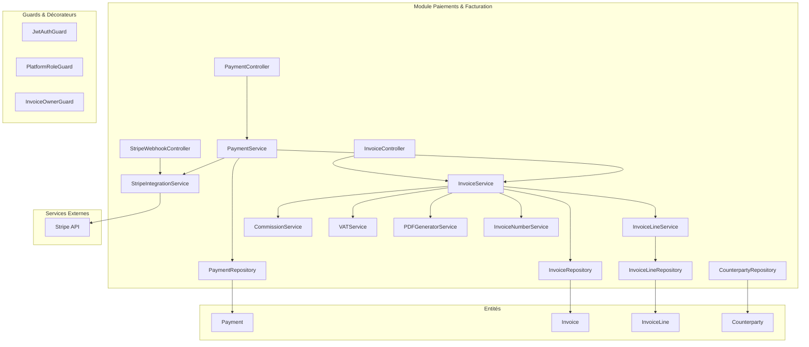
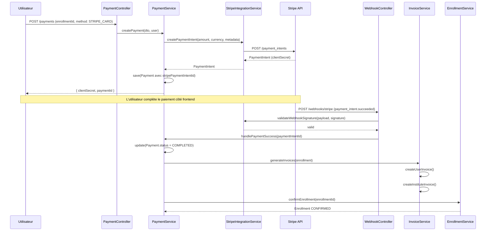
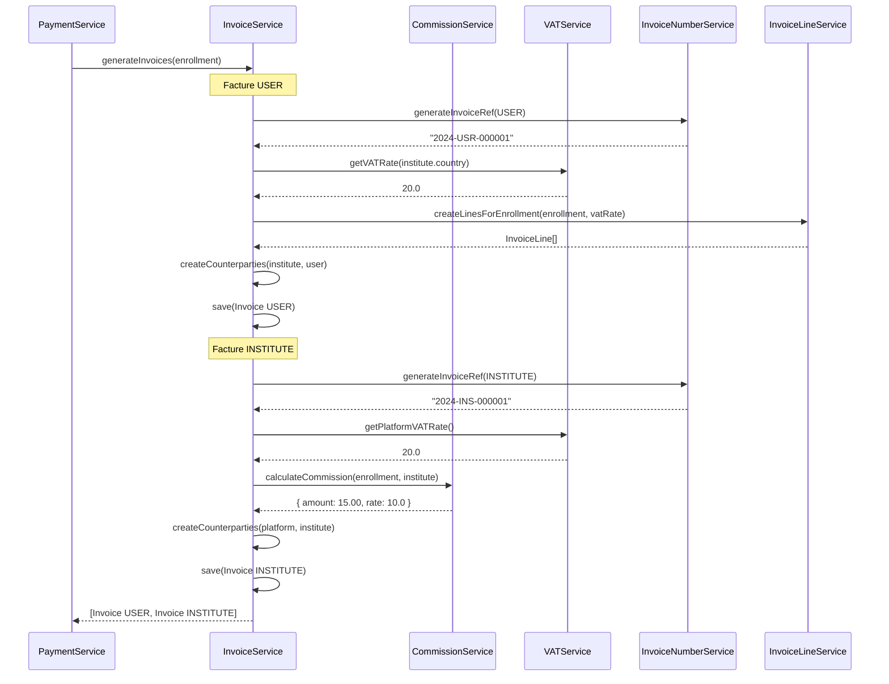
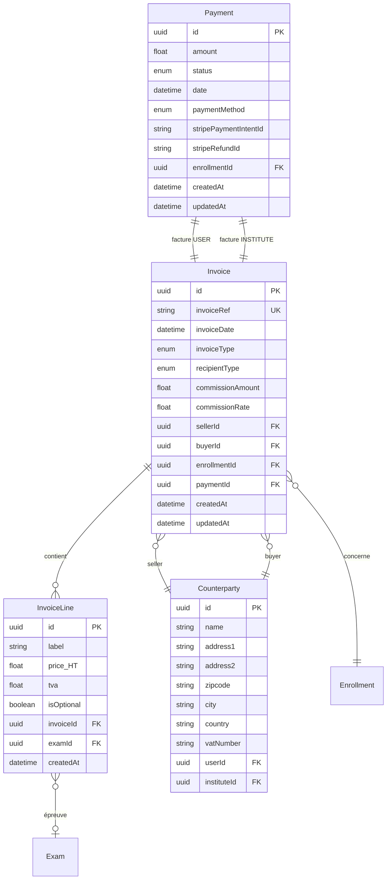

# Document de Conception - Module Paiements & Facturation

## Vue d'ensemble

Ce document décrit la conception technique du module de gestion des paiements et de la facturation pour une plateforme européenne de gestion d'inscriptions aux tests de langues. Le module implémente une architecture modulaire NestJS avec TypeORM et PostgreSQL, intégrant Stripe pour les paiements par carte, supportant le paiement par chèque en France, et gérant la double facturation (USER et INSTITUTE) avec calcul automatique des commissions et de la TVA selon la réglementation européenne.

### Dépendances

- **authentification-utilisateurs** : Authentification JWT, gestion des utilisateurs et PlatformRole
- **gestion-instituts** : Gestion des instituts, InstituteMembership, InstituteRole, StripeAccount et PlatformSettings
- **hierarchie-assessment** : Assessments, Exams, tarification personnalisée (InstituteExamPricing)
- **sessions-inscriptions** : Sessions, Enrollments, EnrollmentOptionalExam et calcul des prix

### Principes de conception

1. **Intégration Stripe robuste** : Webhooks avec validation de signature, idempotence des opérations
2. **Double facturation** : Génération automatique de deux factures par inscription (USER + INSTITUTE)
3. **Immuabilité des factures** : Aucune modification possible après génération, avoirs pour corrections
4. **Conformité fiscale UE** : TVA calculée selon le pays de l'institut (USER) ou de la plateforme (INSTITUTE)
5. **Traçabilité complète** : Journalisation de toutes les opérations financières


## Architecture




### Structure des modules

```
src/
├── payment/
│   ├── payment.module.ts
│   ├── controllers/
│   │   ├── payment.controller.ts
│   │   ├── invoice.controller.ts
│   │   └── stripe-webhook.controller.ts
│   ├── services/
│   │   ├── payment.service.ts
│   │   ├── invoice.service.ts
│   │   ├── invoice-line.service.ts
│   │   ├── commission.service.ts
│   │   ├── vat.service.ts
│   │   ├── stripe-integration.service.ts
│   │   ├── pdf-generator.service.ts
│   │   └── invoice-number.service.ts
│   ├── entities/
│   │   ├── payment.entity.ts
│   │   ├── invoice.entity.ts
│   │   ├── invoice-line.entity.ts
│   │   └── counterparty.entity.ts
│   ├── dto/
│   │   ├── create-payment.dto.ts
│   │   ├── confirm-payment.dto.ts
│   │   ├── refund-payment.dto.ts
│   │   ├── list-invoices-query.dto.ts
│   │   └── list-payments-query.dto.ts
│   ├── guards/
│   │   └── invoice-owner.guard.ts
│   └── enums/
│       ├── payment-status.enum.ts
│       ├── payment-method.enum.ts
│       ├── invoice-type.enum.ts
│       └── invoice-recipient-type.enum.ts
```


### Flux de paiement Stripe




### Flux de génération des factures




## Composants et Interfaces

### PaymentController

```typescript
@Controller('payments')
@UseGuards(JwtAuthGuard)
export class PaymentController {
  // POST /payments - Création d'un paiement
  @Post()
  create(
    @Body() dto: CreatePaymentDto,
    @CurrentUser() user: User
  ): Promise<PaymentResponseDto>;

  // GET /payments - Liste des paiements (admin)
  @Get()
  @UseGuards(PlatformRoleGuard)
  @PlatformRoles(PlatformRoleEnum.ADMIN)
  findAll(@Query() query: ListPaymentsQueryDto): Promise<PaginatedResult<Payment>>;

  // GET /payments/:id - Détail d'un paiement
  @Get(':id')
  findOne(@Param('id') id: string, @CurrentUser() user: User): Promise<Payment>;

  // POST /payments/:id/confirm - Confirmation manuelle (chèque)
  @Post(':id/confirm')
  @UseGuards(PlatformRoleGuard)
  @PlatformRoles(PlatformRoleEnum.ADMIN)
  confirmManually(@Param('id') id: string, @CurrentUser() user: User): Promise<Payment>;

  // POST /payments/:id/refund - Remboursement
  @Post(':id/refund')
  @UseGuards(PlatformRoleGuard)
  @PlatformRoles(PlatformRoleEnum.ADMIN)
  refund(@Param('id') id: string, @Body() dto: RefundPaymentDto, @CurrentUser() user: User): Promise<Payment>;

  // POST /payments/:id/cancel - Annulation
  @Post(':id/cancel')
  cancel(@Param('id') id: string, @CurrentUser() user: User): Promise<Payment>;
}
```


### InvoiceController

```typescript
@Controller('invoices')
@UseGuards(JwtAuthGuard)
export class InvoiceController {
  // GET /invoices - Liste des factures
  @Get()
  findAll(
    @Query() query: ListInvoicesQueryDto,
    @CurrentUser() user: User
  ): Promise<PaginatedResult<Invoice>>;

  // GET /invoices/:id - Détail d'une facture
  @Get(':id')
  @UseGuards(InvoiceOwnerGuard)
  findOne(@Param('id') id: string): Promise<InvoiceDetailDto>;

  // GET /invoices/:id/pdf - Téléchargement PDF
  @Get(':id/pdf')
  @UseGuards(InvoiceOwnerGuard)
  downloadPdf(@Param('id') id: string, @Res() res: Response): Promise<void>;

  // GET /invoices/by-enrollment/:enrollmentId - Factures d'une inscription
  @Get('by-enrollment/:enrollmentId')
  findByEnrollment(
    @Param('enrollmentId') enrollmentId: string,
    @CurrentUser() user: User
  ): Promise<Invoice[]>;
}

@Controller('my-invoices')
@UseGuards(JwtAuthGuard)
export class MyInvoicesController {
  // GET /my-invoices - Mes factures USER
  @Get()
  findMyInvoices(
    @CurrentUser() user: User,
    @Query() query: ListInvoicesQueryDto
  ): Promise<PaginatedResult<Invoice>>;

  // GET /my-invoices/:id - Détail d'une de mes factures
  @Get(':id')
  findOne(@Param('id') id: string, @CurrentUser() user: User): Promise<InvoiceDetailDto>;

  // GET /my-invoices/:id/pdf - Téléchargement PDF
  @Get(':id/pdf')
  downloadPdf(@Param('id') id: string, @CurrentUser() user: User, @Res() res: Response): Promise<void>;
}
```


### StripeWebhookController

```typescript
@Controller('webhooks/stripe')
export class StripeWebhookController {
  constructor(
    private stripeIntegrationService: StripeIntegrationService,
    private paymentService: PaymentService,
  ) {}

  // POST /webhooks/stripe - Réception des webhooks Stripe
  @Post()
  @HttpCode(200)
  async handleWebhook(
    @Headers('stripe-signature') signature: string,
    @RawBody() rawBody: Buffer
  ): Promise<{ received: boolean }> {
    const event = await this.stripeIntegrationService.validateWebhook(rawBody, signature);
    
    switch (event.type) {
      case 'payment_intent.succeeded':
        await this.paymentService.handlePaymentSuccess(event.data.object.id);
        break;
      case 'payment_intent.payment_failed':
        await this.paymentService.handlePaymentFailure(event.data.object.id);
        break;
      case 'charge.refunded':
        await this.paymentService.handleRefundSuccess(event.data.object.payment_intent);
        break;
    }
    
    return { received: true };
  }
}
```


### Services

#### PaymentService

```typescript
@Injectable()
export class PaymentService {
  constructor(
    @InjectRepository(Payment)
    private paymentRepository: Repository<Payment>,
    private stripeIntegrationService: StripeIntegrationService,
    private invoiceService: InvoiceService,
    private enrollmentService: EnrollmentService,
    private priceCalculationService: PriceCalculationService,
  ) {}

  async create(dto: CreatePaymentDto, user: User): Promise<PaymentResponseDto>;
  async findOne(id: string): Promise<Payment>;
  async findAll(query: ListPaymentsQueryDto): Promise<PaginatedResult<Payment>>;
  async findByEnrollment(enrollmentId: string): Promise<Payment>;
  
  // Confirmation manuelle (chèque)
  async confirmManually(id: string, adminId: string): Promise<Payment>;
  
  // Remboursement
  async refund(id: string, dto: RefundPaymentDto, adminId: string): Promise<Payment>;
  
  // Annulation
  async cancel(id: string, userId: string): Promise<Payment>;
  
  // Handlers webhooks
  async handlePaymentSuccess(stripePaymentIntentId: string): Promise<void>;
  async handlePaymentFailure(stripePaymentIntentId: string): Promise<void>;
  async handleRefundSuccess(stripePaymentIntentId: string): Promise<void>;
  
  // Validation des transitions de statut
  private validateStatusTransition(current: PaymentStatusEnum, next: PaymentStatusEnum): boolean;
}
```

#### InvoiceService

```typescript
@Injectable()
export class InvoiceService {
  constructor(
    @InjectRepository(Invoice)
    private invoiceRepository: Repository<Invoice>,
    private invoiceLineService: InvoiceLineService,
    private commissionService: CommissionService,
    private vatService: VATService,
    private invoiceNumberService: InvoiceNumberService,
    private pdfGeneratorService: PDFGeneratorService,
    private dataSource: DataSource,
  ) {}

  async generateInvoices(enrollment: Enrollment, payment: Payment): Promise<Invoice[]>;
  async findOne(id: string): Promise<Invoice>;
  async findAll(query: ListInvoicesQueryDto, user: User): Promise<PaginatedResult<Invoice>>;
  async findByEnrollment(enrollmentId: string): Promise<Invoice[]>;
  async findByUser(userId: string, query: ListInvoicesQueryDto): Promise<PaginatedResult<Invoice>>;
  async findByInstitute(instituteId: string, query: ListInvoicesQueryDto): Promise<PaginatedResult<Invoice>>;
  
  // Génération PDF
  async generatePdf(id: string): Promise<Buffer>;
  
  // Génération d'avoir (remboursement)
  async generateCreditNote(originalInvoice: Invoice): Promise<Invoice>;
  
  // Méthodes privées
  private async createUserInvoice(enrollment: Enrollment, payment: Payment): Promise<Invoice>;
  private async createInstituteInvoice(enrollment: Enrollment, payment: Payment): Promise<Invoice>;
  private createCounterparty(entity: Institute | User | PlatformSettings): Counterparty;
}
```


#### CommissionService

```typescript
@Injectable()
export class CommissionService {
  constructor(
    @InjectRepository(Institute)
    private instituteRepository: Repository<Institute>,
    @InjectRepository(PlatformSettings)
    private platformSettingsRepository: Repository<PlatformSettings>,
  ) {}

  async calculateCommission(
    amountHT: number,
    instituteId: string
  ): Promise<CommissionResult>;
  
  async getCommissionRate(instituteId: string): Promise<number>;
}

export interface CommissionResult {
  amount: number;
  rate: number;
  baseAmount: number;
}
```

#### VATService

```typescript
@Injectable()
export class VATService {
  constructor(
    @InjectRepository(Country)
    private countryRepository: Repository<Country>,
    @InjectRepository(PlatformSettings)
    private platformSettingsRepository: Repository<PlatformSettings>,
  ) {}

  async getInstituteVATRate(instituteId: string): Promise<number>;
  async getPlatformVATRate(): Promise<number>;
  
  calculateTTC(amountHT: number, vatRate: number): number;
  calculateHT(amountTTC: number, vatRate: number): number;
  calculateVATAmount(amountHT: number, vatRate: number): number;
}
```

#### StripeIntegrationService

```typescript
@Injectable()
export class StripeIntegrationService {
  private stripe: Stripe;

  constructor(private configService: ConfigService) {
    this.stripe = new Stripe(this.configService.get('STRIPE_SECRET_KEY'), {
      apiVersion: '2023-10-16',
    });
  }

  async createPaymentIntent(
    amount: number,
    currency: string,
    metadata: Record<string, string>
  ): Promise<Stripe.PaymentIntent>;
  
  async createRefund(paymentIntentId: string, amount?: number): Promise<Stripe.Refund>;
  
  async cancelPaymentIntent(paymentIntentId: string): Promise<Stripe.PaymentIntent>;
  
  validateWebhook(rawBody: Buffer, signature: string): Stripe.Event;
}
```


#### InvoiceNumberService

```typescript
@Injectable()
export class InvoiceNumberService {
  constructor(
    @InjectRepository(Invoice)
    private invoiceRepository: Repository<Invoice>,
    private dataSource: DataSource,
  ) {}

  async generateInvoiceRef(recipientType: InvoiceRecipientTypeEnum): Promise<string>;
  
  // Utilise un compteur atomique avec SELECT FOR UPDATE
  private async getNextSequence(year: number, prefix: string): Promise<number>;
  
  private getPrefix(recipientType: InvoiceRecipientTypeEnum): string;
}
```

#### PDFGeneratorService

```typescript
@Injectable()
export class PDFGeneratorService {
  async generateInvoicePdf(invoice: Invoice): Promise<Buffer>;
  
  private formatInvoiceData(invoice: Invoice): InvoicePdfData;
  private calculateTotals(lines: InvoiceLine[]): InvoiceTotals;
}

interface InvoicePdfData {
  invoiceRef: string;
  invoiceDate: Date;
  seller: CounterpartyData;
  buyer: CounterpartyData;
  lines: InvoiceLinePdfData[];
  totals: InvoiceTotals;
  commission?: CommissionData;
}
```


### Guards

```typescript
// InvoiceOwnerGuard - Vérifie que l'utilisateur peut accéder à la facture
@Injectable()
export class InvoiceOwnerGuard implements CanActivate {
  constructor(
    private invoiceService: InvoiceService,
    private membershipService: MembershipService,
  ) {}

  async canActivate(context: ExecutionContext): Promise<boolean> {
    const request = context.switchToHttp().getRequest();
    const user = request.user;
    const invoiceId = request.params.id;

    // Admin plateforme : accès total
    if (user.platformRole === PlatformRoleEnum.ADMIN) {
      return true;
    }

    const invoice = await this.invoiceService.findOne(invoiceId);
    
    // Facture USER : seul le buyer peut y accéder
    if (invoice.recipientType === InvoiceRecipientTypeEnum.USER) {
      return invoice.buyer.userId === user.id;
    }
    
    // Facture INSTITUTE : admin de l'institut peut y accéder
    if (invoice.recipientType === InvoiceRecipientTypeEnum.INSTITUTE) {
      const membership = await this.membershipService.getMembershipByUserId(user.id);
      return membership?.institute?.id === invoice.buyer.instituteId 
        && membership?.role === InstituteRoleEnum.ADMIN;
    }
    
    return false;
  }
}
```


## Modèles de données

### Diagramme des entités




### Entité Payment

```typescript
@Entity('payments')
export class Payment {
  @PrimaryGeneratedColumn('uuid')
  id: string;

  @Column({ type: 'decimal', precision: 10, scale: 2 })
  amount: number;

  @Column({ type: 'enum', enum: PaymentStatusEnum, default: PaymentStatusEnum.PENDING })
  status: PaymentStatusEnum;

  @Column({ type: 'timestamp', default: () => 'CURRENT_TIMESTAMP' })
  date: Date;

  @Column({ type: 'enum', enum: PaymentMethodEnum })
  paymentMethod: PaymentMethodEnum;

  @Column({ nullable: true })
  stripePaymentIntentId: string;

  @Column({ nullable: true })
  stripeRefundId: string;

  @ManyToOne(() => Enrollment)
  @JoinColumn({ name: 'enrollmentId' })
  enrollment: Enrollment;

  @Column()
  enrollmentId: string;

  @OneToMany(() => Invoice, invoice => invoice.payment)
  invoices: Invoice[];

  @CreateDateColumn()
  createdAt: Date;

  @UpdateDateColumn()
  updatedAt: Date;
}
```

### Entité Invoice

```typescript
@Entity('invoices')
export class Invoice {
  @PrimaryGeneratedColumn('uuid')
  id: string;

  @Column({ unique: true })
  invoiceRef: string;

  @Column({ type: 'timestamp' })
  invoiceDate: Date;

  @Column({ type: 'enum', enum: InvoiceTypeEnum })
  invoiceType: InvoiceTypeEnum;

  @Column({ type: 'enum', enum: InvoiceRecipientTypeEnum })
  recipientType: InvoiceRecipientTypeEnum;

  @Column({ type: 'decimal', precision: 10, scale: 2, nullable: true })
  commissionAmount: number;

  @Column({ type: 'decimal', precision: 5, scale: 2, nullable: true })
  commissionRate: number;

  @ManyToOne(() => Counterparty, { eager: true })
  @JoinColumn({ name: 'sellerId' })
  seller: Counterparty;

  @Column()
  sellerId: string;

  @ManyToOne(() => Counterparty, { eager: true })
  @JoinColumn({ name: 'buyerId' })
  buyer: Counterparty;

  @Column()
  buyerId: string;

  @ManyToOne(() => Enrollment)
  @JoinColumn({ name: 'enrollmentId' })
  enrollment: Enrollment;

  @Column()
  enrollmentId: string;

  @ManyToOne(() => Payment, payment => payment.invoices)
  @JoinColumn({ name: 'paymentId' })
  payment: Payment;

  @Column()
  paymentId: string;

  @OneToMany(() => InvoiceLine, line => line.invoice, { eager: true })
  lines: InvoiceLine[];

  @CreateDateColumn()
  createdAt: Date;

  @UpdateDateColumn()
  updatedAt: Date;
}
```


### Entité InvoiceLine

```typescript
@Entity('invoice_lines')
export class InvoiceLine {
  @PrimaryGeneratedColumn('uuid')
  id: string;

  @Column({ length: 255 })
  label: string;

  @Column({ type: 'decimal', precision: 10, scale: 2, name: 'price_ht' })
  priceHT: number;

  @Column({ type: 'decimal', precision: 5, scale: 2 })
  tva: number;

  @Column({ default: false })
  isOptional: boolean;

  @ManyToOne(() => Invoice, invoice => invoice.lines, { onDelete: 'CASCADE' })
  @JoinColumn({ name: 'invoiceId' })
  invoice: Invoice;

  @Column()
  invoiceId: string;

  @ManyToOne(() => Exam, { nullable: true })
  @JoinColumn({ name: 'examId' })
  exam: Exam;

  @Column({ nullable: true })
  examId: string;

  @CreateDateColumn()
  createdAt: Date;
}
```

### Entité Counterparty

```typescript
@Entity('counterparties')
export class Counterparty {
  @PrimaryGeneratedColumn('uuid')
  id: string;

  @Column({ length: 255 })
  name: string;

  @Column({ length: 255 })
  address1: string;

  @Column({ length: 255, nullable: true })
  address2: string;

  @Column({ length: 20 })
  zipcode: string;

  @Column({ length: 100 })
  city: string;

  @Column({ length: 100 })
  country: string;

  @Column({ length: 50, nullable: true })
  vatNumber: string;

  // Référence optionnelle vers l'utilisateur (pour factures USER)
  @Column({ nullable: true })
  userId: string;

  // Référence optionnelle vers l'institut (pour factures INSTITUTE)
  @Column({ nullable: true })
  instituteId: string;
}
```


### Énumérations

```typescript
// payment-status.enum.ts
export enum PaymentStatusEnum {
  PENDING = 'PENDING',
  COMPLETED = 'COMPLETED',
  FAILED = 'FAILED',
  REFUNDED = 'REFUNDED',
  CANCELLED = 'CANCELLED',
}

// payment-method.enum.ts
export enum PaymentMethodEnum {
  STRIPE_CARD = 'STRIPE_CARD',
  CHEQUE = 'CHEQUE',
}

// invoice-type.enum.ts
export enum InvoiceTypeEnum {
  ENROLLMENT = 'ENROLLMENT',
  TEST_LICENSE = 'TEST_LICENSE',
}

// invoice-recipient-type.enum.ts
export enum InvoiceRecipientTypeEnum {
  USER = 'USER',
  INSTITUTE = 'INSTITUTE',
}
```

### DTOs de validation

```typescript
// create-payment.dto.ts
export class CreatePaymentDto {
  @IsUUID()
  enrollmentId: string;

  @IsEnum(PaymentMethodEnum)
  paymentMethod: PaymentMethodEnum;
}

// refund-payment.dto.ts
export class RefundPaymentDto {
  @IsOptional()
  @IsNumber()
  @Min(0)
  amount?: number; // Remboursement partiel optionnel

  @IsOptional()
  @IsString()
  reason?: string;
}

// list-invoices-query.dto.ts
export class ListInvoicesQueryDto {
  @IsOptional()
  @IsEnum(InvoiceRecipientTypeEnum)
  recipientType?: InvoiceRecipientTypeEnum;

  @IsOptional()
  @IsDateString()
  fromDate?: string;

  @IsOptional()
  @IsDateString()
  toDate?: string;

  @IsOptional()
  @IsInt()
  @Min(1)
  page?: number = 1;

  @IsOptional()
  @IsInt()
  @Min(1)
  @Max(100)
  limit?: number = 20;
}

// list-payments-query.dto.ts
export class ListPaymentsQueryDto {
  @IsOptional()
  @IsEnum(PaymentStatusEnum)
  status?: PaymentStatusEnum;

  @IsOptional()
  @IsEnum(PaymentMethodEnum)
  paymentMethod?: PaymentMethodEnum;

  @IsOptional()
  @IsDateString()
  fromDate?: string;

  @IsOptional()
  @IsDateString()
  toDate?: string;

  @IsOptional()
  @IsUUID()
  instituteId?: string;

  @IsOptional()
  @IsInt()
  @Min(1)
  page?: number = 1;

  @IsOptional()
  @IsInt()
  @Min(1)
  @Max(100)
  limit?: number = 20;
}
```


## Propriétés de Correction

*Une propriété est une caractéristique ou un comportement qui doit rester vrai pour toutes les exécutions valides d'un système - essentiellement, une déclaration formelle de ce que le système doit faire. Les propriétés servent de pont entre les spécifications lisibles par l'humain et les garanties de correction vérifiables par la machine.*

### Propriété 1 : Création de paiement avec attributs corrects

*Pour tout* paiement créé à partir d'une inscription en statut PENDING_PAYMENT, le paiement résultant doit avoir le statut PENDING et la méthode de paiement correspondant à celle demandée (STRIPE_CARD ou CHEQUE).

**Valide : Exigences 1.1, 2.3**

### Propriété 2 : Restriction du paiement par chèque à la France

*Pour tout* institut dont le pays n'est pas la France, toute tentative de création de paiement avec la méthode CHEQUE doit être rejetée avec une erreur explicative.

**Valide : Exigences 2.1, 2.2**

### Propriété 3 : Validation de signature webhook Stripe

*Pour tout* webhook Stripe reçu, si la signature ne correspond pas au secret configuré, la requête doit être rejetée avec un code HTTP 400.

**Valide : Exigences 3.2, 3.6**

### Propriété 4 : Transitions de statut via webhooks

*Pour tout* paiement en statut PENDING avec un stripePaymentIntentId valide :
- Un webhook payment_intent.succeeded doit faire passer le statut à COMPLETED
- Un webhook payment_intent.payment_failed doit faire passer le statut à FAILED
- Un webhook charge.refunded (sur un paiement COMPLETED) doit faire passer le statut à REFUNDED

**Valide : Exigences 3.3, 3.4, 3.5, 12.3**

### Propriété 5 : Transitions de statut valides uniquement

*Pour toute* tentative de transition de statut d'un paiement, seules les transitions suivantes sont autorisées : PENDING → COMPLETED, PENDING → FAILED, PENDING → CANCELLED, COMPLETED → REFUNDED. Toute autre transition doit être rejetée.

**Valide : Exigences 4.1**

### Propriété 6 : Double facturation après paiement confirmé

*Pour tout* paiement passant au statut COMPLETED, exactement deux factures doivent être générées : une avec recipientType USER et une avec recipientType INSTITUTE, toutes deux liées à la même inscription.

**Valide : Exigences 5.1, 6.1**

### Propriété 7 : Seller et Buyer corrects sur les factures

*Pour toute* facture générée :
- Si recipientType = USER : seller = institut organisateur, buyer = utilisateur inscrit
- Si recipientType = INSTITUTE : seller = plateforme, buyer = institut organisateur

**Valide : Exigences 5.2, 5.3, 6.2, 6.3**

### Propriété 8 : TVA correcte selon le type de facture

*Pour toute* facture générée :
- Si recipientType = USER : le taux de TVA appliqué doit correspondre au taux du pays de l'institut organisateur
- Si recipientType = INSTITUTE : le taux de TVA appliqué doit correspondre à PlatformSettings.platformVAT

**Valide : Exigences 5.4, 6.4, 9.1, 9.2**

### Propriété 9 : Lignes de facture correspondant aux épreuves

*Pour toute* facture USER générée, le nombre de lignes de facture doit être égal au nombre d'épreuves obligatoires plus le nombre d'épreuves optionnelles sélectionnées par le candidat. Chaque ligne doit avoir isOptional = true si et seulement si l'épreuve correspondante est optionnelle.

**Valide : Exigences 5.5, 10.1, 10.3**

### Propriété 10 : Format et unicité du numéro de facture

*Pour toute* facture générée :
- Le numéro de facture (invoiceRef) doit suivre le format {YEAR}-{TYPE}-{SEQUENCE} où TYPE = "USR" pour USER et "INS" pour INSTITUTE
- Aucun doublon d'invoiceRef ne doit exister dans la base de données

**Valide : Exigences 7.1, 7.2, 7.4, 7.5**

### Propriété 11 : Calcul de commission correct

*Pour tout* montant HT et taux de commission, le montant de commission calculé doit être égal à : montant_HT × (taux_commission / 100). Le taux doit être compris entre 0 et 100.

**Valide : Exigences 8.1, 8.5**

### Propriété 12 : Priorité du taux de commission personnalisé

*Pour tout* institut :
- Si customCommissionRate est défini (non null), ce taux doit être utilisé pour le calcul de commission
- Sinon, PlatformSettings.defaultCommissionRate doit être utilisé

**Valide : Exigences 8.2, 8.3**

### Propriété 13 : Calcul TTC correct

*Pour tout* montant HT et taux de TVA, le montant TTC calculé doit être égal à : HT × (1 + TVA/100).

**Valide : Exigences 9.3**

### Propriété 14 : Immuabilité des factures

*Pour toute* facture existante, toute tentative de modification de ses champs ou de ses lignes doit être rejetée. Toute tentative de suppression d'une facture ou d'une ligne de facture doit être rejetée.

**Valide : Exigences 11.1, 11.2, 11.3**

### Propriété 15 : Génération d'avoir après remboursement

*Pour tout* remboursement effectué (statut passant à REFUNDED), un avoir (facture avec montants négatifs) doit être généré pour chaque facture originale liée au paiement.

**Valide : Exigences 12.5, 13.3**

### Propriété 16 : Permissions d'accès aux factures

*Pour tout* utilisateur tentant d'accéder à une facture :
- Si PlatformRole = ADMIN : accès autorisé à toutes les factures
- Si admin d'institut : accès autorisé uniquement aux factures INSTITUTE de son institut
- Si USER standard : accès autorisé uniquement à ses propres factures USER

**Valide : Exigences 14.1, 14.3, 14.4, 16.1, 16.2**

### Propriété 17 : Contenu complet des factures

*Pour toute* facture consultée, la réponse doit contenir : invoiceRef, invoiceDate, montant total, toutes les lignes avec prix HT/TVA/TTC, et les informations complètes du seller et buyer (nom, adresse, numéro TVA).

**Valide : Exigences 15.2, 17.2, 17.3**

### Propriété 18 : Journalisation des opérations

*Pour toute* opération sur un paiement (création, changement de statut, remboursement) ou une facture (génération), un enregistrement d'audit doit être créé contenant : l'identifiant de l'utilisateur, l'horodatage et les détails de l'action.

**Valide : Exigences 18.1, 18.2, 18.4**


## Gestion des Erreurs

### Erreurs de paiement

| Code | Message | Condition |
|------|---------|-----------|
| `PAYMENT_001` | L'inscription n'est pas en attente de paiement | Enrollment.status ≠ PENDING_PAYMENT |
| `PAYMENT_002` | Le paiement par chèque n'est disponible qu'en France | PaymentMethod = CHEQUE et Institute.country ≠ France |
| `PAYMENT_003` | Transition de statut invalide | Transition non autorisée (ex: FAILED → COMPLETED) |
| `PAYMENT_004` | Le paiement ne peut pas être remboursé | Payment.status ≠ COMPLETED |
| `PAYMENT_005` | Signature webhook invalide | Signature Stripe non valide |
| `PAYMENT_006` | Paiement introuvable | PaymentIntent ID non trouvé |

### Erreurs de facturation

| Code | Message | Condition |
|------|---------|-----------|
| `INVOICE_001` | Facture introuvable | Invoice.id non trouvé |
| `INVOICE_002` | Accès non autorisé à cette facture | Permissions insuffisantes |
| `INVOICE_003` | Les factures ne peuvent pas être modifiées | Tentative de modification |
| `INVOICE_004` | Les factures ne peuvent pas être supprimées | Tentative de suppression |
| `INVOICE_005` | Erreur lors de la génération du PDF | Échec de génération PDF |

### Erreurs de commission et TVA

| Code | Message | Condition |
|------|---------|-----------|
| `COMMISSION_001` | Taux de commission invalide (0-100) | Rate < 0 ou Rate > 100 |
| `VAT_001` | Taux de TVA invalide | Rate < 0 |
| `VAT_002` | Pays non configuré pour la TVA | Country.vatRate non défini |


## Stratégie de Tests

### Approche duale

Le module utilise une approche de test combinant :
- **Tests unitaires** : pour les cas spécifiques, les edge cases et les conditions d'erreur
- **Tests de propriétés** : pour valider les propriétés universelles sur un large éventail d'entrées

### Configuration des tests de propriétés

- **Bibliothèque** : fast-check pour TypeScript
- **Itérations minimum** : 100 par test de propriété
- **Format de tag** : `Feature: paiements-facturation, Property {number}: {property_text}`

### Tests unitaires recommandés

1. **PaymentService**
   - Création de paiement Stripe avec mock de l'API
   - Création de paiement par chèque (France uniquement)
   - Confirmation manuelle d'un paiement chèque
   - Remboursement Stripe avec mock
   - Gestion des webhooks avec différents événements

2. **InvoiceService**
   - Génération des deux factures après paiement
   - Création des lignes de facture
   - Génération du numéro de facture séquentiel
   - Génération d'avoir après remboursement
   - Génération PDF

3. **CommissionService**
   - Calcul avec taux personnalisé
   - Calcul avec taux par défaut
   - Validation des bornes (0-100)

4. **VATService**
   - Calcul TTC depuis HT
   - Récupération du taux par pays
   - Récupération du taux plateforme

### Tests de propriétés à implémenter

Chaque propriété de correction (1-18) doit être implémentée comme un test de propriété avec fast-check :

```typescript
// Exemple : Propriété 13 - Calcul TTC correct
describe('VATService', () => {
  it('Property 13: Calcul TTC correct', () => {
    fc.assert(
      fc.property(
        fc.float({ min: 0, max: 100000, noNaN: true }),
        fc.float({ min: 0, max: 100, noNaN: true }),
        (amountHT, vatRate) => {
          const expectedTTC = amountHT * (1 + vatRate / 100);
          const actualTTC = vatService.calculateTTC(amountHT, vatRate);
          return Math.abs(actualTTC - expectedTTC) < 0.01;
        }
      ),
      { numRuns: 100 }
    );
  });
});
```

### Tests d'intégration

1. **Flux complet de paiement Stripe**
   - Création → Webhook succeeded → Factures générées → Enrollment confirmé

2. **Flux complet de paiement chèque**
   - Création → Confirmation manuelle → Factures générées → Enrollment confirmé

3. **Flux de remboursement**
   - Paiement COMPLETED → Remboursement → Avoir généré → Statut REFUNDED

4. **Permissions**
   - Accès admin plateforme à toutes les factures
   - Accès admin institut limité à son institut
   - Accès utilisateur limité à ses factures

### Mocking Stripe

Pour les tests, utiliser un mock de l'API Stripe :

```typescript
const mockStripe = {
  paymentIntents: {
    create: jest.fn().mockResolvedValue({
      id: 'pi_test_123',
      client_secret: 'pi_test_123_secret',
    }),
  },
  refunds: {
    create: jest.fn().mockResolvedValue({
      id: 're_test_123',
    }),
  },
};
```
