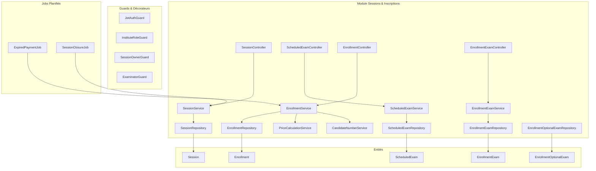
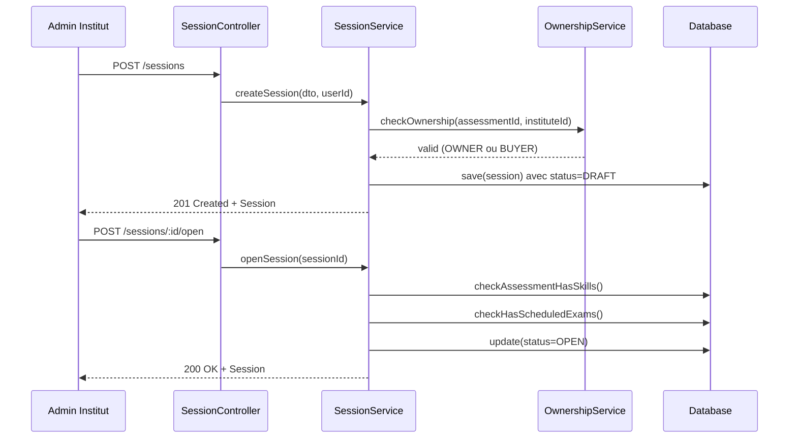
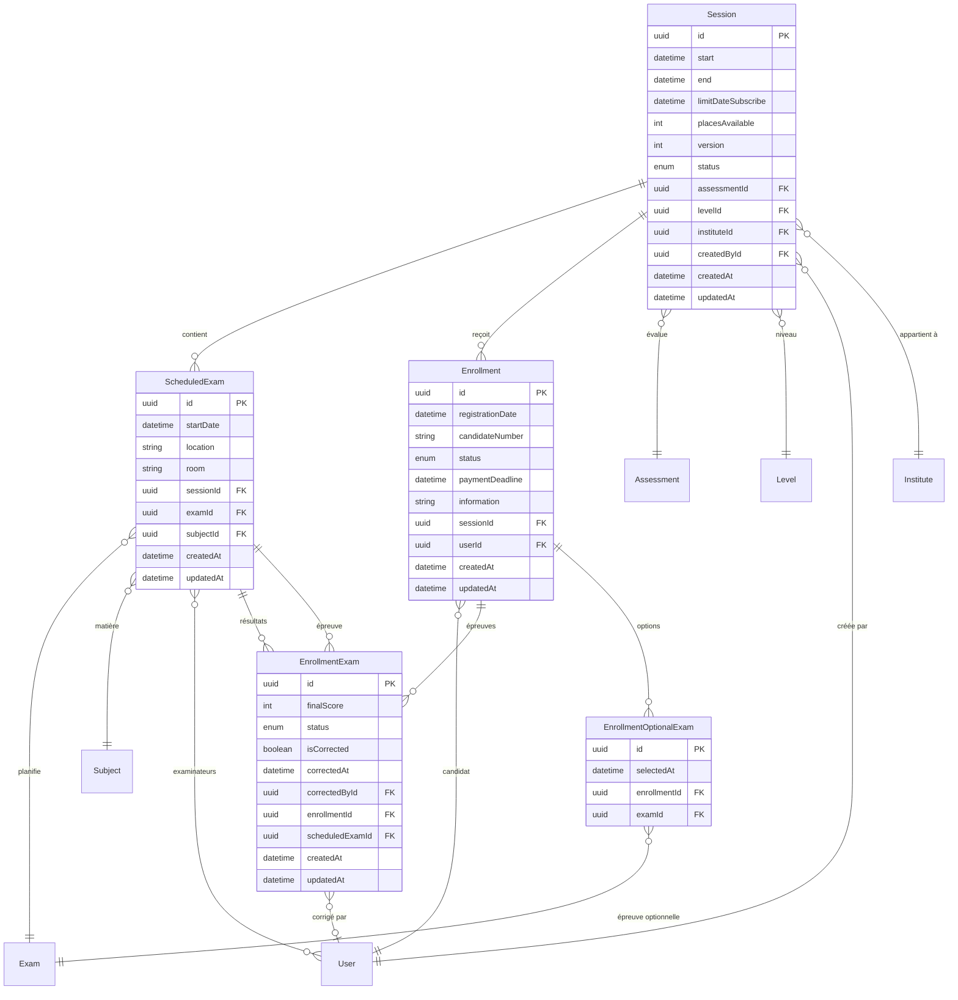

# Document de Conception - Module Sessions & Inscriptions

## Vue d'ensemble

Ce document décrit la conception technique du module de gestion des sessions de tests et des inscriptions des candidats pour une plateforme européenne de gestion d'examens de langues. Le module implémente une architecture modulaire NestJS avec TypeORM et PostgreSQL, permettant la gestion complète du cycle de vie des sessions, la planification des épreuves, l'inscription des candidats avec gestion de la concurrence, et le suivi des résultats.

### Dépendances

- **authentification-utilisateurs** : Authentification JWT, gestion des utilisateurs et PlatformRole
- **gestion-instituts** : Gestion des instituts, InstituteMembership et InstituteRole
- **hierarchie-assessment** : Assessments, Levels, Exams, Skills et tarification personnalisée
- **systeme-questions** : Subjects associés aux ScheduledExam

### Principes de conception

1. **Cycle de vie strict** : Les sessions suivent un workflow DRAFT → OPEN → CLOSED/CANCELLED sans retour arrière
2. **Concurrence maîtrisée** : Verrouillage optimiste sur placesAvailable avec retry automatique
3. **Délai de paiement** : 24h pour confirmer une inscription, libération automatique des places expirées
4. **Séparation des responsabilités** : Services dédiés pour Session, Enrollment, ScheduledExam et EnrollmentExam


## Architecture




### Structure des modules

```
src/
├── session/
│   ├── session.module.ts
│   ├── controllers/
│   │   ├── session.controller.ts
│   │   ├── scheduled-exam.controller.ts
│   │   ├── enrollment.controller.ts
│   │   └── enrollment-exam.controller.ts
│   ├── services/
│   │   ├── session.service.ts
│   │   ├── scheduled-exam.service.ts
│   │   ├── enrollment.service.ts
│   │   ├── enrollment-exam.service.ts
│   │   ├── price-calculation.service.ts
│   │   └── candidate-number.service.ts
│   ├── entities/
│   │   ├── session.entity.ts
│   │   ├── scheduled-exam.entity.ts
│   │   ├── enrollment.entity.ts
│   │   ├── enrollment-exam.entity.ts
│   │   └── enrollment-optional-exam.entity.ts
│   ├── dto/
│   │   ├── create-session.dto.ts
│   │   ├── update-session.dto.ts
│   │   ├── create-scheduled-exam.dto.ts
│   │   ├── create-enrollment.dto.ts
│   │   ├── select-optional-exam.dto.ts
│   │   └── record-score.dto.ts
│   ├── guards/
│   │   ├── session-owner.guard.ts
│   │   └── examinator.guard.ts
│   ├── enums/
│   │   ├── session-status.enum.ts
│   │   ├── enrollment-status.enum.ts
│   │   └── enrollment-exam-status.enum.ts
│   └── jobs/
│       ├── expired-payment.job.ts
│       └── session-closure.job.ts
```


### Flux de création de session et ouverture



### Flux d'inscription avec gestion de concurrence

```mermaid
sequenceDiagram
    participant U as Utilisateur
    participant EC as EnrollmentController
    participant ES as EnrollmentService
    participant CNS as CandidateNumberService
    participant PCS as PriceCalculationService
    participant DB as Database
    
    U->>EC: POST /sessions/:id/enrollments
    EC->>ES: createEnrollment(sessionId, userId, optionalExams)
    
    loop Retry (max 3)
        ES->>DB: SELECT session WITH version
        ES->>DB: UPDATE placesAvailable-1 WHERE version=X
        alt Conflit de version
            ES->>ES: retry
        else Succès
            break
        end
    end
    
    ES->>CNS: generateCandidateNumber(sessionId)
    CNS-->>ES: "SESSION-001"
    ES->>PCS: calculatePrice(sessionId, optionalExams)
    PCS-->>ES: {total: 150, details: [...]}
    ES->>DB: save(enrollment) avec paymentDeadline=now+24h
    ES-->>U: 201 Created + Enrollment
```


## Composants et Interfaces

### SessionController

```typescript
@Controller('sessions')
@UseGuards(JwtAuthGuard)
export class SessionController {
  // GET /sessions - Liste paginée des sessions (publiques OPEN)
  @Get()
  findAll(@Query() query: ListSessionsQueryDto): Promise<PaginatedResult<Session>>;

  // GET /sessions/:id - Détail d'une session avec ScheduledExams
  @Get(':id')
  findOne(@Param('id') id: string): Promise<SessionDetailDto>;

  // POST /sessions - Création d'une session (admin institut)
  @Post()
  @UseGuards(InstituteRoleGuard)
  @InstituteRoles(InstituteRoleEnum.ADMIN)
  create(@Body() dto: CreateSessionDto, @CurrentUser() user: User): Promise<Session>;

  // PATCH /sessions/:id - Modification d'une session
  @Patch(':id')
  @UseGuards(SessionOwnerGuard)
  update(@Param('id') id: string, @Body() dto: UpdateSessionDto): Promise<Session>;

  // DELETE /sessions/:id - Suppression d'une session DRAFT
  @Delete(':id')
  @UseGuards(SessionOwnerGuard)
  remove(@Param('id') id: string): Promise<void>;

  // POST /sessions/:id/open - Passage en statut OPEN
  @Post(':id/open')
  @UseGuards(SessionOwnerGuard)
  openSession(@Param('id') id: string): Promise<Session>;

  // POST /sessions/:id/close - Passage en statut CLOSED
  @Post(':id/close')
  @UseGuards(SessionOwnerGuard)
  closeSession(@Param('id') id: string): Promise<Session>;

  // POST /sessions/:id/cancel - Annulation de la session
  @Post(':id/cancel')
  @UseGuards(SessionOwnerGuard)
  cancelSession(@Param('id') id: string): Promise<Session>;
}
```


### ScheduledExamController

```typescript
@Controller('sessions/:sessionId/scheduled-exams')
@UseGuards(JwtAuthGuard, SessionOwnerGuard)
export class ScheduledExamController {
  // GET /sessions/:sessionId/scheduled-exams - Liste des épreuves planifiées
  @Get()
  findAll(@Param('sessionId') sessionId: string): Promise<ScheduledExam[]>;

  // GET /sessions/:sessionId/scheduled-exams/:id - Détail d'une épreuve
  @Get(':id')
  findOne(@Param('id') id: string): Promise<ScheduledExam>;

  // POST /sessions/:sessionId/scheduled-exams - Création d'une épreuve planifiée
  @Post()
  @InstituteRoles(InstituteRoleEnum.ADMIN)
  create(
    @Param('sessionId') sessionId: string,
    @Body() dto: CreateScheduledExamDto
  ): Promise<ScheduledExam>;

  // PATCH /sessions/:sessionId/scheduled-exams/:id - Modification
  @Patch(':id')
  @InstituteRoles(InstituteRoleEnum.ADMIN)
  update(@Param('id') id: string, @Body() dto: UpdateScheduledExamDto): Promise<ScheduledExam>;

  // DELETE /sessions/:sessionId/scheduled-exams/:id - Suppression
  @Delete(':id')
  @InstituteRoles(InstituteRoleEnum.ADMIN)
  remove(@Param('id') id: string): Promise<void>;

  // POST /sessions/:sessionId/scheduled-exams/:id/examinators - Assignation examinateur
  @Post(':id/examinators')
  @InstituteRoles(InstituteRoleEnum.ADMIN)
  addExaminator(
    @Param('id') id: string,
    @Body() dto: AddExaminatorDto
  ): Promise<ScheduledExam>;

  // DELETE /sessions/:sessionId/scheduled-exams/:id/examinators/:userId - Retrait examinateur
  @Delete(':id/examinators/:userId')
  @InstituteRoles(InstituteRoleEnum.ADMIN)
  removeExaminator(
    @Param('id') id: string,
    @Param('userId') userId: string
  ): Promise<ScheduledExam>;
}
```


### EnrollmentController

```typescript
@Controller('sessions/:sessionId/enrollments')
@UseGuards(JwtAuthGuard)
export class EnrollmentController {
  // GET /sessions/:sessionId/enrollments - Liste des inscriptions (admin institut)
  @Get()
  @UseGuards(SessionOwnerGuard)
  findAll(@Param('sessionId') sessionId: string): Promise<Enrollment[]>;

  // POST /sessions/:sessionId/enrollments - Inscription à une session
  @Post()
  create(
    @Param('sessionId') sessionId: string,
    @Body() dto: CreateEnrollmentDto,
    @CurrentUser() user: User
  ): Promise<EnrollmentResponseDto>;

  // GET /sessions/:sessionId/enrollments/:id - Détail d'une inscription
  @Get(':id')
  findOne(@Param('id') id: string, @CurrentUser() user: User): Promise<EnrollmentDetailDto>;

  // POST /sessions/:sessionId/enrollments/:id/confirm - Confirmation après paiement
  @Post(':id/confirm')
  confirmPayment(@Param('id') id: string, @CurrentUser() user: User): Promise<Enrollment>;

  // POST /sessions/:sessionId/enrollments/:id/cancel - Annulation
  @Post(':id/cancel')
  cancel(@Param('id') id: string, @CurrentUser() user: User): Promise<Enrollment>;

  // POST /sessions/:sessionId/enrollments/:id/optional-exams - Sélection épreuve optionnelle
  @Post(':id/optional-exams')
  selectOptionalExam(
    @Param('id') id: string,
    @Body() dto: SelectOptionalExamDto,
    @CurrentUser() user: User
  ): Promise<EnrollmentDetailDto>;

  // DELETE /sessions/:sessionId/enrollments/:id/optional-exams/:examId - Désélection
  @Delete(':id/optional-exams/:examId')
  deselectOptionalExam(
    @Param('id') id: string,
    @Param('examId') examId: string,
    @CurrentUser() user: User
  ): Promise<EnrollmentDetailDto>;

  // GET /sessions/:sessionId/enrollments/:id/price - Calcul du prix
  @Get(':id/price')
  calculatePrice(@Param('id') id: string): Promise<PriceCalculationDto>;
}

@Controller('my-enrollments')
@UseGuards(JwtAuthGuard)
export class MyEnrollmentsController {
  // GET /my-enrollments - Mes inscriptions
  @Get()
  findMyEnrollments(
    @CurrentUser() user: User,
    @Query() query: ListEnrollmentsQueryDto
  ): Promise<PaginatedResult<Enrollment>>;

  // GET /my-enrollments/:id - Détail d'une de mes inscriptions
  @Get(':id')
  findOne(@Param('id') id: string, @CurrentUser() user: User): Promise<EnrollmentDetailDto>;
}
```


### EnrollmentExamController

```typescript
@Controller('enrollment-exams')
@UseGuards(JwtAuthGuard)
export class EnrollmentExamController {
  // GET /enrollment-exams - Liste des épreuves d'un candidat
  @Get()
  findByEnrollment(@Query('enrollmentId') enrollmentId: string): Promise<EnrollmentExam[]>;

  // GET /enrollment-exams/:id - Détail d'une épreuve
  @Get(':id')
  findOne(@Param('id') id: string): Promise<EnrollmentExam>;

  // POST /enrollment-exams/:id/score - Saisie du score (examinateur)
  @Post(':id/score')
  @UseGuards(ExaminatorGuard)
  recordScore(
    @Param('id') id: string,
    @Body() dto: RecordScoreDto,
    @CurrentUser() user: User
  ): Promise<EnrollmentExam>;
}

@Controller('scheduled-exams/:scheduledExamId/results')
@UseGuards(JwtAuthGuard, ExaminatorGuard)
export class ScheduledExamResultsController {
  // GET /scheduled-exams/:scheduledExamId/results - Liste des résultats
  @Get()
  findResults(@Param('scheduledExamId') scheduledExamId: string): Promise<EnrollmentExam[]>;

  // POST /scheduled-exams/:scheduledExamId/results/bulk - Saisie en masse
  @Post('bulk')
  recordBulkScores(
    @Param('scheduledExamId') scheduledExamId: string,
    @Body() dto: BulkRecordScoreDto,
    @CurrentUser() user: User
  ): Promise<EnrollmentExam[]>;
}
```


### Services

#### SessionService

```typescript
@Injectable()
export class SessionService {
  constructor(
    @InjectRepository(Session)
    private sessionRepository: Repository<Session>,
    private ownershipService: OwnershipService,
    private assessmentService: AssessmentService,
  ) {}

  async create(dto: CreateSessionDto, user: User): Promise<Session>;
  async findOne(id: string): Promise<Session>;
  async findAll(query: ListSessionsQueryDto): Promise<PaginatedResult<Session>>;
  async update(id: string, dto: UpdateSessionDto): Promise<Session>;
  async remove(id: string): Promise<void>;
  
  // Gestion du cycle de vie
  async openSession(id: string): Promise<Session>;
  async closeSession(id: string): Promise<Session>;
  async cancelSession(id: string): Promise<Session>;
  
  // Validation avant ouverture
  async validateForOpening(id: string): Promise<{ valid: boolean; errors: string[] }>;
  
  // Gestion des places avec verrouillage optimiste
  async decrementPlaces(id: string): Promise<boolean>;
  async incrementPlaces(id: string): Promise<void>;
  
  // Job de fermeture automatique
  async closeExpiredSessions(): Promise<number>;
}
```

#### EnrollmentService

```typescript
@Injectable()
export class EnrollmentService {
  constructor(
    @InjectRepository(Enrollment)
    private enrollmentRepository: Repository<Enrollment>,
    private sessionService: SessionService,
    private candidateNumberService: CandidateNumberService,
    private priceCalculationService: PriceCalculationService,
    private dataSource: DataSource,
  ) {}

  async create(sessionId: string, userId: string, optionalExamIds: string[]): Promise<Enrollment>;
  async findOne(id: string): Promise<Enrollment>;
  async findByUser(userId: string, query: ListEnrollmentsQueryDto): Promise<PaginatedResult<Enrollment>>;
  async findBySession(sessionId: string): Promise<Enrollment[]>;
  
  // Confirmation et annulation
  async confirmPayment(id: string): Promise<Enrollment>;
  async cancel(id: string): Promise<Enrollment>;
  
  // Épreuves optionnelles
  async selectOptionalExam(enrollmentId: string, examId: string): Promise<Enrollment>;
  async deselectOptionalExam(enrollmentId: string, examId: string): Promise<Enrollment>;
  
  // Job d'expiration des paiements
  async cancelExpiredEnrollments(): Promise<number>;
  
  // Création des EnrollmentExam après confirmation
  private async createEnrollmentExams(enrollment: Enrollment): Promise<void>;
}
```


#### ScheduledExamService

```typescript
@Injectable()
export class ScheduledExamService {
  constructor(
    @InjectRepository(ScheduledExam)
    private scheduledExamRepository: Repository<ScheduledExam>,
    private membershipService: MembershipService,
  ) {}

  async create(sessionId: string, dto: CreateScheduledExamDto): Promise<ScheduledExam>;
  async findOne(id: string): Promise<ScheduledExam>;
  async findBySession(sessionId: string): Promise<ScheduledExam[]>;
  async update(id: string, dto: UpdateScheduledExamDto): Promise<ScheduledExam>;
  async remove(id: string): Promise<void>;
  
  // Gestion des examinateurs
  async addExaminator(scheduledExamId: string, userId: string): Promise<ScheduledExam>;
  async removeExaminator(scheduledExamId: string, userId: string): Promise<ScheduledExam>;
  async checkExaminatorAvailability(userId: string, startDate: Date, excludeId?: string): Promise<boolean>;
}
```

#### EnrollmentExamService

```typescript
@Injectable()
export class EnrollmentExamService {
  constructor(
    @InjectRepository(EnrollmentExam)
    private enrollmentExamRepository: Repository<EnrollmentExam>,
  ) {}

  async create(enrollmentId: string, scheduledExamId: string): Promise<EnrollmentExam>;
  async findOne(id: string): Promise<EnrollmentExam>;
  async findByEnrollment(enrollmentId: string): Promise<EnrollmentExam[]>;
  async findByScheduledExam(scheduledExamId: string): Promise<EnrollmentExam[]>;
  
  // Saisie des résultats
  async recordScore(id: string, score: number, correctorId: string): Promise<EnrollmentExam>;
  async recordBulkScores(scheduledExamId: string, scores: { enrollmentExamId: string; score: number }[], correctorId: string): Promise<EnrollmentExam[]>;
  
  // Détermination du statut
  private determineStatus(score: number, successScore: number): EnrollmentExamStatusEnum;
}
```

#### PriceCalculationService

```typescript
@Injectable()
export class PriceCalculationService {
  constructor(
    private pricingService: PricingService,
  ) {}

  async calculateEnrollmentPrice(
    sessionId: string,
    instituteId: string,
    optionalExamIds: string[]
  ): Promise<PriceCalculationResult>;
  
  async getExamPrice(examId: string, instituteId: string): Promise<number>;
}

export interface PriceCalculationResult {
  total: number;
  currency: string;
  details: {
    examId: string;
    examLabel: string;
    isOptional: boolean;
    price: number;
    isCustomPrice: boolean;
  }[];
}
```

#### CandidateNumberService

```typescript
@Injectable()
export class CandidateNumberService {
  constructor(
    @InjectRepository(Enrollment)
    private enrollmentRepository: Repository<Enrollment>,
  ) {}

  async generateCandidateNumber(sessionId: string): Promise<string>;
  
  // Utilise un compteur atomique avec SELECT FOR UPDATE
  private async getNextSequence(sessionId: string): Promise<number>;
}
```


### Guards

```typescript
// SessionOwnerGuard - Vérifie que l'utilisateur est admin de l'institut propriétaire de la session
@Injectable()
export class SessionOwnerGuard implements CanActivate {
  constructor(
    private sessionService: SessionService,
    private membershipService: MembershipService,
  ) {}

  async canActivate(context: ExecutionContext): Promise<boolean> {
    const request = context.switchToHttp().getRequest();
    const user = request.user;
    const sessionId = request.params.sessionId || request.params.id;

    // Admin plateforme : accès total
    if (user.platformRole === PlatformRoleEnum.ADMIN) {
      return true;
    }

    const session = await this.sessionService.findOne(sessionId);
    const membership = await this.membershipService.getMembershipByUserId(user.id);
    
    return membership?.institute?.id === session.institute?.id 
      && membership?.role === InstituteRoleEnum.ADMIN;
  }
}

// ExaminatorGuard - Vérifie que l'utilisateur est examinateur assigné
@Injectable()
export class ExaminatorGuard implements CanActivate {
  constructor(
    private scheduledExamService: ScheduledExamService,
    private enrollmentExamService: EnrollmentExamService,
  ) {}

  async canActivate(context: ExecutionContext): Promise<boolean> {
    const request = context.switchToHttp().getRequest();
    const user = request.user;
    
    // Admin plateforme : accès total
    if (user.platformRole === PlatformRoleEnum.ADMIN) {
      return true;
    }

    const enrollmentExamId = request.params.id;
    const scheduledExamId = request.params.scheduledExamId;
    
    let scheduledExam;
    if (scheduledExamId) {
      scheduledExam = await this.scheduledExamService.findOne(scheduledExamId);
    } else if (enrollmentExamId) {
      const enrollmentExam = await this.enrollmentExamService.findOne(enrollmentExamId);
      scheduledExam = enrollmentExam.scheduledExam;
    }
    
    return scheduledExam?.examinators?.some(e => e.id === user.id) ?? false;
  }
}
```


## Modèles de données

### Diagramme des entités




### Entité Session

```typescript
@Entity('sessions')
export class Session {
  @PrimaryGeneratedColumn('uuid')
  id: string;

  @Column({ type: 'timestamp' })
  start: Date;

  @Column({ type: 'timestamp' })
  end: Date;

  @Column({ type: 'timestamp' })
  limitDateSubscribe: Date;

  @Column({ type: 'int' })
  placesAvailable: number;

  @VersionColumn()
  version: number;

  @Column({ type: 'enum', enum: SessionStatusEnum, default: SessionStatusEnum.DRAFT })
  status: SessionStatusEnum;

  @ManyToOne(() => Assessment)
  @JoinColumn({ name: 'assessmentId' })
  assessment: Assessment;

  @Column()
  assessmentId: string;

  @ManyToOne(() => Level)
  @JoinColumn({ name: 'levelId' })
  level: Level;

  @Column()
  levelId: string;

  @ManyToOne(() => Institute)
  @JoinColumn({ name: 'instituteId' })
  institute: Institute;

  @Column()
  instituteId: string;

  @ManyToOne(() => User)
  @JoinColumn({ name: 'createdById' })
  createdBy: User;

  @Column()
  createdById: string;

  @OneToMany(() => ScheduledExam, scheduledExam => scheduledExam.session)
  scheduledExams: ScheduledExam[];

  @OneToMany(() => Enrollment, enrollment => enrollment.session)
  enrollments: Enrollment[];

  @CreateDateColumn()
  createdAt: Date;

  @UpdateDateColumn()
  updatedAt: Date;
}
```


### Entité ScheduledExam

```typescript
@Entity('scheduled_exams')
export class ScheduledExam {
  @PrimaryGeneratedColumn('uuid')
  id: string;

  @Column({ type: 'timestamp' })
  startDate: Date;

  @Column({ length: 255 })
  location: string;

  @Column({ length: 100, nullable: true })
  room: string;

  @ManyToOne(() => Session, session => session.scheduledExams, { onDelete: 'CASCADE' })
  @JoinColumn({ name: 'sessionId' })
  session: Session;

  @Column()
  sessionId: string;

  @ManyToOne(() => Exam)
  @JoinColumn({ name: 'examId' })
  exam: Exam;

  @Column()
  examId: string;

  @OneToOne(() => Subject)
  @JoinColumn({ name: 'subjectId' })
  subject: Subject;

  @Column()
  subjectId: string;

  @ManyToMany(() => User)
  @JoinTable({
    name: 'scheduled_exam_examinators',
    joinColumn: { name: 'scheduledExamId' },
    inverseJoinColumn: { name: 'userId' },
  })
  examinators: User[];

  @OneToMany(() => EnrollmentExam, enrollmentExam => enrollmentExam.scheduledExam)
  enrollmentExams: EnrollmentExam[];

  @CreateDateColumn()
  createdAt: Date;

  @UpdateDateColumn()
  updatedAt: Date;
}
```

### Entité Enrollment

```typescript
@Entity('enrollments')
@Unique(['sessionId', 'candidateNumber'])
export class Enrollment {
  @PrimaryGeneratedColumn('uuid')
  id: string;

  @Column({ type: 'timestamp', default: () => 'CURRENT_TIMESTAMP' })
  registrationDate: Date;

  @Column({ length: 50 })
  candidateNumber: string;

  @Column({ type: 'enum', enum: EnrollmentStatusEnum, default: EnrollmentStatusEnum.PENDING_PAYMENT })
  status: EnrollmentStatusEnum;

  @Column({ type: 'timestamp' })
  paymentDeadline: Date;

  @Column({ type: 'text', nullable: true })
  information: string;

  @ManyToOne(() => Session, session => session.enrollments, { onDelete: 'CASCADE' })
  @JoinColumn({ name: 'sessionId' })
  session: Session;

  @Column()
  sessionId: string;

  @ManyToOne(() => User)
  @JoinColumn({ name: 'userId' })
  user: User;

  @Column()
  userId: string;

  @OneToMany(() => EnrollmentExam, enrollmentExam => enrollmentExam.enrollment)
  enrollmentExams: EnrollmentExam[];

  @OneToMany(() => EnrollmentOptionalExam, optionalExam => optionalExam.enrollment)
  optionalExams: EnrollmentOptionalExam[];

  @CreateDateColumn()
  createdAt: Date;

  @UpdateDateColumn()
  updatedAt: Date;
}
```


### Entité EnrollmentExam

```typescript
@Entity('enrollment_exams')
@Unique(['enrollmentId', 'scheduledExamId'])
export class EnrollmentExam {
  @PrimaryGeneratedColumn('uuid')
  id: string;

  @Column({ type: 'int', nullable: true })
  finalScore: number;

  @Column({ type: 'enum', enum: EnrollmentExamStatusEnum, default: EnrollmentExamStatusEnum.REGISTERED })
  status: EnrollmentExamStatusEnum;

  @Column({ default: false })
  isCorrected: boolean;

  @Column({ type: 'timestamp', nullable: true })
  correctedAt: Date;

  @ManyToOne(() => User, { nullable: true })
  @JoinColumn({ name: 'correctedById' })
  correctedBy: User;

  @Column({ nullable: true })
  correctedById: string;

  @ManyToOne(() => Enrollment, enrollment => enrollment.enrollmentExams, { onDelete: 'CASCADE' })
  @JoinColumn({ name: 'enrollmentId' })
  enrollment: Enrollment;

  @Column()
  enrollmentId: string;

  @ManyToOne(() => ScheduledExam, scheduledExam => scheduledExam.enrollmentExams)
  @JoinColumn({ name: 'scheduledExamId' })
  scheduledExam: ScheduledExam;

  @Column()
  scheduledExamId: string;

  @CreateDateColumn()
  createdAt: Date;

  @UpdateDateColumn()
  updatedAt: Date;
}
```

### Entité EnrollmentOptionalExam

```typescript
@Entity('enrollment_optional_exams')
@Unique(['enrollmentId', 'examId'])
export class EnrollmentOptionalExam {
  @PrimaryGeneratedColumn('uuid')
  id: string;

  @Column({ type: 'timestamp', default: () => 'CURRENT_TIMESTAMP' })
  selectedAt: Date;

  @ManyToOne(() => Enrollment, enrollment => enrollment.optionalExams, { onDelete: 'CASCADE' })
  @JoinColumn({ name: 'enrollmentId' })
  enrollment: Enrollment;

  @Column()
  enrollmentId: string;

  @ManyToOne(() => Exam)
  @JoinColumn({ name: 'examId' })
  exam: Exam;

  @Column()
  examId: string;
}
```


### Énumérations

```typescript
// session-status.enum.ts
export enum SessionStatusEnum {
  DRAFT = 'DRAFT',
  OPEN = 'OPEN',
  CLOSED = 'CLOSED',
  CANCELLED = 'CANCELLED',
}

// enrollment-status.enum.ts
export enum EnrollmentStatusEnum {
  PENDING_PAYMENT = 'PENDING_PAYMENT',
  CONFIRMED = 'CONFIRMED',
  CANCELLED = 'CANCELLED',
}

// enrollment-exam-status.enum.ts
export enum EnrollmentExamStatusEnum {
  REGISTERED = 'REGISTERED',
  PASSED = 'PASSED',
  FAILED = 'FAILED',
}
```

### DTOs de validation

```typescript
// create-session.dto.ts
export class CreateSessionDto {
  @IsDateString()
  start: string;

  @IsDateString()
  end: string;

  @IsDateString()
  limitDateSubscribe: string;

  @IsInt()
  @Min(1)
  placesAvailable: number;

  @IsUUID()
  assessmentId: string;

  @IsUUID()
  levelId: string;
}

// update-session.dto.ts
export class UpdateSessionDto {
  @IsDateString()
  @IsOptional()
  start?: string;

  @IsDateString()
  @IsOptional()
  end?: string;

  @IsDateString()
  @IsOptional()
  limitDateSubscribe?: string;

  @IsInt()
  @Min(0)
  @IsOptional()
  placesAvailable?: number;
}

// create-scheduled-exam.dto.ts
export class CreateScheduledExamDto {
  @IsDateString()
  startDate: string;

  @IsString()
  @IsNotEmpty()
  @MaxLength(255)
  location: string;

  @IsString()
  @IsOptional()
  @MaxLength(100)
  room?: string;

  @IsUUID()
  examId: string;

  @IsUUID()
  subjectId: string;
}

// create-enrollment.dto.ts
export class CreateEnrollmentDto {
  @IsArray()
  @IsUUID('4', { each: true })
  @IsOptional()
  optionalExamIds?: string[];

  @IsString()
  @IsOptional()
  information?: string;
}

// select-optional-exam.dto.ts
export class SelectOptionalExamDto {
  @IsUUID()
  examId: string;
}

// record-score.dto.ts
export class RecordScoreDto {
  @IsInt()
  @Min(0)
  finalScore: number;
}

// bulk-record-score.dto.ts
export class BulkRecordScoreDto {
  @IsArray()
  @ValidateNested({ each: true })
  @Type(() => ScoreEntryDto)
  scores: ScoreEntryDto[];
}

export class ScoreEntryDto {
  @IsUUID()
  enrollmentExamId: string;

  @IsInt()
  @Min(0)
  finalScore: number;
}
```


### Jobs Planifiés

```typescript
// expired-payment.job.ts
@Injectable()
export class ExpiredPaymentJob {
  private readonly logger = new Logger(ExpiredPaymentJob.name);

  constructor(private enrollmentService: EnrollmentService) {}

  @Cron(CronExpression.EVERY_5_MINUTES)
  async handleExpiredPayments(): Promise<void> {
    this.logger.log('Vérification des inscriptions expirées...');
    const cancelledCount = await this.enrollmentService.cancelExpiredEnrollments();
    this.logger.log(`${cancelledCount} inscription(s) annulée(s) pour non-paiement`);
  }
}

// session-closure.job.ts
@Injectable()
export class SessionClosureJob {
  private readonly logger = new Logger(SessionClosureJob.name);

  constructor(private sessionService: SessionService) {}

  @Cron(CronExpression.EVERY_HOUR)
  async handleSessionClosure(): Promise<void> {
    this.logger.log('Vérification des sessions à fermer...');
    const closedCount = await this.sessionService.closeExpiredSessions();
    this.logger.log(`${closedCount} session(s) fermée(s) automatiquement`);
  }
}
```

### Gestion de la concurrence - Verrouillage optimiste

```typescript
// session.service.ts - Méthode de décrémentation atomique
async decrementPlaces(sessionId: string, maxRetries = 3): Promise<boolean> {
  for (let attempt = 0; attempt < maxRetries; attempt++) {
    try {
      const result = await this.sessionRepository
        .createQueryBuilder()
        .update(Session)
        .set({ 
          placesAvailable: () => 'placesAvailable - 1',
          version: () => 'version + 1'
        })
        .where('id = :id', { id: sessionId })
        .andWhere('placesAvailable > 0')
        .andWhere('version = :version', { version: await this.getCurrentVersion(sessionId) })
        .execute();

      if (result.affected === 1) {
        return true;
      }
      
      // Vérifier si c'est un problème de places ou de version
      const session = await this.findOne(sessionId);
      if (session.placesAvailable === 0) {
        throw new BusinessRuleException('Plus de places disponibles');
      }
      
      // Conflit de version, réessayer
      this.logger.warn(`Conflit de version, tentative ${attempt + 1}/${maxRetries}`);
    } catch (error) {
      if (error instanceof BusinessRuleException) throw error;
      throw error;
    }
  }
  
  throw new BusinessRuleException('Impossible de réserver une place, veuillez réessayer');
}

private async getCurrentVersion(sessionId: string): Promise<number> {
  const session = await this.sessionRepository.findOne({ 
    where: { id: sessionId }, 
    select: ['version'] 
  });
  return session?.version ?? 0;
}
```


## Propriétés de Correction

*Une propriété est une caractéristique ou un comportement qui doit rester vrai pour toutes les exécutions valides d'un système - essentiellement, une déclaration formelle de ce que le système doit faire. Les propriétés servent de pont entre les spécifications lisibles par l'humain et les garanties de correction vérifiables par la machine.*

### Propriété 1 : Statut initial DRAFT à la création

*Pour toute* session créée avec des paramètres valides, le statut initial doit être DRAFT et le champ createdBy doit référencer l'utilisateur créateur.

**Valide : Exigences 1.1**

### Propriété 2 : Cohérence des dates de session

*Pour toute* session, les dates doivent respecter l'ordre : limitDateSubscribe < start < end. Toute tentative de création ou modification violant cet ordre doit être rejetée.

**Valide : Exigences 1.2, 1.3**

### Propriété 3 : Validation des places disponibles

*Pour toute* valeur de placesAvailable fournie lors de la création d'une session, le système doit accepter uniquement les entiers strictement positifs (> 0) et rejeter toutes les autres valeurs.

**Valide : Exigences 1.4**

### Propriété 4 : Vérification de propriété de l'assessment

*Pour toute* création de session, l'institut doit posséder l'assessment (OWNER) ou l'avoir acheté (BUYER avec licence non expirée). Toute tentative avec un assessment non possédé doit être rejetée.

**Valide : Exigences 1.5**

### Propriété 5 : Prérequis pour l'ouverture de session

*Pour toute* session passant de DRAFT à OPEN, l'assessment associé doit avoir au moins un Skill ET la session doit avoir au moins un ScheduledExam planifié. L'ouverture doit échouer si l'une de ces conditions n'est pas remplie.

**Valide : Exigences 2.1, 2.2**

### Propriété 6 : Inscriptions selon le statut de session

*Pour toute* tentative d'inscription, elle doit être acceptée si et seulement si la session est en statut OPEN et la date limitDateSubscribe n'est pas dépassée.

**Valide : Exigences 2.3, 2.4, 6.6**


### Propriété 7 : Transitions de statut irréversibles

*Pour toute* session, les transitions de statut autorisées sont : DRAFT→OPEN, OPEN→CLOSED, OPEN→CANCELLED, DRAFT→CANCELLED. Toute transition inverse (CLOSED→OPEN, CANCELLED→OPEN) doit être rejetée.

**Valide : Exigences 2.7**

### Propriété 8 : Modification selon le statut de session

*Pour toute* session en statut DRAFT, tous les champs sont modifiables. *Pour toute* session en statut OPEN, seuls placesAvailable et limitDateSubscribe sont modifiables. Les modifications d'autres champs doivent être rejetées.

**Valide : Exigences 3.1, 3.2**

### Propriété 9 : Protection contre la suppression avec inscriptions

*Pour toute* session ayant au moins une inscription CONFIRMED, la suppression doit être bloquée et retourner une erreur.

**Valide : Exigences 3.3**

### Propriété 10 : Cohérence ScheduledExam-Assessment

*Pour tout* ScheduledExam créé, l'Exam associé doit appartenir à l'Assessment de la session. Toute tentative avec un Exam d'un autre Assessment doit être rejetée.

**Valide : Exigences 4.2**

### Propriété 11 : Dates de ScheduledExam dans la plage de session

*Pour tout* ScheduledExam, sa startDate doit être comprise entre session.start et session.end (inclus). Toute date hors de cette plage doit être rejetée.

**Valide : Exigences 4.3**

### Propriété 12 : Unicité de l'assignation examinateur par horaire

*Pour tout* examinateur assigné à un ScheduledExam, il ne doit pas être déjà assigné à un autre ScheduledExam dont l'horaire chevauche. Toute assignation créant un conflit doit être rejetée.

**Valide : Exigences 5.2**


### Propriété 13 : Statut initial PENDING_PAYMENT à l'inscription

*Pour toute* inscription créée à une session OPEN, le statut initial doit être PENDING_PAYMENT.

**Valide : Exigences 6.1**

### Propriété 14 : Unicité du numéro de candidat par session

*Pour toute* session, chaque candidateNumber doit être unique. Deux inscriptions dans la même session ne peuvent pas avoir le même candidateNumber.

**Valide : Exigences 6.2, 13.1, 13.2**

### Propriété 15 : Calcul du délai de paiement

*Pour toute* inscription créée, paymentDeadline doit être égal à registrationDate + 24 heures exactement.

**Valide : Exigences 6.3**

### Propriété 16 : Décrémentation atomique des places

*Pour toute* inscription créée avec succès, placesAvailable de la session doit être décrémenté de exactement 1. Après N inscriptions réussies, placesAvailable = placesInitiales - N.

**Valide : Exigences 6.4**

### Propriété 17 : Rejet d'inscription sans places disponibles

*Pour toute* session avec placesAvailable = 0, toute tentative d'inscription doit être rejetée avec une erreur explicative.

**Valide : Exigences 6.5**

### Propriété 18 : Confirmation et création des EnrollmentExam

*Pour toute* inscription passant de PENDING_PAYMENT à CONFIRMED, le système doit créer un EnrollmentExam pour chaque ScheduledExam obligatoire (Exam.isOption=false) ET pour chaque épreuve optionnelle sélectionnée.

**Valide : Exigences 7.1, 7.2, 11.1, 11.2**


### Propriété 19 : Expiration automatique des inscriptions non payées

*Pour toute* inscription avec status PENDING_PAYMENT et paymentDeadline dépassé, le système doit automatiquement passer le status à CANCELLED et incrémenter placesAvailable de 1.

**Valide : Exigences 7.3, 7.4**

### Propriété 20 : Annulation et libération de place

*Pour toute* inscription annulée (passage à CANCELLED), placesAvailable de la session doit être incrémenté de exactement 1.

**Valide : Exigences 8.1, 8.2**

### Propriété 21 : Suppression en cascade à l'annulation

*Pour toute* inscription annulée, tous les EnrollmentExam et EnrollmentOptionalExam associés doivent être supprimés.

**Valide : Exigences 8.3**

### Propriété 22 : Blocage d'annulation après début de session

*Pour toute* inscription à une session dont la date start est dépassée, l'annulation doit être bloquée et retourner une erreur.

**Valide : Exigences 8.4**

### Propriété 23 : Modification des options avant paiement uniquement

*Pour toute* inscription, la sélection/désélection d'épreuves optionnelles n'est autorisée que si status = PENDING_PAYMENT. Toute modification avec un autre statut doit être rejetée.

**Valide : Exigences 9.4**

### Propriété 24 : Calcul du prix total

*Pour toute* inscription, le prix total doit être égal à la somme des prix des épreuves obligatoires plus la somme des prix des épreuves optionnelles sélectionnées, en utilisant customPrice si un InstituteExamPricing actif existe, sinon Exam.price.

**Valide : Exigences 10.1, 10.2**


### Propriété 25 : Initialisation des EnrollmentExam

*Pour tout* EnrollmentExam créé, les valeurs initiales doivent être : status = REGISTERED, finalScore = null, isCorrected = false.

**Valide : Exigences 11.3**

### Propriété 26 : Validation du score dans la plage autorisée

*Pour tout* finalScore saisi, il doit être compris entre 0 et Exam.maxScore (inclus). Toute valeur hors de cette plage doit être rejetée.

**Valide : Exigences 12.2**

### Propriété 27 : Mise à jour des champs de correction

*Pour tout* EnrollmentExam avec un finalScore saisi, isCorrected doit être true, correctedAt doit être défini à l'horodatage de la saisie, et correctedBy doit référencer l'utilisateur ayant saisi le score.

**Valide : Exigences 12.3**

### Propriété 28 : Détermination du statut PASSED/FAILED

*Pour tout* EnrollmentExam avec un finalScore saisi, le status doit être PASSED si finalScore >= Exam.successScore, et FAILED sinon.

**Valide : Exigences 12.4, 12.5**

### Propriété 29 : Format du numéro de candidat

*Pour tout* candidateNumber généré, il doit respecter le format {SESSION_REF}-{SEQUENCE_NUMBER} où SEQUENCE_NUMBER est un entier séquentiel.

**Valide : Exigences 13.3**

### Propriété 30 : Invariant placesAvailable non négatif

*Pour toute* session, à tout moment, placesAvailable >= 0. Aucune opération ne doit permettre à placesAvailable de devenir négatif.

**Valide : Exigences 14.4**


## Gestion des erreurs

### Codes d'erreur HTTP

| Code | Situation |
|------|-----------|
| 400 Bad Request | Validation échouée (dates incohérentes, placesAvailable <= 0, score hors plage) |
| 401 Unauthorized | Token JWT manquant ou invalide |
| 403 Forbidden | Permissions insuffisantes (non-admin tentant de créer une session, non-examinateur tentant de saisir un score) |
| 404 Not Found | Session, Enrollment, ScheduledExam ou EnrollmentExam non trouvé |
| 409 Conflict | Conflit de version sur placesAvailable après 3 tentatives, candidateNumber en doublon |
| 422 Unprocessable Entity | Règle métier violée (session sans Skills, inscription après deadline, annulation après début) |

### Messages d'erreur standardisés

```typescript
// Exemples de messages d'erreur
{
  "statusCode": 400,
  "message": "La date de début doit être antérieure à la date de fin",
  "error": "Bad Request"
}

{
  "statusCode": 422,
  "message": "L'assessment doit avoir au moins un Skill pour ouvrir la session",
  "error": "Unprocessable Entity"
}

{
  "statusCode": 422,
  "message": "Plus de places disponibles pour cette session",
  "error": "Unprocessable Entity"
}

{
  "statusCode": 422,
  "message": "La date limite d'inscription est dépassée",
  "error": "Unprocessable Entity"
}

{
  "statusCode": 409,
  "message": "Impossible de réserver une place, veuillez réessayer",
  "error": "Conflict"
}
```


## Stratégie de test

### Approche duale : Tests unitaires et Tests basés sur les propriétés

Le module sera testé avec une combinaison de :
- **Tests unitaires** : Pour les cas spécifiques, les cas limites et les conditions d'erreur
- **Tests basés sur les propriétés (PBT)** : Pour valider les propriétés universelles sur des entrées générées aléatoirement

### Configuration des tests basés sur les propriétés

- **Bibliothèque** : fast-check pour TypeScript/JavaScript
- **Minimum d'itérations** : 100 par test de propriété
- **Format de tag** : `Feature: sessions-inscriptions, Property {number}: {property_text}`

### Tests unitaires recommandés

1. **SessionService**
   - Création de session avec paramètres valides/invalides
   - Transitions de statut autorisées/interdites
   - Validation avant ouverture (Skills, ScheduledExams)

2. **EnrollmentService**
   - Inscription avec places disponibles/épuisées
   - Génération de candidateNumber unique
   - Confirmation et création des EnrollmentExam
   - Expiration des inscriptions non payées

3. **EnrollmentExamService**
   - Saisie de score dans/hors plage
   - Détermination du statut PASSED/FAILED

### Tests de propriétés recommandés

Chaque propriété définie dans la section "Propriétés de Correction" doit être implémentée comme un test de propriété distinct avec le tag approprié.

### Tests d'intégration

- Flux complet : création session → ouverture → inscription → paiement → saisie résultats
- Concurrence : inscriptions simultanées avec verrouillage optimiste
- Jobs planifiés : expiration des paiements, fermeture automatique des sessions
